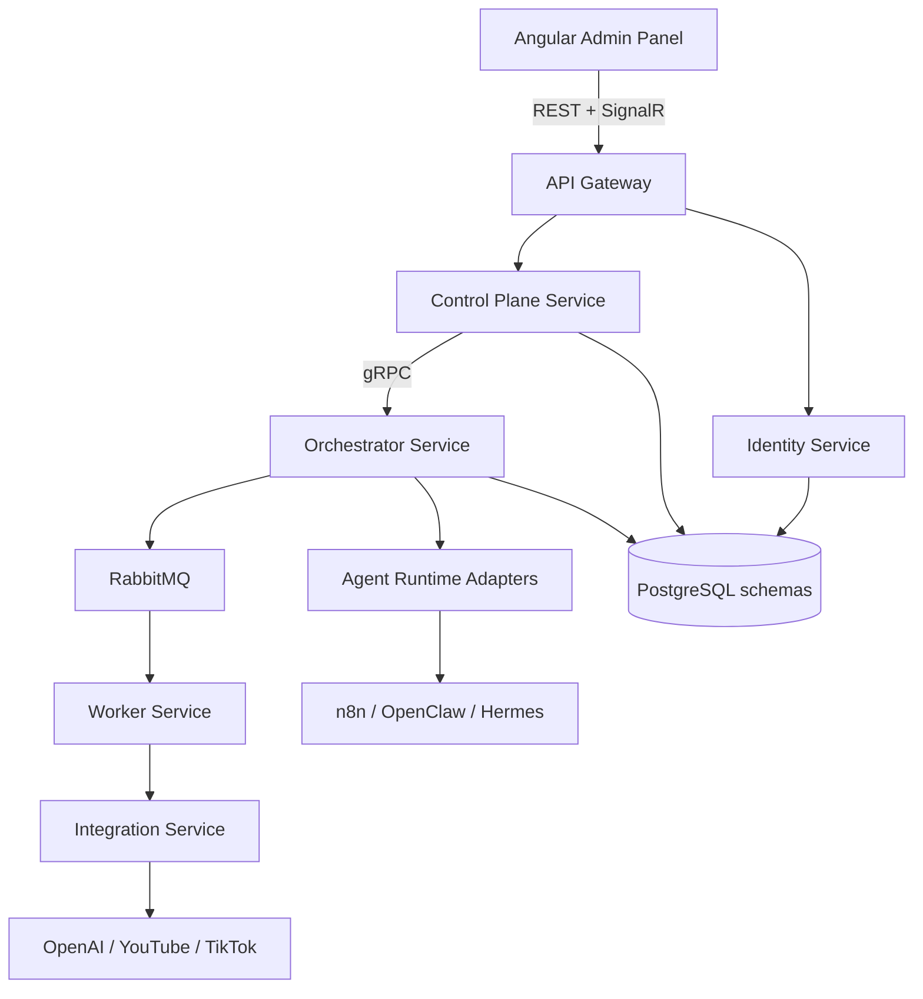
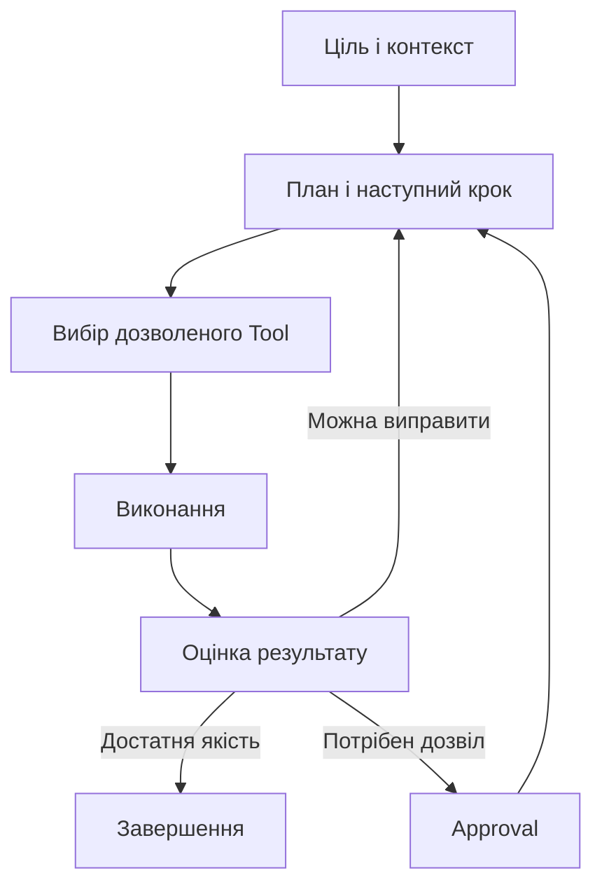
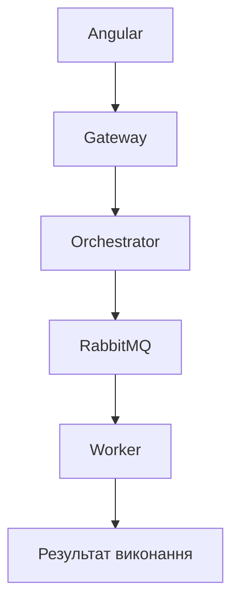

# AiControlCenter — нотатка та план реалізації

## 1. Ідея проєкту

`AiControlCenter` — це власна адміністративна панель для керування AI-агентами, автоматизаціями та програмами. Через одну систему можна буде:

- створювати напрямки роботи;
- додавати й налаштовувати агентів;
- запускати агентів вручну або за розкладом;
- об'єднувати дії у workflows;
- підключати OpenAI, YouTube, TikTok, Telegram, n8n, OpenClaw, Hermes та інші зовнішні сервіси;
- переглядати статуси запусків, результати, помилки та журнали;
- підтверджувати критичні дії через модуль Approvals;
- керувати доступом користувачів за ролями.

Перші заплановані бізнес-напрямки:

- `AI Notes / AI Ideas` — AI-агент допрацьовує будь-яку ідею, проводить аналіз, знаходить сильні й слабкі сторони, дає поради та формує практичний план реалізації;
- `Video 2D / Publishing` — пошук або ручний вибір відео, перетворення у 2D-графіку з ефектами, ручне доопрацювання та автоматична AI-публікація в YouTube, YouTube Shorts або TikTok;
- у майбутньому — Telegram, аналіз повідомлень, описи товарів, пошук інформації та інші напрямки.

## 2. Основний принцип архітектури

Проєкт будується як **модульна багатосервісна система**. Кожна велика зона відповідальності працює як окремий .NET-сервіс і має власні моделі, Application-рівень, Infrastructure та API або gRPC-контракти.

Це не означає, що потрібно одразу створювати десятки дрібних мікросервісів. На старті достатньо виділити сервіси з чіткою відповідальністю:

- `Gateway` — єдина точка входу для Angular, REST і SignalR;
- `Identity Service` — користувачі, ролі, JWT і refresh tokens;
- `Control Plane Service` — Directions, Agent Definitions, Workflows і Schedules;
- `Orchestrator Service` — керування Runs і послідовністю виконання кроків;
- `Worker Service` — виконання AI-завдань та довгих операцій;
- `Integration Service` — OpenAI, YouTube, TikTok, Telegram та інші зовнішні API;
- `Agent Runtime Adapters` — єдиний шар підключення n8n, OpenClaw і Hermes Agent до нашого Orchestrator.

Кожен сервіс запускається окремим процесом і Docker-контейнером. На початку вони можуть використовувати один сервер PostgreSQL, але кожен сервіс володіє своєю схемою та не читає таблиці іншого сервісу напряму.

Загальна схема:



## 3. Технології

### Frontend

- Angular;
- TypeScript;
- Angular Material для компонентів адмін-панелі;
- RxJS для асинхронної роботи з API та станами;
- REST API для основних операцій;
- SignalR для оновлення прогресу виконання в реальному часі.

### Backend

- C#;
- .NET 10 LTS;
- ASP.NET Core Web API;
- Clean Architecture;
- багатосервісна модульна архітектура;
- окремий .NET-процес і Docker-контейнер для кожного сервісу;
- Dependency Injection;
- async/await;
- FluentValidation для перевірки команд і DTO;
- Swagger/OpenAPI для документації API;
- Serilog або стандартний `ILogger` для журналів.

### Дані

- PostgreSQL як основна база даних;
- окрема схема або база даних для кожного сервісу;
- Entity Framework Core;
- міграції EF Core;
- оптимізовані LINQ-запити;
- S3-сумісне object storage для вихідних відео, preview, рендерів і вкладень; у Development можна використовувати MinIO, а production-провайдера вибрати за вартістю та обсягом перед відеоетапом;
- у PostgreSQL зберігати лише метадані, статуси й посилання на об'єкти, а не великі відеофайли;
- Redis можна додати пізніше для кешу та розподілених блокувань, коли в цьому з'явиться реальна потреба.

### Взаємодія між компонентами

- REST — Angular, мобільні клієнти та зовнішні інтеграції;
- gRPC — синхронна внутрішня взаємодія між .NET-сервісами;
- RabbitMQ + MassTransit — асинхронні команди, події та черга довгих завдань;
- SignalR — статуси запусків, повідомлення й прогрес у реальному часі;
- Webhooks — вхідні події від зовнішніх сервісів;
- n8n — допоміжні інтеграційні сценарії, а не центральна бізнес-логіка системи.

### AI

- OpenAI Responses API для агентів, генерації та аналізу контенту;
- Hermes Agent від Nous Research для глибокого аналізу, довготривалої пам'яті, досліджень і делегування задач підлеглим агентам;
- OpenClaw як постійно активний персональний агент, multi-agent router та канал доступу через Telegram, Discord, WhatsApp і WebChat;
- n8n для візуальних інтеграційних workflows, webhooks, розкладів і зв'язування зовнішніх сервісів;
- Ollama можна використовувати локально для тестів без витрат на API;
- промпти, параметри моделей та доступні інструменти агента потрібно зберігати як конфігурацію, а не жорстко прописувати в коді.

### Video Processing

- `FFmpeg` і `ffprobe` для перевірки медіафайлів, технічних трансформацій, підготовки форматів, preview та профілів експорту;
- окремий Video Processing Worker, який за потреби може запускатися на іншому сервері або GPU-вузлі;
- `IVideoTransformationEngine` як універсальний контракт до конкретного рушія 2D-конвертації;
- конкретні AI-моделі, бібліотеки або репозиторії для 2D-стилізації вибираються після їх прикріплення, запуску proof of concept і порівняння якості, швидкості, ліцензій та вимог до GPU;
- object storage для обміну файлами між Orchestrator, Worker та Integration Service.

### External Agent Runtimes

AiControlCenter не замінює Hermes Agent, OpenClaw або n8n, але й не передає їм повний контроль над системою. Вони підключаються як зовнішні виконавці через адаптери.

- `Hermes Agent` використовується для складних аналітичних завдань, пам'яті, web research та isolated subagents. Основний приклад — поглиблений аналіз ідей у AI Notes.
- `OpenClaw` використовується як персональний always-on агент, інтерфейс через месенджери, маршрутизатор кількох агентів, skills і scheduled actions.
- `n8n` використовується для детермінованих інтеграцій: webhooks, сповіщення, синхронізація даних і прості workflows між API.

У `AgentDefinition` потрібно зберігати тип runtime:

```text
NativeOpenAI
Hermes
OpenClaw
N8n
```

Orchestrator створює `AgentRun`, вибирає потрібний адаптер, передає завдання зовнішньому runtime, отримує зовнішній execution ID, збирає результат і зберігає остаточний статус у власній базі даних.

Hermes, OpenClaw і n8n не повинні напряму змінювати таблиці AiControlCenter. Інтеграція виконується через REST, webhooks, CLI bridge, message contracts або інший офіційно підтримуваний інтерфейс, який буде підтверджено окремим proof of concept.

### Інфраструктура

- Docker;
- Docker Compose;
- Nginx, Caddy або Traefik як reverse proxy;
- Hostinger VPS для production;
- GitHub для зберігання коду;
- OpenTelemetry для traces і метрик між сервісами; Grafana/Prometheus можна підключити на етапі production observability;
- окремі конфігурації для Development і Production;
- секрети й API-ключі зберігаються в environment variables або іншому захищеному сховищі, але не в Git.

### Зафіксовані архітектурні рішення

- власна адмін-панель створюється на Angular;
- Appsmith у базовий стек не входить, оскільки не повинен дублювати Angular-панель і обмежувати власну бізнес-логіку;
- n8n, Hermes і OpenClaw підключаються як зовнішні runtime або інтеграційні виконавці;
- AiControlCenter і `.NET Orchestrator` залишаються джерелом істини для станів, прав, бюджетів, approvals та аудиту;
- система може складатися з кількох великих сервісів; її не потрібно штучно дробити на багато дрібних мікросервісів;
- великі медіафайли зберігаються в object storage, а не в PostgreSQL чи RabbitMQ;
- точний рушій 2D-конвертації не фіксується до аналізу майбутніх репозиторіїв.

## 4. Структура solution

```text
AiControlCenter/
├── src/
│   ├── Gateway/
│   │   └── AiControlCenter.Gateway/
│   ├── Services/
│   │   ├── Identity/
│   │   │   ├── Identity.Domain/
│   │   │   ├── Identity.Application/
│   │   │   ├── Identity.Infrastructure/
│   │   │   └── Identity.Api/
│   │   ├── ControlPlane/
│   │   │   ├── ControlPlane.Domain/
│   │   │   ├── ControlPlane.Application/
│   │   │   ├── ControlPlane.Infrastructure/
│   │   │   └── ControlPlane.Api/
│   │   ├── Orchestrator/
│   │   │   ├── Orchestrator.Domain/
│   │   │   ├── Orchestrator.Application/
│   │   │   ├── Orchestrator.Infrastructure/
│   │   │   └── Orchestrator.Api/
│   │   ├── Worker/
│   │   │   ├── Worker.Service/
│   │   │   └── VideoProcessing.Worker/
│   │   ├── Integrations/
│   │   │   ├── Integrations.Application/
│   │   │   ├── Integrations.Infrastructure/
│   │   │   └── Integrations.Api/
│   │   └── AgentRuntimes/
│   │       ├── AgentRuntimes.Abstractions/
│   │       ├── AgentRuntimes.N8n/
│   │       ├── AgentRuntimes.OpenClaw/
│   │       └── AgentRuntimes.Hermes/
│   └── BuildingBlocks/
│       ├── AiControlCenter.Contracts/
│       ├── AiControlCenter.Grpc.Contracts/
│       └── AiControlCenter.Observability/
├── frontend/
│   └── ai-control-center-angular/
├── tests/
│   ├── UnitTests/
│   ├── IntegrationTests/
│   └── ArchitectureTests/
├── docker/
├── docker-compose.yml
├── .env.example
├── .gitignore
└── README.md
```

Призначення проєктів:

- `Gateway` — маршрутизація запитів Angular, перевірка доступу та SignalR;
- `Identity` — окремий bounded context для користувачів, ролей і токенів;
- `ControlPlane` — конфігурація Directions, Agents, Workflows та Schedules;
- `Orchestrator` — Runs, RunSteps, стани й координація виконання;
- `Worker` — фонове виконання агентів і кроків workflow; `VideoProcessing.Worker` окремо виконує важкі медіазавдання;
- `Integrations` — адаптери OpenAI, YouTube, TikTok, Telegram та інших API;
- `AgentRuntimes` — адаптери до n8n, OpenClaw і Hermes без залежності доменного ядра від їхньої внутрішньої реалізації;
- `BuildingBlocks` — лише технічні контракти, спільні повідомлення й observability; доменні сутності між сервісами не розділяються;
- `frontend` — Angular-адмінка;
- `tests` — модульні й інтеграційні тести.

## 5. Основні модулі

### Auth та Users

- реєстрація або створення користувачів адміністратором;
- вхід через JWT access token;
- refresh tokens;
- блокування та активація користувачів;
- ролі й дозволи.

Початкові ролі:

- `Admin` — повне керування системою, користувачами, інтеграціями та правами;
- `Developer` — створення агентів, workflows, інтеграцій і перегляд технічних журналів;
- `User` — запуск дозволених сценаріїв і перегляд власних результатів.

### Directions

`Direction` — динамічний контейнер для певного напряму роботи. Наприклад: `YouTube`, `AI Notes`, `Tesla Parts` або `Telegram`.

Основні поля:

- `Id`;
- `Name`;
- `Code` або `Slug`;
- `Description`;
- `Icon`;
- `Status`;
- `SortOrder`;
- `CreatedAt`;
- `UpdatedAt`.

Для модуля потрібно реалізувати:

- список напрямків;
- створення;
- редагування;
- активацію та деактивацію;
- сортування;
- архівування або безпечне видалення;
- перевірку унікальності `Code`;
- права доступу;
- REST API;
- Angular-сторінки;
- тести.

Новий напрямок повинен створюватися через адмін-панель без зміни коду. У коді не можна робити `switch/case` за `direction.Code`. Нова бізнес-функція все одно потребуватиме реалізації або підключення готового універсального інструмента.

### Agents

`AgentDefinition` описує, що агент уміє робити та які інструменти може використовувати.

Орієнтовні дані агента:

- назва й опис;
- системний промпт;
- модель і параметри;
- прив'язка до Direction;
- доступні інструменти;
- дозволені інтеграції;
- статус і версія конфігурації.

### Runs

`AgentRun` зберігає кожен запуск:

- хто й коли запустив;
- який агент або workflow виконувався;
- вхідні параметри;
- статус `Queued`, `Running`, `Succeeded`, `Failed` або `Cancelled`;
- прогрес;
- результат;
- помилку;
- час початку та завершення;
- журнал кроків.

### Workers

Worker виконує завдання поза HTTP-запитом, щоб довгі операції не блокували API.

У багатосервісній системі локальний `Channel` не може бути основною чергою між сервісами, тому Orchestrator публікує завдання в RabbitMQ через MassTransit. `Worker Service` працює як `BackgroundService`, отримує повідомлення, виконує завдання та публікує подію з результатом. Кожен запуск обов'язково спочатку зберігається в PostgreSQL, а обробники повідомлень мають бути ідемпотентними, щоб повторна доставка не створювала подвійне виконання.

gRPC використовується для синхронних внутрішніх запитів, наприклад перевірки доступності Worker або отримання службової інформації. RabbitMQ використовується для довгих завдань і подій. SignalR через Gateway повідомляє Angular про зміну статусу.

### Workflows та Orchestrator

Workflow складається з послідовності кроків. Кроком може бути:

- запуск агента;
- виклик зовнішнього API;
- передача даних у n8n;
- трансформація даних;
- очікування підтвердження;
- запуск іншого workflow.

Orchestrator:

- читає схему workflow;
- визначає порядок кроків;
- передає задачі Worker;
- зберігає стан виконання;
- обробляє помилки;
- підтримує повторний запуск дозволених кроків;
- передає результат одного кроку наступному.

### Autonomous Agent Loop

Workflow задає наперед визначений процес, а `Autonomous Agent Loop` дозволяє агенту самостійно планувати наступні дії в межах чітко заданої цілі та дозволів.

Базовий цикл:



Orchestrator залишається власником стану й політик. AI-runtime може запропонувати план або наступну дію, але фактичний виклик інструмента виконується тільки після серверної перевірки дозволів, бюджету, стану Run і правил конкретного workflow.

Потрібно підтримати режими автономності:

- `SuggestOnly` — агент лише аналізує та пропонує дії;
- `ApprovalRequired` — агент готує дію, але виконання чекає підтвердження;
- `AutoExecute` — агент сам виконує дозволені кроки в межах політики;
- `FullAutonomy` — агент сам планує, виконує, перевіряє та повторює кроки до досягнення цілі, але все одно має технічні ліміти, заборонені інструменти й аварійну зупинку.

Для кожного агента або workflow задаються:

- дозволені Tools, інтеграції, платформи й акаунти;
- максимальна кількість кроків і повторних спроб;
- ліміти часу, токенів, вартості, рендерів і сховища;
- дії, які завжди потребують Approval;
- умови успіху й мінімальний поріг якості;
- умови зупинки, скасування та переходу до ручного керування.

Кожне рішення агента, виклик інструмента, отриманий результат, оцінка якості та причина повторної спроби зберігаються в журналі. Це дає агентам практичну самостійність без передачі їм необмеженого доступу до системи.

### Integrations

Модуль містить налаштування зовнішніх підключень:

- OpenAI;
- YouTube;
- TikTok;
- Telegram;
- n8n;
- інші REST API та webhooks.

API-ключі не можна повертати на frontend або зберігати у відкритому вигляді. В адмінці показується лише назва інтеграції, стан підключення та масковане значення секрету.

### Schedules

- запуск workflow або агента у визначений час;
- одноразові й повторювані запуски;
- активація та деактивація розкладу;
- зберігання наступного часу запуску;
- журнал виконаних запусків.

### Approvals

- запит підтвердження перед критичною дією;
- статуси `Pending`, `Approved`, `Rejected`, `Expired`;
- інформація про того, хто підтвердив або відхилив дію;
- продовження workflow після підтвердження.

### Dashboard

- активні агенти;
- запуски за період;
- успішні та невдалі виконання;
- останні помилки;
- активні Workers;
- запити, що очікують підтвердження;
- статистика використання OpenAI та приблизні витрати.

## 6. Основні сутності бази даних

- `User`;
- `Role`;
- `RefreshToken`;
- `Direction`;
- `Feature`;
- `AgentDefinition`;
- `AgentTool`;
- `AgentRuntimeProvider`;
- `ExternalAgentBinding`;
- `ExternalExecution`;
- `AgentGoal`;
- `AgentPlan`;
- `AgentPlanStep`;
- `ToolDefinition`;
- `ToolPermission`;
- `ToolCall`;
- `AgentObservation`;
- `DecisionLog`;
- `AutonomyPolicy`;
- `ExecutionBudget`;
- `QualityGate`;
- `WorkflowDefinition`;
- `WorkflowStep`;
- `Integration`;
- `AgentRun`;
- `RunStep`;
- `WorkerNode`;
- `Schedule`;
- `ApprovalRequest`;
- `AuditLog`.

Ключові зв'язки:

- один Direction має багато Features, Agents і Workflows;
- один Workflow має багато WorkflowSteps;
- один Agent може використовувати багато Tools та Integrations;
- один Agent або Workflow має багато Runs;
- один Run має багато RunSteps;
- ApprovalRequest належить до конкретного Run або RunStep.

## 7. Послідовність реалізації

### Етап 0. Підготовка репозиторію

- перевірити Git-репозиторій `AiControlCenter`;
- створити solution і базову структуру папок;
- додати `.gitignore`, `.editorconfig`, `README.md` і `.env.example`;
- підготувати Docker Compose для Gateway, сервісів, Angular, PostgreSQL і RabbitMQ;
- додати базову перевірку збірки в GitHub Actions.

Результат: проєкт збирається та запускається однією командою через Docker Compose.

### Етап 1. Архітектурний фундамент

- зафіксувати межі Identity, ControlPlane, Orchestrator, Worker та Integrations;
- створити окремі .NET-проєкти й Dockerfile для кожного сервісу;
- застосувати Clean Architecture всередині сервісів із доменною логікою;
- створити Gateway, gRPC Contracts і спільні message contracts;
- налаштувати Dependency Injection;
- додати EF Core та окрему PostgreSQL-схему для кожного сервісу;
- створити окремі міграції для кожного власника даних;
- додати RabbitMQ та MassTransit;
- додати централізовану обробку помилок;
- додати валідацію;
- підключити Swagger;
- налаштувати логування;
- додати health checks.

Результат: готова основа, на яку можна без хаотичних залежностей додавати модулі.

### Етап 2. Авторизація та ролі

- реалізувати User і Role в Identity Service;
- додати JWT та refresh tokens через Identity Service;
- налаштувати перевірку токенів у Gateway та внутрішніх сервісах;
- створити політики доступу для Admin, Developer і User;
- додати сторінку входу в Angular;
- захистити маршрути frontend і endpoints backend.

Результат: доступ до системи контролюється ролями.

### Етап 3. Повна реалізація Directions

- реалізувати Direction у Control Plane Service;
- створити окрему міграцію його PostgreSQL-схеми;
- створити commands, queries, DTO та validators;
- реалізувати внутрішній API сервісу та зовнішні маршрути через Gateway;
- створити Angular-сторінки списку, додавання та редагування;
- додати статус, сортування й архівування;
- написати unit та integration tests.

Результат: новий напрямок додається через панель без редагування коду.

На цьому етапі не потрібно реалізовувати повну бізнес-логіку `AI Notes` або `YouTube`. Вони можуть існувати як записи Directions, але реальні функції з'являться на наступних етапах.

### Етап 4. Agents, Runs і Worker

- реалізувати AgentDefinition у Control Plane Service;
- реалізувати AgentRun і RunStep в Orchestrator Service;
- створити gRPC-контракти між Control Plane, Orchestrator та Worker;
- додати RabbitMQ і MassTransit для черги виконання;
- реалізувати споживачів повідомлень у Worker Service;
- реалізувати зміну статусів запуску;
- передавати події про статус у Gateway і SignalR;
- створити сторінку запусків і перегляду журналу.

Результат: користувач може запустити тестового агента й побачити виконання в реальному часі.

### Етап 5. OpenAI та інструменти агента

- підключити OpenAI Responses API;
- створити універсальний інтерфейс AI-провайдера;
- додати налаштування моделі й промпту;
- реалізувати дозволені Tools;
- зберігати використання токенів, тривалість і приблизну вартість;
- додати обмеження доступу до інструментів.

Результат: AgentDefinition перетворюється з конфігурації на реально виконуваного AI-агента.

### Етап 5.1. Адаптери n8n, OpenClaw і Hermes

- створити спільний інтерфейс `IAgentRuntimeAdapter`;
- створити типи runtime `NativeOpenAI`, `Hermes`, `OpenClaw` і `N8n`;
- реалізувати окремий proof of concept для кожної системи;
- визначити підтримуваний спосіб виклику, отримання статусу, скасування й повернення результату;
- зберігати зовнішній execution ID у `ExternalExecution`;
- додати callback/webhook endpoints для асинхронних результатів;
- додати timeout, retries та обробку недоступності зовнішнього runtime;
- не передавати зовнішнім runtime зайві секрети або прямий доступ до бази;
- додати health status кожної інтеграції в адмін-панель.

Результат: агент у панелі може виконуватися нативним Worker або делегуватися n8n, OpenClaw чи Hermes через однаковий контракт.

### Етап 5.2. Autonomous Agent Loop

- реалізувати `AgentGoal`, `AgentPlan` і `AgentPlanStep`;
- додати каталог `ToolDefinition` та дозволи `ToolPermission`;
- реалізувати серверний цикл `Plan → Tool → Execute → Observe → Evaluate`;
- додати режими `SuggestOnly`, `ApprovalRequired`, `AutoExecute` і `FullAutonomy`;
- зберігати кожен `ToolCall`, `AgentObservation` і `DecisionLog`;
- перевіряти дозволи перед кожним фактичним викликом інструмента;
- додати `ExecutionBudget`: час, кількість кроків, retries, токени, вартість, рендери й використання сховища;
- реалізувати `QualityGate` для перевірки результату перед переходом до наступного кроку;
- додати stop conditions, timeout, cancel, emergency stop і ручне перехоплення Run;
- заборонити нескінченні цикли та повторне виконання незворотних дій;
- додати Angular-екран із планом, поточним кроком, рішеннями, бюджетом і кнопкою зупинки;
- покрити state machine, дозволи, ліміти та повторні спроби unit та integration tests.

Результат: агент може самостійно рухатися до заданої цілі, але лише в межах дозволених інструментів, бюджету й політики автономності.

### Етап 6. Workflows та оркестрація

- реалізувати WorkflowDefinition і WorkflowStep;
- додати послідовне виконання кроків;
- передавати результат між кроками;
- реалізувати стани, помилки й безпечні повторні спроби;
- додати Approvals;
- створити базовий редактор workflow в Angular.

Результат: кілька агентів та інтеграцій об'єднуються в один керований процес.

### Етап 7. Перший бізнес-напрямок — AI Notes

- введення будь-якої ідеї у вільній формі;
- уточнювальні запитання від агента, якщо для якісної відповіді бракує даних;
- допрацювання та структурування початкової думки;
- аналіз мети, аудиторії, користі та можливості реалізації;
- визначення сильних і слабких сторін;
- пошук ризиків, суперечностей і відсутньої інформації;
- порівняння альтернативних варіантів;
- практичні поради щодо покращення;
- покроковий план наступних дій;
- короткий і розширений режими відповіді;
- збереження історії аналізів і версій ідеї;
- продовження діалогу з агентом у межах конкретної ідеї.

Результат: користувач може записати навіть коротку або незавершену думку, а агент перетворить її на структуровану концепцію з аналізом, рекомендаціями та планом реалізації.

### Етап 8. Напрямок Video 2D / Publishing

Це окрема програма всередині AiControlCenter, яка проводить відео через повний конвеєр: пошук або ручний вибір джерела, імпорт, перетворення у 2D-графіку з ефектами, попередній перегляд, ручне доопрацювання та публікацію.

Основні можливості:

- рекомендації відео з YouTube, YouTube Shorts і TikTok за заданими критеріями;
- ручний вибір відео користувачем;
- імпорт дозволеного відео за посиланням або завантаження локального файла;
- створення `VideoProject` для кожної обробки;
- передача важкої обробки в окремий Video Processing Worker;
- перетворення відео у 2D-графіку;
- застосування вибраних ефектів і пресетів;
- відображення прогресу та журналу обробки;
- створення preview перед фінальним рендером;
- повторна обробка з іншими налаштуваннями;
- завантаження обробленого файла для ручного редагування;
- повторне завантаження вручну відредагованої версії;
- вибір цільової платформи: YouTube, YouTube Shorts або TikTok;
- підготовка потрібного профілю експорту, формату й співвідношення сторін;
- вибір режиму `Manual Approval` або `Auto Publish`;
- автоматична підготовка AI-агентом назв, описів, тегів та інших метаданих;
- автоматична публікація через офіційні API налаштованих платформ;
- повторні спроби й повідомлення у разі помилки завантаження;
- збереження статусу, результату та посилання на публікацію.

Конкретна технологія перетворення у 2D-графіку, набір ефектів і формат Worker визначаються після аналізу репозиторіїв, які будуть додані пізніше. Рушій потрібно підключити через універсальний контракт, щоб його можна було замінити без переписування Orchestrator.

Система повинна обробляти лише відео, на використання, зміну та публікацію яких користувач має відповідні права або дозвіл.

Результат: керований конвеєр перетворення та мультиплатформної публікації відео без змішування логіки обробки з ядром AiControlCenter.

### Етап 9. Schedules, Dashboard та аудит

- додати запуски за розкладом;
- реалізувати Dashboard;
- додати AuditLog;
- показувати статистику, помилки та витрати;
- додати фільтри й пошук у запусках.

Результат: системою зручно керувати без прямої роботи з базою або журналами сервера.

### Етап 10. Production deployment

- створити production Docker images;
- налаштувати Docker Compose на Hostinger VPS;
- підключити домен і HTTPS через reverse proxy;
- створити production database;
- налаштувати environment variables;
- додати резервне копіювання PostgreSQL;
- перевірити health checks і автоматичний перезапуск контейнерів;
- додати CI/CD deployment після успішних тестів.

Результат: система працює на Hostinger і оновлюється контрольовано.

## 8. Що входить у перший MVP

Перша робоча версія повинна містити:

- авторизацію;
- ролі Admin, Developer і User;
- API Gateway;
- Identity Service;
- Control Plane Service;
- Orchestrator Service;
- повний CRUD Directions;
- створення AgentDefinition;
- ручний запуск агента;
- AgentRun зі статусами;
- окремий Worker Service;
- внутрішню взаємодію через gRPC;
- RabbitMQ + MassTransit для фонових завдань;
- SignalR-прогрес;
- підключення OpenAI;
- контракти Agent Runtime Adapter;
- тестове підключення n8n, OpenClaw і Hermes без перенесення в них основної бізнес-логіки;
- базовий Autonomous Agent Loop у режимах `SuggestOnly` та `ApprovalRequired`;
- каталог Tools, журнал рішень і обмеження кількості кроків;
- базові журнали й обробку помилок;
- Angular-адмінку;
- PostgreSQL;
- запуск через Docker Compose.

`AI Notes`, складні workflows, YouTube, розклади та розширена аналітика додаються після стабілізації цього MVP.

## 9. Правила, яких потрібно дотримуватися

- не створювати залежності від Infrastructure до Domain/Application у неправильному напрямку;
- не дозволяти сервісам напряму читати або змінювати таблиці іншого сервісу;
- не ділитися доменними Entity через спільну бібліотеку;
- обмінюватися між сервісами лише через versioned API, gRPC або message contracts;
- не розміщувати бізнес-логіку в controllers;
- не прив'язувати код до конкретного `Direction.Code`;
- не зберігати API-ключі в репозиторії;
- не виконувати довгі AI-операції всередині HTTP-запиту;
- кожен запуск спочатку фіксувати в базі даних;
- робити споживачів повідомлень ідемпотентними;
- зовнішні інтеграції приховувати за інтерфейсами;
- вважати AiControlCenter єдиним джерелом істини для AgentRun, Workflow, прав доступу й AuditLog;
- не дозволяти n8n, OpenClaw або Hermes напряму змінювати базу даних AiControlCenter;
- не виконувати один AgentRun одночасно в кількох runtime без окремо визначеної стратегії;
- перевіряти й журналювати результати зовнішніх runtime перед наступною критичною дією;
- перевіряти ToolPermission, AutonomyPolicy та ExecutionBudget перед кожним викликом інструмента;
- не дозволяти моделі самостійно розширювати власні права, змінювати політику автономності або отримувати нові секрети;
- обмежувати кількість автономних кроків і retries та зупиняти цикл після вичерпання бюджету;
- робити незворотні зовнішні дії ідемпотентними або захищати їх Approval;
- надавати користувачу кнопку негайної зупинки активного автономного Run;
- запускати OpenClaw і Hermes з мінімальними дозволами та ізоляцією;
- додавати міграцію для кожної зміни схеми;
- критичні операції проводити через Approvals;
- спочатку завершити фундамент і Directions, а вже потім розробляти AI Notes та YouTube.

## 10. Найближча практична ціль

Перший великий крок для Codex:

1. Створити базову структуру solution.
2. Виділити Gateway, Identity, Control Plane, Orchestrator, Worker та Integrations.
3. Підготувати Docker Compose з PostgreSQL і RabbitMQ.
4. Налаштувати Clean Architecture, EF Core, gRPC, MassTransit, Swagger, логування та обробку помилок.
5. Реалізувати JWT і ролі в Identity Service.
6. Повністю реалізувати Directions у Control Plane Service та Angular.
7. Додати тести й інструкцію запуску.

Після завершення цього кроку система матиме робочий фундамент, а наступним завданням стане модуль `Agents + Runs + Worker`.

## 11. Що реалізовувати після фундаменту та Directions

Після завершення фундаменту, авторизації та модуля `Directions` розробка переходить до механізму реального виконання агентів. Кожен наступний блок потрібно реалізовувати окремим контрольованим етапом, після якого запускаються збірка й тести.

### 11.1. Agents

Потрібно створити можливість додавати й налаштовувати агентів через адміністративну панель.

Приклад конфігурації:

```text
Назва: Генератор описів товарів
Direction: AI Notes
Модель: OpenAI
Системний промпт: Створи структурований опис товару...
Статус: Active
```

Основною сутністю буде `AgentDefinition`, яка зберігатиме:

- назву й опис агента;
- належність до Direction;
- AI-провайдера та модель;
- системний промпт;
- параметри виконання;
- дозволені Tools та Integrations;
- статус;
- версію конфігурації.

На цьому етапі агент уже існує як конфігурація, але ще не виконує реальні завдання через OpenAI.

### 11.2. Runs

Кожен запуск агента або workflow потрібно зберігати як `AgentRun`.

Приклад запуску:

```text
Agent: Генератор описів товарів
Status: Running
StartedAt: 21.07.2026 15:30
Progress: 60%
Result: ...
Error: ...
```

Запуск повинен містити:

- користувача, який його створив;
- Agent або Workflow;
- вхідні параметри;
- статус `Queued`, `Running`, `Succeeded`, `Failed` або `Cancelled`;
- поточний прогрес;
- результат;
- інформацію про помилку;
- час початку й завершення;
- журнал виконаних кроків.

### 11.3. Orchestrator, RabbitMQ та Worker

Після створення Agents і Runs потрібно реалізувати виконання завдань:



Послідовність роботи:

1. Користувач натискає «Запустити агента».
2. Gateway передає запит у Orchestrator Service.
3. Orchestrator створює `AgentRun` зі статусом `Queued`.
4. Завдання публікується в RabbitMQ через MassTransit.
5. Worker отримує повідомлення й змінює статус на `Running`.
6. Worker виконує потрібну операцію.
7. Результат або помилка зберігається в Run.
8. Gateway передає оновлений статус в Angular через SignalR.

На цьому етапі потрібно забезпечити ідемпотентність обробників, повторні спроби для дозволених помилок та захист від подвійного виконання одного запуску.

### 11.4. Підключення OpenAI

Коли механізм виконання стабільно працює, можна підключати OpenAI Responses API.

Потрібно реалізувати:

- універсальний інтерфейс AI-провайдера;
- адаптер OpenAI;
- передачу системного промпту й користувацьких даних;
- налаштування моделі та параметрів;
- обробку відповіді й помилок;
- збереження результату в AgentRun;
- підрахунок використаних токенів;
- приблизний розрахунок вартості;
- обмеження доступних агенту інструментів;
- безпечне зберігання API-ключа.

Після цього `AgentDefinition` перетворюється з конфігурації на реально виконуваного AI-агента.

### 11.5. Autonomous Agent Loop

Після підключення AI-провайдера та runtime-адаптерів потрібно реалізувати керований цикл автономної роботи. Самостійність агента означає не прямий доступ моделі до сервера, бази або акаунтів, а можливість багаторазово вибирати наступний дозволений крок до досягнення заданої цілі.

#### Базовий контракт автономного запуску

Кожен автономний Run отримує:

- `Goal` — очікуваний кінцевий результат;
- `Context` — вхідні дані, файли, попередні результати й обмеження;
- `AutonomyPolicy` — режим самостійності та дії, які потребують підтвердження;
- `AllowedTools` — точний список доступних інструментів;
- `ExecutionBudget` — максимальний час, кількість кроків, retries, токени, вартість, рендери та обсяг сховища;
- `SuccessCriteria` — умови, за яких ціль вважається виконаною;
- `StopConditions` — умови негайної зупинки або переходу до користувача.

Цикл одного запуску:

1. Orchestrator створює `AgentGoal` та переводить Run у `Planning`.
2. AI-runtime формує план або обирає наступний крок.
3. Orchestrator перевіряє, чи входить Tool до `AllowedTools`.
4. Policy Engine перевіряє права, бюджет, режим автономності та необхідність Approval.
5. Worker або Integration Service виконує тільки один затверджений ToolCall.
6. Результат нормалізується як `AgentObservation`.
7. Evaluator порівнює результат із `QualityGate` і критеріями успіху.
8. Якщо результат достатній — Run завершується.
9. Якщо результат можна покращити — агент отримує Observation і планує наступний крок.
10. Якщо потрібне рішення користувача — Run переходить у `WaitingForApproval` або `WaitingForInput`.
11. Якщо вичерпано бюджет, досягнуто stop condition або сталася невиправна помилка — Run безпечно зупиняється.

Додаткові стани автономного Run:

```text
Queued
Planning
WaitingForApproval
WaitingForInput
ExecutingTool
Evaluating
Paused
Succeeded
Failed
Cancelled
BudgetExceeded
```

Перехід станів виконує лише Orchestrator. Hermes, OpenClaw, n8n, OpenAI або Worker повертають результат виконання, але не можуть напряму виставити остаточний стан у базі.

#### Режими автономності

| Режим | Що робить агент | Що робить користувач |
| --- | --- | --- |
| `SuggestOnly` | Аналізує, будує план і пропонує наступні дії | Сам запускає кожну дію |
| `ApprovalRequired` | Планує і готує ToolCall | Підтверджує дії, визначені політикою |
| `AutoExecute` | Сам виконує дозволені кроки готового workflow | Втручається лише при помилці або запиті |
| `FullAutonomy` | Сам планує, виконує, оцінює та повторює кроки | Задає ціль, ліміти й може зупинити Run |

`FullAutonomy` не скасовує ролі, ToolPermission, бюджети, AuditLog, правила платформ або блокування небезпечних і незворотних дій.

#### Основні компоненти

- `Planner` — формує план і вибирає наступний крок;
- `Tool Registry` — містить versioned-опис доступних інструментів, JSON Schema вхідних і вихідних даних та ознаку ризику;
- `Policy Engine` — перевіряє роль, ToolPermission, AutonomyPolicy, акаунт, платформу, бюджет і необхідність Approval;
- `Tool Executor` — маршрутизує виконання у Worker, Integration Service, n8n, Hermes або OpenClaw;
- `Observation Normalizer` — перетворює різні відповіді інструментів у спільний формат;
- `Evaluator` — перевіряє результат за правилами `QualityGate`;
- `Memory/Context Builder` — збирає тільки потрібний контекст, попередні кроки й результати;
- `Budget Manager` — рахує час, кроки, retries, токени, вартість, рендери та сховище;
- `Decision Log` — зберігає причину вибору наступної дії, оцінку результату та причину зупинки;
- `Run Supervisor` — підтримує pause, resume, cancel, timeout, emergency stop і ручне перехоплення.

#### Розподіл відповідальності між системами

| Компонент | Відповідальність |
| --- | --- |
| `.NET Orchestrator` | Стан Run, політики, дозволи, бюджети, переходи, AuditLog і остаточні рішення |
| `Hermes Agent` | Складне планування, дослідження, аналіз, критика результату й isolated subagents |
| `OpenClaw` | Приймання команд, статуси та керування дозволеними сценаріями через підключені канали |
| `n8n` | Детерміновані webhooks, розклади, сповіщення й прості інтеграційні гілки |
| `Worker Service` | Виконання AI-задач і звичайних фонових операцій |
| `Video Processing Worker` | Preview, рендер, конвертація, ефекти й технічна інформація про відео |
| `Integration Service` | OAuth, офіційні API платформ, завантаження, статуси публікацій і зовнішні retries |

Точний спосіб інтеграції Hermes і OpenClaw потрібно зафіксувати тільки після окремого proof of concept. POC повинен підтвердити запуск, передачу контексту, отримання проміжного статусу, callback або polling, скасування, timeout, обробку помилок і спосіб ізоляції.

#### Каталог інструментів AI Notes

Початковий набір:

- `ClarifyIdea`;
- `ResearchTopic`;
- `AnalyzeIdea`;
- `CritiqueIdea`;
- `FindRisks`;
- `GenerateAlternatives`;
- `CompareVariants`;
- `BuildActionPlan`;
- `SaveIdeaVersion`;
- `RequestUserInput`.

Автономний сценарій AI Notes:

```text
Отримати ідею
→ Визначити, чи достатньо контексту
→ За потреби поставити уточнювальні запитання
→ За потреби провести дослідження
→ Сформувати аналіз
→ Запустити окрему критичну перевірку
→ Виправити слабкі місця
→ Порівняти результат із QualityGate
→ Сформувати рекомендації, пріоритети й план дій
→ Зберегти нову версію та журнал рішень
```

Для аналізу не можна видавати припущення за перевірені факти. Результат дослідження повинен містити джерела, а власні висновки агента мають бути відокремлені від знайдених даних.

#### Каталог інструментів Video 2D / Publishing

Початковий набір:

- `SearchVideoSources`;
- `ImportAuthorizedVideo`;
- `CreateVideoProject`;
- `AnalyzeSourceVideo`;
- `ChooseTransformationPreset`;
- `Start2DConversion`;
- `GetTransformationProgress`;
- `CreatePreview`;
- `AnalyzePreview`;
- `ChangeTransformationParameters`;
- `RetryConversion`;
- `SelectFinalVersion`;
- `PreparePlatformVersion`;
- `GeneratePublicationMetadata`;
- `ValidatePublicationRequest`;
- `PublishYouTube`;
- `PublishTikTok`;
- `GetPublicationStatus`;
- `NotifyUser`.

Автономний відеосценарій:

```text
Знайти або прийняти дозволене джерело
→ Створити VideoProject
→ Проаналізувати формат і вміст
→ Вибрати 2D-пресет та ефекти
→ Створити preview
→ Перевірити технічну якість
→ За потреби змінити параметри й повторити preview
→ Виконати фінальний рендер
→ Підготувати окремі версії для платформ
→ Згенерувати й перевірити метадані
→ Виконати Approval або Auto Publish за політикою
→ Перевірити статус кожної публікації
→ Зберегти посилання й повідомити користувача
```

`AnalyzePreview` повинен використовувати технічні перевірки та AI-оцінку: наявність файла, тривалість, роздільну здатність, співвідношення сторін, аудіодоріжку, помилки кадрів, відповідність пресету й мінімальний поріг якості. Кількість автоматичних рендерів обмежується `ExecutionBudget`.

Агент може сам змінити пресет або повторити конвертацію тільки в межах дозволених параметрів. Він не може імпортувати, змінювати або публікувати контент без підтверджених прав користувача.

#### Правила для Auto Publish

Автоматична публікація дозволяється лише якщо одночасно виконані всі умови:

- акаунт платформи підключений через OAuth;
- `AutoPublishPolicy` активна для конкретного workflow й акаунта;
- цільова платформа входить до дозволеного списку;
- фінальна версія пройшла `QualityGate`;
- метадані пройшли валідацію;
- не перевищено денний або workflow-ліміт публікацій;
- немає активної команди pause або emergency stop;
- PublicationRequest має idempotency key;
- правила платформи та права на контент підтверджені.

Якщо хоча б одна умова не виконана, Run переходить до `WaitingForApproval` або завершується без публікації з поясненням причини.

#### Надійність і захист від циклів

- `MaxSteps` обмежує загальну кількість кроків;
- `MaxRetriesPerTool` обмежує повторення одного інструмента;
- однаковий ToolCall із тими самими параметрами не виконується без нової Observation або явної стратегії retry;
- незворотні ToolCalls отримують idempotency key;
- timeout і cancellation token передаються до кожного Worker та інтеграції;
- після рестарту Orchestrator відновлює Run із останнього зафіксованого стану;
- повідомлення RabbitMQ обробляються ідемпотентно;
- недоступність Hermes, OpenClaw або n8n не повинна блокувати скасування Run;
- необроблений результат зовнішнього runtime не запускає автоматично критичну дію;
- усі секрети залишаються в Integration Service або захищеному сховищі.

#### Мінімальна реалізація автономності

Щоб не ускладнювати перший MVP, автономність вводиться поступово:

1. `SuggestOnly` із планом без виконання Tools.
2. `ApprovalRequired` для одного ToolCall.
3. Кілька послідовних ToolCalls із лімітом кроків.
4. `AutoExecute` для перевірених workflow.
5. Evaluator, QualityGate та автоматичні retries.
6. `FullAutonomy` для окремо дозволених AI Notes і Video 2D сценаріїв.

Результат: агенти можуть керувати всією дозволеною послідовністю — від аналізу цілі до 2D-конвертації, перевірки результату й публікації — але система в кожний момент знає, що вони роблять, чому, з якими правами та в межах якого бюджету.

### 11.6. Workflows

Наступний етап — об'єднання агентів та інтеграцій у послідовні процеси.

Приклад Video 2D workflow:

```text
Отримати рекомендації або вибрати відео вручну
→ Імпортувати відео чи завантажити локальний файл
→ Перевірити права на використання
→ Вибрати 2D-стиль, ефекти та параметри
→ Запустити обробку у Video Processing Worker
→ Переглянути preview
→ Прийняти результат, повторити обробку або завантажити файл для ручного редагування
→ За потреби завантажити назад вручну відредаговану версію
→ Вибрати YouTube, YouTube Shorts або TikTok
→ Підготувати формат і метадані
→ Згенерувати назву, опис, теги й параметри публікації
→ Якщо ввімкнено Auto Publish — автоматично опублікувати на налаштованих платформах
→ Якщо вибрано Manual Approval — дочекатися підтвердження
→ Зберегти статуси та посилання на кожну публікацію
```

Потрібно реалізувати:

- `WorkflowDefinition`;
- `WorkflowStep`;
- порядок виконання кроків;
- передачу результату між кроками;
- збереження стану;
- обробку помилок;
- повторний запуск дозволених кроків;
- очікування підтвердження через Approvals;
- базовий редактор workflow в Angular.

Виконанням workflow керуватиме Orchestrator Service, а окремі операції виконуватимуть Workers.

### 11.7. Перший робочий напрямок — AI Notes

Після реалізації універсального механізму агентів і workflows потрібно створити перший завершений бізнес-напрямок.

`AI Notes` — це не звичайний нотатник. Користувач вводить будь-яку, навіть коротку чи незавершену ідею, а AI-агент допомагає перетворити її на повноцінну структуровану концепцію.

#### Створення ідеї

Користувач може:

- написати ідею у вільній формі;
- додати опис проблеми або бажаного результату;
- прикріпити пов'язані матеріали;
- вибрати короткий або глибокий режим аналізу;
- вказати сферу, наприклад програмування, бізнес, контент, навчання чи особистий проєкт.

Якщо інформації недостатньо, агент спочатку ставить кілька конкретних уточнювальних запитань і лише після цього формує остаточний аналіз.

#### Допрацювання та аналіз

Агент повинен повертати структуровану відповідь, яка за потреби містить:

- зрозуміле формулювання ідеї;
- основну мету;
- проблему, яку вона вирішує;
- потенційну цільову аудиторію;
- можливу користь і цінність;
- сильні сторони;
- слабкі сторони;
- ризики й обмеження;
- відсутню інформацію;
- припущення, на яких базується аналіз;
- можливі альтернативи;
- варіанти покращення;
- рекомендації;
- пріоритети;
- покроковий план реалізації;
- конкретні наступні дії.

Для ідей, які залежать від актуальної інформації, агент може окремо запускати пошук, аналізувати знайдені джерела й відділяти перевірені факти від власних висновків.

Для глибокого режиму AI Notes основним зовнішнім runtime може бути Hermes Agent: він виконує дослідження, використовує пам'ять про попередні версії ідеї та за потреби делегує окремі частини аналізу isolated subagents. OpenClaw може приймати нові ідеї й повертати готовий аналіз через підключені месенджери. Остаточний результат і вся історія однаково зберігаються в AiControlCenter.

#### Продовження роботи з ідеєю

Після першої відповіді користувач може:

- поставити додаткові запитання;
- попросити глибше проаналізувати окремий пункт;
- змінити умови;
- попросити інший варіант;
- перетворити рекомендації на список задач;
- зберегти нову версію допрацьованої ідеї;
- порівняти кілька версій аналізу.

#### Сутності AI Notes

- `Idea`;
- `IdeaVersion`;
- `IdeaAnalysis`;
- `AgentRecommendation`;
- `ActionPlan`;
- `ActionItem`;
- `IdeaConversation`;
- `IdeaAttachment`.

Результат: користувач отримує не просто переписаний текст, а аргументований аналіз, практичні поради та зрозумілий план подальших дій.

### 11.8. Напрямок Video 2D / Publishing

Після стабілізації AI Notes можна переходити до програми обробки та публікації відео.

#### Пошук і вибір джерела

Користувач повинен мати кілька способів почати новий VideoProject:

- отримати рекомендації відео з YouTube;
- отримати рекомендації з YouTube Shorts;
- отримати рекомендації з TikTok;
- самостійно вставити посилання на вибране відео;
- завантажити власний відеофайл.

Рекомендаційний модуль повинен працювати окремо від завантаження та обробки. Він повертає картки відео з доступними метаданими, після чого користувач сам вибирає джерело. Імпорт дозволяється лише для контенту, на використання якого користувач має права або дозвіл.

#### Імпорт і створення VideoProject

Після вибору джерела система:

1. Створює `VideoProject`.
2. Зберігає джерело, платформу та доступні метадані.
3. Імпортує дозволене відео або приймає локальний файл.
4. Перевіряє формат файла.
5. Створює завдання на обробку.
6. Передає його в RabbitMQ через MassTransit.

#### Перетворення у 2D-графіку

Окремий `Video Processing Worker` повинен:

- отримати вихідний файл;
- застосувати вибраний алгоритм перетворення у 2D-графіку;
- додати налаштовані ефекти;
- підтримувати пресети стилю;
- повідомляти про прогрес;
- створити preview;
- виконати фінальний рендер;
- зберегти технічні параметри й журнал обробки.

Конкретний рушій, бібліотеки та технології обробки не фіксуються до аналізу прикріплених репозиторіїв. Вони мають підключатися через контракт на зразок `IVideoTransformationEngine`, щоб .NET Orchestrator не залежав від конкретної мови або реалізації рушія.

#### Перевірка та ручне доопрацювання

Після обробки користувач переглядає результат і вибирає одну з дій:

- прийняти готове відео та перейти до публікації;
- змінити ефекти або параметри й запустити обробку повторно;
- завантажити оброблений файл на комп'ютер;
- відредагувати його у сторонній програмі;
- завантажити вручну відредаговану версію назад у VideoProject;
- вибрати потрібну версію як фінальну.

Система повинна зберігати вихідний файл, автоматично оброблені варіанти та вручну завантажені версії окремо, щоб користувач міг повернутися до попереднього результату.

#### Публікація на платформи

Після вибору фінальної версії AI-агент може сам підготувати й завантажити відео на всі платформи, які користувач дозволив у налаштуваннях VideoProject або каналу.

Початкове налаштування автоматизації:

- користувач підключає свої акаунти YouTube і TikTok через OAuth;
- вибирає дозволені платформи: YouTube, YouTube Shorts і/або TikTok;
- задає режим `Auto Publish` або `Manual Approval`;
- визначає стандартні параметри видимості, категорії та аудиторії;
- задає правила негайної публікації або розклад;
- за потреби встановлює обмеження на кількість автоматичних публікацій.

У режимі `Auto Publish` система:

1. Вибирає фінальну версію відео відповідно до workflow.
2. Готує окремий формат для кожної цільової платформи.
3. AI-агент генерує назву, опис, теги та інші доступні метадані.
4. Перевіряє правила експорту й заповнення обов'язкових полів.
5. Створює окремий `PublicationRequest` для кожної платформи.
6. Integration Service автоматично завантажує відео через офіційні API.
7. Відстежує статус кожного завантаження.
8. Повторює дозволені операції у разі тимчасової помилки.
9. Зберігає ідентифікатор, статус і посилання на кожну публікацію.
10. Повідомляє користувача про успіх або помилку.

У режимі `Manual Approval` виконується той самий процес підготовки, але перед фактичним завантаженням система очікує підтвердження користувача.

AI не повинен запитувати підтвердження перед кожною публікацією, якщо користувач свідомо ввімкнув `Auto Publish` для відповідного акаунта й workflow. Усі автоматичні дії записуються в AuditLog, а автоматичну публікацію можна вимкнути в будь-який момент.

Профілі експорту та обмеження платформ потрібно зберігати як конфігурацію, оскільки вимоги YouTube, Shorts і TikTok можуть змінюватися.

OAuth-токени потрібно зберігати у захищеному вигляді, не показувати на frontend і надавати Integration Service тільки мінімально необхідні дозволи.

#### Сутності модуля

- `VideoProject`;
- `VideoSource`;
- `VideoRecommendation`;
- `VideoAsset`;
- `TransformationPreset`;
- `TransformationJob`;
- `VideoVersion`;
- `ExportProfile`;
- `ConnectedPlatformAccount`;
- `AutoPublishPolicy`;
- `PublicationTarget`;
- `PublicationRequest`;
- `PublicationResult`.

Логіка рекомендацій, імпорту, відеообробки та публікації повинна бути розділена. Orchestrator лише координує workflow, Video Processing Worker виконує важку обробку, а Integration Service відповідає за роботу з API платформ.

n8n можна використовувати для допоміжних гілок цього процесу: надсилання повідомлень, синхронізації з таблицями чи Notion, запуску webhook-сценаріїв та інших простих інтеграцій. Обробка відео, вибір фінальної версії, права доступу й остаточний статус публікації залишаються в AiControlCenter.

### 11.9. Schedules, Approvals, Dashboard та аудит

Після основних бізнес-напрямків потрібно завершити адміністративні можливості:

- `Schedules` — автоматичні одноразові й повторювані запуски;
- `Approvals` — підтвердження критичних дій;
- `Dashboard` — статистика агентів, запусків і помилок;
- `AuditLog` — історія змін користувачів і системи;
- облік токенів і приблизної вартості OpenAI;
- сповіщення про невдалі виконання;
- фільтри, пошук і перегляд технічних журналів.

### 11.10. Production deployment

Завершальний етап:

- створити production Docker images;
- розгорнути сервіси через Docker Compose на Hostinger VPS;
- налаштувати reverse proxy, домен і HTTPS;
- налаштувати PostgreSQL і RabbitMQ;
- винести секрети в environment variables;
- додати health checks;
- налаштувати автоматичний перезапуск контейнерів;
- організувати резервне копіювання PostgreSQL;
- додати CI/CD після успішної збірки й тестів.

### 11.11. Повна послідовність розробки

```text
Фундамент багатосервісної системи
→ Авторизація та ролі
→ Directions
→ Agents
→ Runs
→ Orchestrator
→ RabbitMQ + MassTransit + Worker
→ OpenAI
→ Agent Runtime Adapters: n8n + OpenClaw + Hermes
→ Autonomous Agent Loop: Planner + Tools + Policy + Evaluator + Budgets
→ Workflows
→ AI Notes
→ Video 2D / Publishing
→ Schedules + Approvals + Dashboard + AuditLog
→ Production deployment на Hostinger
```

Кожен блок потрібно передавати Codex окремим завданням. Після реалізації Codex повинен запустити збірку й тести, показати змінені файли та зупинитися, не переходячи до наступного етапу без підтвердження.

## 12. Як переходити від плану до реалізації

Цей файл є основним технічним орієнтиром проєкту. Його не потрібно реалізовувати одним великим запитом. Правильний процес — прикріпити або відкрити репозиторій, дати Codex прочитати цей план і передавати етапи по черзі.

### 12.1. Формат роботи з Codex

Для кожного етапу:

1. Codex читає актуальний план, структуру репозиторію, `README`, конфігурацію та наявний код.
2. Перевіряє, що попередній етап завершений і проєкт збирається.
3. Коротко фіксує межі поточного завдання та файли, яких воно стосується.
4. Реалізує тільки поточний етап без самовільного переходу до наступного.
5. Додає або оновлює міграції, контракти, конфігурацію, тести й документацію, якщо вони потрібні цьому етапу.
6. Запускає форматування, збірку, unit tests, integration tests і потрібні Docker-перевірки.
7. Виправляє помилки, які виникли через внесені зміни.
8. Показує результат, змінені файли, виконані перевірки й відомі обмеження.
9. Зупиняється та чекає підтвердження перед наступним етапом.

Перший запит до Codex після прикріплення репозиторію:

```text
Ознайомся з файлом AiControlCenter_план_реалізації.md і поточним репозиторієм.
Реалізуй лише Етап 0 «Підготовка репозиторію» та Етап 1
«Архітектурний фундамент». Не переходь до авторизації, Directions або
бізнес-модулів. Збережи наявні зміни, запусти збірку й тести, а наприкінці
покажи змінені файли, результат перевірок і команди запуску.
```

Після успішного завершення наступним окремим завданням буде Етап 2, потім Етап 3, а далі — `Agents + Runs + Worker`.

### 12.2. Definition of Done для кожного етапу

Етап вважається завершеним, якщо:

- код відповідає межам сервісів і правилам залежностей;
- solution успішно збирається;
- нові unit та integration tests проходять;
- наявні тести не зламані;
- міграції створюються і застосовуються контрольовано;
- API або message contracts мають версії та валідацію;
- фонові обробники є ідемпотентними, якщо це стосується етапу;
- помилки журналюються без витоку секретів;
- додані health checks для нових зовнішніх залежностей;
- Docker-конфігурація й `.env.example` оновлені;
- секрети, токени та приватні файли не потрапили в Git;
- `README` містить актуальні команди запуску;
- Codex показав список змінених файлів і фактично виконані перевірки;
- незавершені або свідомо відкладені рішення записані як конкретні наступні задачі.

### 12.3. Обов'язкові proof of concept перед повною інтеграцією

До production-реалізації потрібно окремо підтвердити:

1. `Hermes Agent` — спосіб запуску, пам'ять, subagents, статус, callback або polling, cancel, timeout та ізоляцію.
2. `OpenClaw` — канали команд, skills, routing, статуси, permissions і спосіб безпечного виклику AiControlCenter.
3. `n8n` — webhook authentication, execution ID, callbacks, retries та versioning workflow.
4. `2D Transformation Engine` — ліцензію, якість, швидкість, GPU/CPU-вимоги, формат API/CLI, preview і повторний рендер.
5. `YouTube` — OAuth, upload flow, квоти, обов'язкові метадані, статуси й поведінку тестового застосунку.
6. `TikTok` — доступ до Content Posting API, OAuth scopes, вимоги до аудиту застосунку, формати та статус публікації.
7. `Object Storage` — швидкість завантаження великих файлів, multipart upload, строк життя тимчасових посилань, очищення й резервування.

POC не повинен одразу змішуватися з основним доменним кодом. Спочатку створюється мінімальний ізольований тест, фіксуються результати й тільки після цього реалізується production-адаптер.

### 12.4. Критерій готовності всього проєкту

Повна система готова, коли користувач може через Angular:

- увійти й працювати відповідно до ролі;
- створити Direction, Agent і Workflow;
- задати агенту ціль, дозволи, бюджет і режим автономності;
- бачити план, кроки, ToolCalls, прогрес, рішення та витрати;
- зупинити, продовжити або підтвердити виконання;
- додати ідею та отримати допрацьований аналіз із рекомендаціями й планом;
- створити VideoProject із дозволеного джерела;
- автоматично перетворити відео у 2D, перевірити preview й обрати фінальну версію;
- вручну доопрацювати та повернути відео в проєкт за потреби;
- опублікувати його через Approval або Auto Publish у YouTube, YouTube Shorts і TikTok;
- переглянути статуси, посилання, помилки, історію рішень та AuditLog;
- запускати дозволені сценарії вручну, за розкладом або через OpenClaw;
- делегувати аналітичні задачі Hermes і детерміновані інтеграції n8n без втрати контролю з боку AiControlCenter.

На рівні планування документ завершений. Відкритими залишаються тільки рішення, які неможливо чесно зафіксувати без майбутніх репозиторіїв, тестових акаунтів і proof of concept: конкретний 2D-рушій, production-провайдер object storage, точні інтерфейси Hermes/OpenClaw та підтверджені можливості API платформ.
