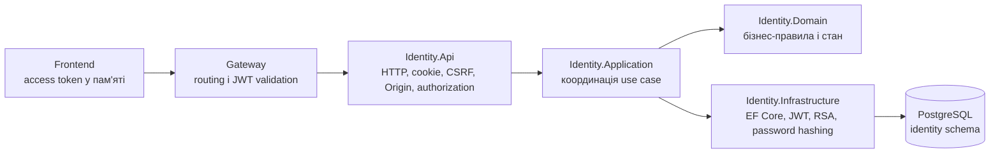
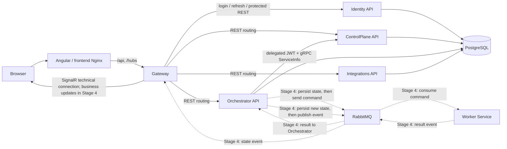
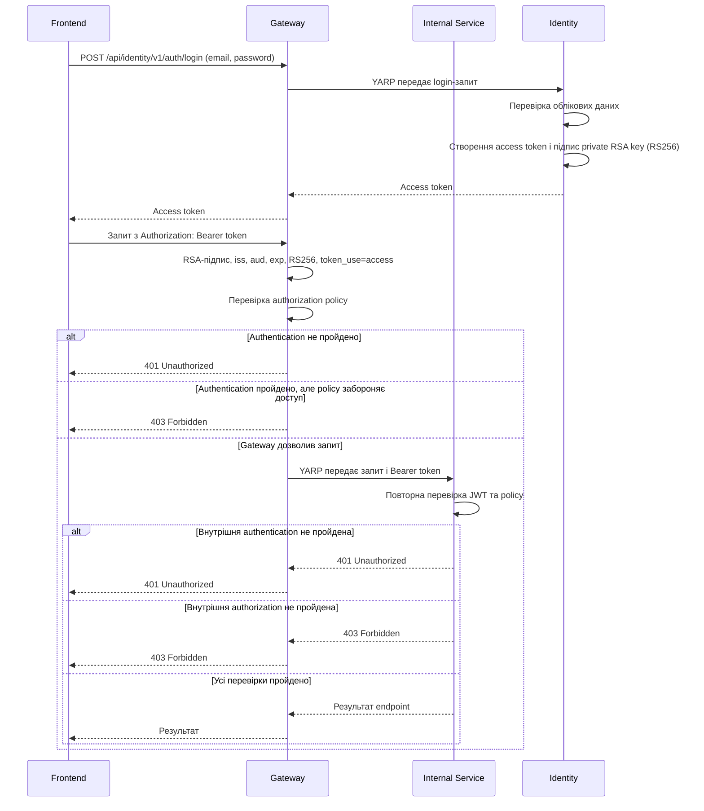

# AiControlCenter

`AiControlCenter` — запланована адміністративна панель для керування
AI-агентами, автоматизаціями, інтеграціями та довготривалими фоновими
операціями.

> Етапи 0–2 реалізують технічний фундамент та Identity/authorization. Пунктирні потоки на схемі
> показують майбутню бізнес-взаємодію Етапу 4, а не наявні Agent/Run сценарії.

## Реалізований фундамент

- .NET 10 solution із Gateway та п'ятьма сервісними межами;
- Clean Architecture project references без міжсервісних залежностей;
- YARP маршрутизація, технічний SignalR hub і `ServiceInfo` gRPC v1;
- EF Core connectivity для чотирьох окремих PostgreSQL схем і ролей;
- RabbitMQ/MassTransit hosts без production messages або consumers;
- Problem Details, correlation ID, JSON logging, OpenTelemetry і health checks;
- Angular 22 shell, Nginx, Docker Compose, тести та CI.

## Реалізована авторизація (Етап 2)

- Admin-created users and fixed `Admin`, `Developer`, `User` roles;
- RSA-signed access JWTs and rotating, hashed refresh-token families;
- CSRF/Origin protection, login throttling and temporary account lockout;
- JWT validation in Gateway and every internal API;
- protected YARP routes, delegated gRPC and authenticated SignalR;
- Angular login, password-change flow, memory-only token store, interceptor
  and route guards;
- one-shot Identity migrations and persistent Development Data Protection
  keys.

# Як система працює під капотом

Ця навігація призначена для розуміння внутрішніх процесів AiControlCenter:
як запит проходить між шарами, де живе стан і які security boundaries
спрацьовують. Інструкції з локального запуску залишаються окремо.

| Розділ | Що пояснює |
| --- | --- |
| [Identity: автентифікація та сесії](docs/identity/authentication-flow.md) | Login, refresh, JWT, refresh-cookie, rotation, CSRF, transactions і row locks |
| [AiControlCenter.Security](docs/security/security-overview.md) | RSA keys, JWT validation, claims, policies і defense in depth |
| [Архітектура сервісів](docs/architecture/service-boundaries.md) | Межі сервісів, data ownership і відповідальність кожного service |
| [Правила залежностей](docs/architecture/dependency-rules.md) | Дозволені project references і межі Clean Architecture layers |
| [Комунікація](docs/architecture/communication.md) | REST, gRPC, SignalR, Gateway, RabbitMQ і Correlation ID |



### Детальніше про цей процес

- [Відповідальність архітектурних шарів](docs/identity/authentication-flow.md#відповідальність-архітектурних-шарів)
- [Повний процес Login](docs/identity/authentication-flow.md#повний-процес-login)
- [Повний процес Refresh](docs/identity/authentication-flow.md#повний-процес-refresh)
- [Основні класи та інтерфейси](docs/identity/authentication-flow.md#основні-класи-та-інтерфейси)
- [Як читати код Login](docs/identity/authentication-flow.md#як-читати-код-login)
- [Як читати код Refresh](docs/identity/authentication-flow.md#як-читати-код-refresh)

## Взаємодія компонентів



### Детальніше про цей процес

- [Межі Gateway та інших сервісів](docs/architecture/service-boundaries.md#gateway)
- [Identity як власник users і sessions](docs/architecture/service-boundaries.md#identity)
- [Data ownership](docs/architecture/service-boundaries.md#data-ownership)
- [Комунікація, реалізована в Етапі 1](docs/architecture/communication.md#implemented-in-stage-1)
- [Authentication-комунікація Етапу 2](docs/architecture/communication.md#implemented-in-stage-2)
- [Correlation ID і межі його propagation](docs/architecture/communication.md#correlation-id)
- [Майбутній асинхронний процес Етапу 4](docs/architecture/communication.md#deferred-until-stage-4)

### Основний маршрут запиту

1. Користувач відкриває Angular-застосунок у браузері.
2. Frontend надсилає API-запити на `/api` і підключається до SignalR через
   `/hubs`.
3. Gateway є єдиною публічною API-точкою та маршрутизує REST-запит до
   потрібного внутрішнього сервісу.
4. Внутрішні сервіси не викликають один одного через Gateway. Для коротких
   синхронних операцій вони використовують прямі gRPC-виклики всередині
   Docker-мережі.

### Відповідальність сервісів

- **Gateway** — зовнішня точка входу, REST-маршрутизація, SignalR та, після
  реалізації авторизації, перевірка доступу.
- **Identity API** — власник користувачів, ролей, password hashes, JWT і
  refresh-token sessions.
- **ControlPlane API** — майбутній власник конфігурації Directions, Agents,
  Workflows і Schedules.
- **Orchestrator API** — майбутній власник стану Runs і координації
  виконання.
- **Worker Service** — майбутнє фонове виконання довготривалих завдань поза
  HTTP-запитом.
- **Integrations API** — ізольований доступ до зовнішніх платформ та API.

### REST і gRPC

REST використовується між frontend і Gateway та для зовнішніх API. gRPC
призначений для короткої синхронної взаємодії між внутрішніми .NET-сервісами,
коли відповідь потрібна одразу.

Основний напрямок — `Orchestrator → ControlPlane`: Orchestrator отримуватиме
конфігурацію агента або workflow з ControlPlane. Довготривалу роботу через gRPC запускати не слід,
оскільки вона не повинна утримувати відкритий HTTP-запит.

### RabbitMQ і MassTransit

RabbitMQ є брокером асинхронних повідомлень, а MassTransit надає .NET-рівень
для надсилання команд, публікації подій, реєстрації consumers, повторних спроб
і health checks.

Майбутній асинхронний сценарій:

1. Orchestrator спочатку фіксує операцію у власній базі.
2. Через MassTransit він надсилає команду в RabbitMQ.
3. Worker отримує команду та виконує завдання у фоні.
4. Worker публікує подію з результатом або помилкою назад у RabbitMQ.
5. Orchestrator отримує результат і спочатку зберігає новий стан.
6. Лише після успішного збереження Orchestrator публікує подію зміни стану.
7. Gateway отримує цю подію та передає оновлення браузеру через SignalR.

RabbitMQ не гарантує, що повідомлення буде доставлене лише один раз, тому
майбутні consumers мають бути ідемпотентними. Для надійних бізнес-операцій
також знадобляться механізми outbox/inbox і дедуплікації.

### SignalR

SignalR використовується тільки для повідомлень у реальному часі: прогресу,
змін статусу та системних сповіщень. Він не є джерелом істини. Після
перепідключення frontend повинен отримати актуальний стан через REST, а
SignalR використовувати для наступних змін.

### PostgreSQL і володіння даними

У Development сервіси можуть використовувати один контейнер PostgreSQL, але
кожен сервіс володіє окремою схемою:

- `identity`;
- `control_plane`;
- `orchestrator`;
- `integrations`.

Сервіс не повинен напряму читати або змінювати таблиці іншого сервісу.
Обмін даними відбувається тільки через versioned REST API, gRPC-контракти або
message contracts. Gateway і Worker не отримують власні схеми, доки не
стають власниками окремих даних.

### Межі архітектурного фундаменту

Етапи 0–1 містять лише transport/configuration foundation: Gateway,
контракти, підключення PostgreSQL і RabbitMQ, MassTransit, технічний SignalR
hub, health checks, логування та Docker Compose. Production message contracts
і consumers для пунктирних потоків ще не створені.

Directions, Agents, Runs, Worker-бізнес-логіка, OpenAI та зовнішні agent
runtimes реалізуються окремими наступними етапами.

## Локальний запуск

Передумови: .NET SDK `10.0.302`, Node.js `24.x`, npm і Docker Compose.

```powershell
Copy-Item .env.example .env
powershell -NoProfile -ExecutionPolicy Bypass -File .\scripts\security\New-IdentityDevelopmentKeys.ps1
# Set IDENTITY_BOOTSTRAP_EMAIL and IDENTITY_BOOTSTRAP_TEMPORARY_PASSWORD in the ignored .env.
dotnet restore .\AiControlCenter.sln
dotnet build .\AiControlCenter.sln --configuration Release --no-restore
dotnet test .\AiControlCenter.sln --configuration Release --no-build

npm.cmd ci --prefix .\frontend\ai-control-center-angular
npm.cmd run build --prefix .\frontend\ai-control-center-angular -- --configuration production

docker compose config
docker compose up --build --detach --wait
docker compose ps
```

Публічна адреса frontend: `http://localhost:8080`. Gateway доступний для
діагностики на `http://localhost:5080`; Swagger сервісів — на портах
`5101`, `5102`, `5104` і `5105`. RabbitMQ Management —
`http://localhost:15672`.

Після роботи:

```powershell
docker compose down
```

`.env` і локальні секрети ігноруються Git. Значення з `.env.example`
призначені лише як безпечні Development placeholders і мають бути замінені.
Деталі ключів, bootstrap, ротації та production Data Protection описані в
`docs/architecture/identity-security.md`.

## Як працює AiControlCenter.Security

### Призначення модуля

`AiControlCenter.Security` — спільний Building Block, який задає однакові правила
перевірки access JWT та authorization policies у Gateway, Identity API,
ControlPlane API, Orchestrator API, Integrations API, SignalR Hub та інших
сервісах, які будуть додані пізніше.

Цей модуль не створює access token. Identity перевіряє облікові дані, створює
JWT і підписує його приватним RSA-ключем. Gateway та внутрішні API отримують
лише публічний RSA-ключ і використовують його для перевірки підпису. Публічний
ключ не дозволяє створити або підписати підроблений токен. Повторна перевірка у
внутрішньому сервісі є частиною defense in depth: сервіс не довіряє запиту лише
тому, що той пройшов через Gateway.

### Загальний процес authentication та authorization



### Детальніше про цей процес

- [Повний процес Login](docs/identity/authentication-flow.md#повний-процес-login)
- [Повний процес Refresh](docs/identity/authentication-flow.md#повний-процес-refresh)
- [Де і як зберігаються токени](docs/identity/authentication-flow.md#де-зберігаються-токени)
- [Ротація refresh-токенів](docs/identity/authentication-flow.md#ротація-refresh-токенів)
- [Транзакції та блокування](docs/identity/authentication-flow.md#транзакції-та-блокування)
- [Як читати код Login](docs/identity/authentication-flow.md#як-читати-код-login)
- [Як читати код Refresh](docs/identity/authentication-flow.md#як-читати-код-refresh)
- [Перевірка JWT у AiControlCenter.Security](docs/security/security-overview.md#перевірка-jwt)
- [Authorization policies](docs/security/security-overview.md#authorization-policies)
- [Defense in depth](docs/security/security-overview.md#defense-in-depth)
