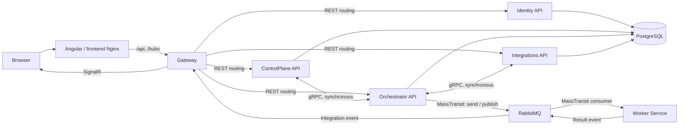

# AiControlCenter

`AiControlCenter` — запланована адміністративна панель для керування
AI-агентами, автоматизаціями, інтеграціями та довготривалими фоновими
операціями.

> Поточний репозиторій перебуває на етапі підготовки. Схема нижче описує
> цільову взаємодію компонентів, а не вже реалізовану функціональність.

## Взаємодія компонентів

### Основний маршрут запиту

1. Користувач відкриває Angular-застосунок у браузері.
2. Frontend надсилає API-запити на `/api` і підключається до SignalR через
   `/hubs`.
3. Gateway є єдиною публічною API-точкою та маршрутизує REST-запит до
   потрібного внутрішнього сервісу.
4. Внутрішні сервіси не викликають один одного через Gateway. Для коротких
   синхронних операцій вони використовують прямі gRPC-виклики всередині
   Docker-мережі.

### Відповідальність сервісів

- **Gateway** — зовнішня точка входу, REST-маршрутизація, SignalR та, після
  реалізації авторизації, перевірка доступу.
- **Identity API** — майбутній власник користувачів, ролей і токенів.
- **ControlPlane API** — майбутній власник конфігурації Directions, Agents,
  Workflows і Schedules.
- **Orchestrator API** — майбутній власник стану Runs і координації
  виконання.
- **Worker Service** — майбутнє фонове виконання довготривалих завдань поза
  HTTP-запитом.
- **Integrations API** — ізольований доступ до зовнішніх платформ та API.

### REST і gRPC

REST використовується між frontend і Gateway та для зовнішніх API. gRPC
призначений для короткої синхронної взаємодії між внутрішніми .NET-сервісами,
коли відповідь потрібна одразу.

Наприклад, ControlPlane зможе синхронно передати Orchestrator необхідну
службову конфігурацію. Довготривалу роботу через gRPC запускати не слід,
оскільки вона не повинна утримувати відкритий HTTP-запит.

### RabbitMQ і MassTransit

RabbitMQ є брокером асинхронних повідомлень, а MassTransit надає .NET-рівень
для надсилання команд, публікації подій, реєстрації consumers, повторних спроб
і health checks.

Майбутній асинхронний сценарій:

1. Orchestrator спочатку фіксує операцію у власній базі.
2. Через MassTransit він надсилає команду в RabbitMQ.
3. Worker отримує команду та виконує завдання у фоні.
4. Worker публікує подію з результатом або помилкою.
5. Orchestrator оновлює стан операції.
6. Gateway отримує подію про зміну стану та передає оновлення браузеру через
   SignalR.

RabbitMQ не гарантує, що повідомлення буде доставлене лише один раз, тому
майбутні consumers мають бути ідемпотентними. Для надійних бізнес-операцій
також знадобляться механізми outbox/inbox і дедуплікації.

### SignalR

SignalR використовується тільки для повідомлень у реальному часі: прогресу,
змін статусу та системних сповіщень. Він не є джерелом істини. Після
перепідключення frontend повинен отримати актуальний стан через REST, а
SignalR використовувати для наступних змін.

### PostgreSQL і володіння даними

У Development сервіси можуть використовувати один контейнер PostgreSQL, але
кожен сервіс володіє окремою схемою:

- `identity`;
- `control_plane`;
- `orchestrator`;
- `integrations`.

Сервіс не повинен напряму читати або змінювати таблиці іншого сервісу.
Обмін даними відбувається тільки через versioned REST API, gRPC-контракти або
message contracts. Gateway і Worker не отримують власні схеми, доки не
стають власниками окремих даних.

### Межі архітектурного фундаменту

На Етапах 0–1 потрібно підготувати лише transport/configuration foundation:
Gateway, контракти, підключення PostgreSQL і RabbitMQ, MassTransit, порожній
SignalR hub, health checks, логування та Docker Compose.

Авторизація, Directions, Agents, Runs, Worker-бізнес-логіка, OpenAI та
зовнішні agent runtimes реалізуються окремими наступними етапами.
