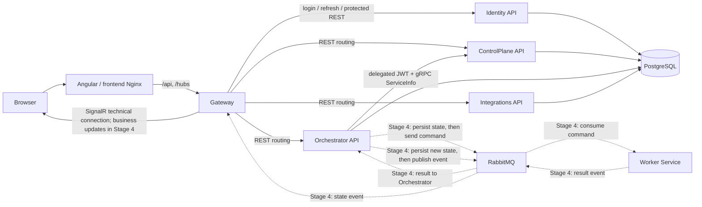
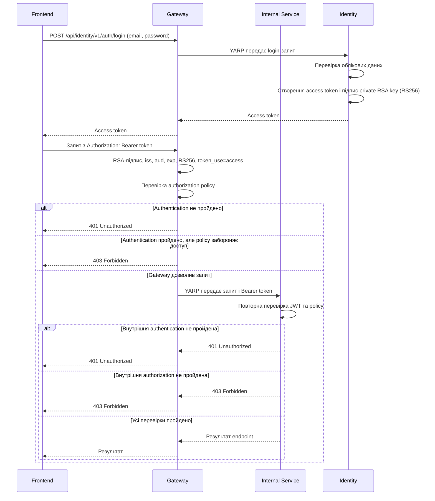

# AiControlCenter

`AiControlCenter` — запланована адміністративна панель для керування
AI-агентами, автоматизаціями, інтеграціями та довготривалими фоновими
операціями.

> Етапи 0–2 реалізують технічний фундамент та Identity/authorization. Пунктирні потоки на схемі
> показують майбутню бізнес-взаємодію Етапу 4, а не наявні Agent/Run сценарії.

## Реалізований фундамент

- .NET 10 solution із Gateway та п'ятьма сервісними межами;
- Clean Architecture project references без міжсервісних залежностей;
- YARP маршрутизація, технічний SignalR hub і `ServiceInfo` gRPC v1;
- EF Core connectivity для чотирьох окремих PostgreSQL схем і ролей;
- RabbitMQ/MassTransit hosts без production messages або consumers;
- Problem Details, correlation ID, JSON logging, OpenTelemetry і health checks;
- Angular 22 shell, Nginx, Docker Compose, тести та CI.

## Реалізована авторизація (Етап 2)

- Admin-created users and fixed `Admin`, `Developer`, `User` roles;
- RSA-signed access JWTs and rotating, hashed refresh-token families;
- CSRF/Origin protection, login throttling and temporary account lockout;
- JWT validation in Gateway and every internal API;
- protected YARP routes, delegated gRPC and authenticated SignalR;
- Angular login, password-change flow, memory-only token store, interceptor
  and route guards;
- one-shot Identity migrations and persistent Development Data Protection
  keys.

## Взаємодія компонентів



### Основний маршрут запиту

1. Користувач відкриває Angular-застосунок у браузері.
2. Frontend надсилає API-запити на `/api` і підключається до SignalR через
   `/hubs`.
3. Gateway є єдиною публічною API-точкою та маршрутизує REST-запит до
   потрібного внутрішнього сервісу.
4. Внутрішні сервіси не викликають один одного через Gateway. Для коротких
   синхронних операцій вони використовують прямі gRPC-виклики всередині
   Docker-мережі.

### Відповідальність сервісів

- **Gateway** — зовнішня точка входу, REST-маршрутизація, SignalR та, після
  реалізації авторизації, перевірка доступу.
- **Identity API** — власник користувачів, ролей, password hashes, JWT і
  refresh-token sessions.
- **ControlPlane API** — майбутній власник конфігурації Directions, Agents,
  Workflows і Schedules.
- **Orchestrator API** — майбутній власник стану Runs і координації
  виконання.
- **Worker Service** — майбутнє фонове виконання довготривалих завдань поза
  HTTP-запитом.
- **Integrations API** — ізольований доступ до зовнішніх платформ та API.

### REST і gRPC

REST використовується між frontend і Gateway та для зовнішніх API. gRPC
призначений для короткої синхронної взаємодії між внутрішніми .NET-сервісами,
коли відповідь потрібна одразу.

Основний напрямок — `Orchestrator → ControlPlane`: Orchestrator отримуватиме
конфігурацію агента або workflow з ControlPlane. Довготривалу роботу через gRPC запускати не слід,
оскільки вона не повинна утримувати відкритий HTTP-запит.

### RabbitMQ і MassTransit

RabbitMQ є брокером асинхронних повідомлень, а MassTransit надає .NET-рівень
для надсилання команд, публікації подій, реєстрації consumers, повторних спроб
і health checks.

Майбутній асинхронний сценарій:

1. Orchestrator спочатку фіксує операцію у власній базі.
2. Через MassTransit він надсилає команду в RabbitMQ.
3. Worker отримує команду та виконує завдання у фоні.
4. Worker публікує подію з результатом або помилкою назад у RabbitMQ.
5. Orchestrator отримує результат і спочатку зберігає новий стан.
6. Лише після успішного збереження Orchestrator публікує подію зміни стану.
7. Gateway отримує цю подію та передає оновлення браузеру через SignalR.

RabbitMQ не гарантує, що повідомлення буде доставлене лише один раз, тому
майбутні consumers мають бути ідемпотентними. Для надійних бізнес-операцій
також знадобляться механізми outbox/inbox і дедуплікації.

### SignalR

SignalR використовується тільки для повідомлень у реальному часі: прогресу,
змін статусу та системних сповіщень. Він не є джерелом істини. Після
перепідключення frontend повинен отримати актуальний стан через REST, а
SignalR використовувати для наступних змін.

### PostgreSQL і володіння даними

У Development сервіси можуть використовувати один контейнер PostgreSQL, але
кожен сервіс володіє окремою схемою:

- `identity`;
- `control_plane`;
- `orchestrator`;
- `integrations`.

Сервіс не повинен напряму читати або змінювати таблиці іншого сервісу.
Обмін даними відбувається тільки через versioned REST API, gRPC-контракти або
message contracts. Gateway і Worker не отримують власні схеми, доки не
стають власниками окремих даних.

### Межі архітектурного фундаменту

Етапи 0–1 містять лише transport/configuration foundation: Gateway,
контракти, підключення PostgreSQL і RabbitMQ, MassTransit, технічний SignalR
hub, health checks, логування та Docker Compose. Production message contracts
і consumers для пунктирних потоків ще не створені.

Directions, Agents, Runs, Worker-бізнес-логіка, OpenAI та зовнішні agent
runtimes реалізуються окремими наступними етапами.

## Локальний запуск

Передумови: .NET SDK `10.0.302`, Node.js `24.x`, npm і Docker Compose.

```powershell
Copy-Item .env.example .env
powershell -NoProfile -ExecutionPolicy Bypass -File .\scripts\security\New-IdentityDevelopmentKeys.ps1
# Set IDENTITY_BOOTSTRAP_EMAIL and IDENTITY_BOOTSTRAP_TEMPORARY_PASSWORD in the ignored .env.
dotnet restore .\AiControlCenter.sln
dotnet build .\AiControlCenter.sln --configuration Release --no-restore
dotnet test .\AiControlCenter.sln --configuration Release --no-build

npm.cmd ci --prefix .\frontend\ai-control-center-angular
npm.cmd run build --prefix .\frontend\ai-control-center-angular -- --configuration production

docker compose config
docker compose up --build --detach --wait
docker compose ps
```

Публічна адреса frontend: `http://localhost:8080`. Gateway доступний для
діагностики на `http://localhost:5080`; Swagger сервісів — на портах
`5101`, `5102`, `5104` і `5105`. RabbitMQ Management —
`http://localhost:15672`.

Після роботи:

```powershell
docker compose down
```

`.env` і локальні секрети ігноруються Git. Значення з `.env.example`
призначені лише як безпечні Development placeholders і мають бути замінені.
Деталі ключів, bootstrap, ротації та production Data Protection описані в
`docs/architecture/identity-security.md`.

## Як працює AiControlCenter.Security

### Призначення модуля

`AiControlCenter.Security` — спільний Building Block, який задає однакові правила
перевірки access JWT та authorization policies у Gateway, Identity API,
ControlPlane API, Orchestrator API, Integrations API, SignalR Hub та інших
сервісах, які будуть додані пізніше.

Цей модуль не створює access token. Identity перевіряє облікові дані, створює
JWT і підписує його приватним RSA-ключем. Gateway та внутрішні API отримують
лише публічний RSA-ключ і використовують його для перевірки підпису. Публічний
ключ не дозволяє створити або підписати підроблений токен. Повторна перевірка у
внутрішньому сервісі є частиною defense in depth: сервіс не довіряє запиту лише
тому, що той пройшов через Gateway.

### Загальний процес authentication та authorization



### Authentication та Authorization

Authentication — хто користувач і чи справжній його токен.

Authorization — що цьому користувачу дозволено робити.

| Ситуація                                | Результат            |
| --------------------------------------- | -------------------- |
| Токен відсутній                         | 401 Unauthorized     |
| Токен пошкоджений або підроблений       | 401 Unauthorized     |
| Токен прострочений                      | 401 Unauthorized     |
| Неправильний issuer/audience            | 401 Unauthorized     |
| `token_use` не дорівнює `access`        | 401 Unauthorized     |
| Токен правильний, але роль не підходить | 403 Forbidden        |
| Потрібно змінити тимчасовий пароль      | 403 Forbidden        |
| Усі перевірки пройдено                  | Виконується endpoint |

### Claims

- `sub` — стабільний ідентифікатор користувача; він також використовується як
  `NameClaimType`.
- `role` — роль користувача. Для кількох ролей Identity додає claim кілька
  разів, а authorization policies використовують його як `RoleClaimType`.
- `token_use` — тип токена. Поточна валідація приймає лише значення `access`.
- `pwd_change_required` — ознака того, що користувач ще повинен змінити
  тимчасовий пароль.
- `iss` — issuer, тобто сервіс, який видав токен.
- `aud` — audience, для якої токен призначено.
- `exp` — Unix-час завершення дії токена.

Приклад payload без реальних ідентифікаторів або секретів; значення `aud`
відповідає поточній конфігурації:

```json
{
  "sub": "user-id",
  "role": "Admin",
  "token_use": "access",
  "pwd_change_required": "false",
  "iss": "AiControlCenter.Identity",
  "aud": "aicontrolcenter-api",
  "exp": 0000000000
}
```

Identity також додає стандартні `jti`, `iat` і `nbf`. Клас
`SecurityClaimNames` зберігає узгоджені назви custom claims, щоб різні сервіси
не використовували відмінні рядки або назви з помилками. Важлива деталь:
`SecurityClaimNames.AccessTokenUse` містить значення `"access"`, а не назву
окремого claim; назвою claim є `SecurityClaimNames.TokenUse`, тобто
`"token_use"`.

### Authorization policies

| Policy             | Кому дозволено доступ |
| ------------------ | --------------------- |
| `AdminOnly`        | Лише ролі `Admin` |
| `AdminOrDeveloper` | Ролям `Admin` або `Developer` |
| `AnyPlatformUser`  | Ролям `Admin`, `Developer` або `User` |
| `PasswordChanged`  | Authenticated user, у якого `pwd_change_required` не дорівнює `"true"` |

`AnyPlatformUser` не тотожна простій authentication: вона додатково вимагає
одну з трьох відомих платформних ролей. `PasswordChanged` пропускає токен, якщо
claim відсутній або має інше значення, ніж `"true"`.

Декілька policies на одному endpoint об'єднуються через `AND`: мають пройти
всі вимоги.

```csharp
app.MapPost("/users", CreateUser)
    .RequirePlatformAuthorization(SecurityPolicyNames.AdminOnly)
    .RequirePlatformAuthorization(SecurityPolicyNames.PasswordChanged);
```

Це означає:

```text
користувач повинен бути Admin
AND
користувач повинен змінити тимчасовий пароль
```

Точніше, друга умова означає, що тимчасовий пароль уже змінено і claim
`pwd_change_required` більше не має значення `"true"`.

### PlatformAuthenticationOptions

Налаштування читаються із секції `Authentication`.

| Параметр          | Призначення |
| ----------------- | ----------- |
| `Issuer`          | Очікуване значення `iss`; має збігатися з issuer у Identity |
| `Audience`        | Очікуване значення `aud`; визначає цільову платформу/API |
| `PublicKeyPath`   | Шлях до PEM-файлу публічного RSA-ключа для перевірки підпису |
| `KeyId`           | Ідентифікатор ключа для зіставлення з `kid` та майбутньої ротації RSA-ключів |
| `ClockSkewSeconds`| Допустима різниця системного часу між сервісами |

Відсутність `Issuer`, `Audience`, `PublicKeyPath` або `KeyId` зупиняє запуск
сервісу. Публічний ключ читається та імпортується під час запуску; відсутній
файл також є помилкою запуску. `ClockSkewSeconds` компенсує невелику різницю
часу між сервісами, а поточна реалізація дозволяє значення лише від 0 до 30
секунд включно. `KeyId` ідентифікує RSA-ключ і створює основу для його
майбутньої ротації.

### Перевірки JWT

`AddPlatformAuthentication` створює `TokenValidationParameters` з такими
правилами:

| Параметр | Що перевіряє або налаштовує |
| -------- | --------------------------- |
| `ValidateIssuerSigningKey` | Вимагає перевірки підпису за налаштованим публічним RSA-ключем |
| `ValidateIssuer` | Перевіряє, що `iss` дорівнює налаштованому `Issuer` |
| `ValidateAudience` | Перевіряє, що `aud` дорівнює налаштованому `Audience` |
| `ValidateLifetime` | Перевіряє часові межі токена, зокрема `exp` і `nbf` |
| `RequireExpirationTime` | Відхиляє токен без `exp` |
| `RequireSignedTokens` | Відхиляє непідписаний токен |
| `ClockSkew` | Додає налаштований допуск до часових перевірок |
| `NameClaimType` | Встановлює `sub` як claim ідентичності користувача |
| `RoleClaimType` | Встановлює `role` як джерело ролей для policies |
| `ValidAlgorithms` | Дозволяє лише `RS256` (`RsaSha256`) |

Після стандартної валідації `OnTokenValidated` окремо перевіряє наявність
`token_use=access`. Тому refresh token або токен іншого типу не можна
використати як Bearer access token.

```csharp
options.MapInboundClaims = false;
```

Це залишає короткі назви claims — `sub`, `role`, `token_use` — без
перетворення на довгі Microsoft URI-назви. Завдяки цьому Identity, Gateway і
внутрішні API працюють з однаковими назвами.

### FallbackPolicy: закрито за замовчуванням

`FallbackPolicy` вимагає authenticated user для будь-якого endpoint, який не
має інших authorization-метаданих. Тому новий endpoint автоматично стає
protected, і програміст не повинен покладатися лише на вручну доданий
`.RequireAuthorization()`. Публічний endpoint потрібно явно позначити
`.AllowAnonymous()`. Маршрути `/health/live` і `/health/ready` залишаються
анонімними, щоб Docker та системи моніторингу могли перевіряти стан сервісу.

```csharp
app.MapGet("/profile", GetProfile); // protected через FallbackPolicy
app.MapGet("/public-info", GetPublicInfo).AllowAnonymous();
```

### SignalR

Звичайний REST-запит передає JWT у заголовку `Authorization: Bearer <token>`.
Під час browser SignalR WebSocket-з'єднання клієнт може передати його як
`access_token` у query string. Обробник `OnMessageReceived` приймає query token
тільки для шляху `/hubs/system`; для інших маршрутів цей механізм не працює.
Після отримання token проходить ті самі перевірки RSA-підпису, issuer,
audience, lifetime, алгоритму, `token_use` та SignalR policy.

У production потрібні HTTPS/WSS. Access token не можна записувати в логи, а
query string слід приховувати або фільтрувати на кожному рівні логування.
Angular зберігає access token тільки в оперативній пам'яті через
`AccessTokenStore`, а не в `localStorage` чи `sessionStorage`.

### Повний алгоритм одного запиту

1. Angular отримує access token після login або refresh.
2. Token залишається тільки в оперативній пам'яті.
3. Interceptor додає заголовок `Authorization: Bearer <token>` до same-origin
   protected-запиту.
4. Nginx передає запит до Gateway.
5. Authentication middleware Gateway перевіряє JWT.
6. Authorization middleware перевіряє policies маршруту або endpoint.
7. YARP передає запит і Bearer token внутрішньому API.
8. Внутрішній API повторно перевіряє JWT і власні policies.
9. Endpoint виконується або повертається `401 Unauthorized` чи
   `403 Forbidden`.
10. Після завершення access token Angular виконує контрольований refresh через
    Identity. Поточний interceptor реагує на `401`, робить одну refresh-спробу
    та повторює початковий запит не більше одного разу.

CSRF-захист використовується для cookie-based операцій refresh і logout:
refresh token передається в `HttpOnly` cookie, а запит додатково проходить
antiforgery та Origin-перевірки. `AiControlCenter.Security` переважно відповідає
за Bearer access token, а не за життєвий цикл refresh cookie.

### Межі відповідальності

| Компонент                | Відповідальність                                                 |
| ------------------------ | ---------------------------------------------------------------- |
| Identity                 | Login, паролі, створення й підпис access token, refresh sessions |
| AiControlCenter.Security | Єдина конфігурація JWT validation і authorization policies       |
| Gateway                  | Публічна точка входу, перша перевірка token, YARP                |
| Internal Service         | Повторна перевірка token і власних policies                      |
| Angular                  | Memory-only access token, interceptor, guards                    |
| PostgreSQL               | Користувачі, ролі та hashes refresh token                        |
| Data Protection          | Захист antiforgery та cookie-related keys                        |
