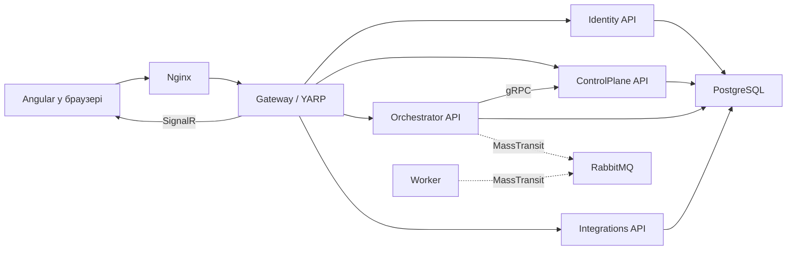

# AiControlCenter

AiControlCenter — платформа з вебінтерфейсом і набором ізольованих .NET-сервісів. Поточна реалізація надає захищений вхід, керування користувачами та сесіями, єдину точку входу через Gateway, технічні health/service-info перевірки, gRPC-зв’язок і SignalR Ping.

## Що вже працює

- Identity: login, refresh із ротацією, logout, зміна пароля, ролі та адміністративне керування користувачами.
- Gateway: перевірка JWT, authorization policies, YARP-проксіювання та SignalR Hub.
- ControlPlane, Orchestrator та Integrations: ізольовані API, health checks і власні PostgreSQL-схеми; бізнес-функції ще не додані.
- Orchestrator → ControlPlane: захищений технічний gRPC-виклик.
- Worker і RabbitMQ/MassTransit: підготовлений транспортний каркас без бізнес-повідомлень та consumers.
- Angular: login, відновлення сесії, memory-only access token, guards, interceptor, зміна пароля та SignalR-статус.

## Архітектура



### Детальніше про цей процес

- [Синхронні запити](docs/architecture/communication.md#синхронні-запити)
- [RabbitMQ і MassTransit](docs/architecture/communication.md#rabbitmq-і-masstransit)
- [SignalR](docs/architecture/communication.md#signalr)
- [Власність даних](docs/architecture/service-boundaries.md#власність-даних)
- [Розподіл RSA-ключів](docs/security/security-overview.md#розподіл-rsa-ключів)

Суцільні стрілки показують наявні запити. Пунктиром позначено налаштований транспорт RabbitMQ: бізнес-контрактів і consumers у ньому зараз немає. Gateway передає Bearer token до внутрішніх API, а кожен захищений API повторно перевіряє його.

## Структура репозиторію

```text
src/BuildingBlocks/   спільні технічні контракти, observability і security
src/Gateway/          публічна точка входу, YARP і SignalR
src/Services/         Identity, ControlPlane, Orchestrator, Integrations, Worker
frontend/             Angular SPA та Nginx
tests/                architecture, unit та integration tests
docs/                 архітектурні рішення й докладні процеси
scripts/security/     утиліта генерації RSA-ключів
```

## Quick Start

Потрібні .NET 10 SDK, Node.js LTS, npm і Docker Desktop із Linux Engine.

```powershell
dotnet restore .\AiControlCenter.sln
dotnet build .\AiControlCenter.sln --configuration Release --no-restore
dotnet test .\AiControlCenter.sln --configuration Release --no-build
npm.cmd ci --prefix .\frontend\ai-control-center-angular
npm.cmd run build --prefix .\frontend\ai-control-center-angular -- --configuration production
docker compose up --build --detach --wait
docker compose ps
docker compose down
```

Перед запуском скопіюйте `.env.example` у `.env` і заповніть локальні значення. Не додавайте `.env`, refresh/access tokens або приватні RSA-ключі до Git.

## Навігація за компонентами

- [Building Blocks](src/BuildingBlocks/README.md): [Contracts](src/BuildingBlocks/AiControlCenter.Contracts/README.md), [gRPC Contracts](src/BuildingBlocks/AiControlCenter.Grpc.Contracts/README.md), [Observability](src/BuildingBlocks/AiControlCenter.Observability/README.md), [Security](src/BuildingBlocks/AiControlCenter.Security/README.md).
- [Gateway](src/Gateway/AiControlCenter.Gateway/README.md).
- [Identity](src/Services/Identity/README.md): [Api](src/Services/Identity/AiControlCenter.Identity.Api/README.md), [Application](src/Services/Identity/AiControlCenter.Identity.Application/README.md), [Domain](src/Services/Identity/AiControlCenter.Identity.Domain/README.md), [Infrastructure](src/Services/Identity/AiControlCenter.Identity.Infrastructure/README.md).
- [ControlPlane](src/Services/ControlPlane/README.md): [Api](src/Services/ControlPlane/AiControlCenter.ControlPlane.Api/README.md), [Application](src/Services/ControlPlane/AiControlCenter.ControlPlane.Application/README.md), [Domain](src/Services/ControlPlane/AiControlCenter.ControlPlane.Domain/README.md), [Infrastructure](src/Services/ControlPlane/AiControlCenter.ControlPlane.Infrastructure/README.md).
- [Orchestrator](src/Services/Orchestrator/README.md): [Api](src/Services/Orchestrator/AiControlCenter.Orchestrator.Api/README.md), [Application](src/Services/Orchestrator/AiControlCenter.Orchestrator.Application/README.md), [Domain](src/Services/Orchestrator/AiControlCenter.Orchestrator.Domain/README.md), [Infrastructure](src/Services/Orchestrator/AiControlCenter.Orchestrator.Infrastructure/README.md).
- [Integrations](src/Services/Integrations/README.md): [Api](src/Services/Integrations/AiControlCenter.Integrations.Api/README.md), [Application](src/Services/Integrations/AiControlCenter.Integrations.Application/README.md), [Infrastructure](src/Services/Integrations/AiControlCenter.Integrations.Infrastructure/README.md).
- [Worker](src/Services/Worker/AiControlCenter.Worker.Service/README.md).
- [Frontend](frontend/ai-control-center-angular/README.md).
- [Tests](tests/README.md): [Architecture](tests/Architecture/AiControlCenter.ArchitectureTests/README.md), [Building Blocks unit](tests/Unit/AiControlCenter.BuildingBlocks.UnitTests/README.md), [Identity unit](tests/Unit/AiControlCenter.Identity.UnitTests/README.md), [Gateway integration](tests/Integration/AiControlCenter.Gateway.IntegrationTests/README.md), [Services integration](tests/Integration/AiControlCenter.Services.IntegrationTests/README.md).
- [RSA key generator](scripts/security/IdentityKeyGenerator/README.md).

## Докладна документація

- [Межі сервісів](docs/architecture/service-boundaries.md)
- [Правила залежностей](docs/architecture/dependency-rules.md)
- [Способи взаємодії](docs/architecture/communication.md)
- [Безпека Identity](docs/architecture/identity-security.md)
- [Login, refresh і зберігання токенів](docs/identity/authentication-flow.md)
- [AiControlCenter.Security](docs/security/security-overview.md)
- [ADR: first-party session protocol](docs/architecture/adr/0001-first-party-session-protocol.md)
