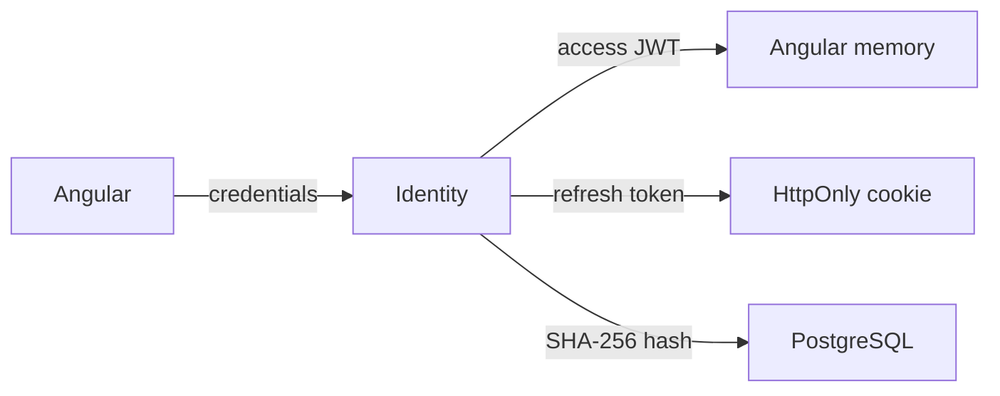

# ADR 0001: Закритий first-party session protocol

- Status: Accepted
- Date: 2026-08-03
- Scope: Identity та authorization для довіреного Angular-клієнта

## Контекст

AiControlCenter має один trusted Angular client, який обслуговується через той самий frontend Nginx і Gateway. Third-party clients, federation та external delegated authorization requirements відсутні.

## Рішення

Identity реалізує закритий first-party session protocol, а не OAuth/OpenID Connect authorization server.

- Angular надсилає credentials лише до versioned Identity login endpoint.
- Identity повертає RSA-signed access JWT із lifetime не більше десяти хвилин.
- Access token зберігається лише в Angular memory.
- Identity передає rotating opaque refresh token у HttpOnly, SameSite=Strict cookie і зберігає лише його SHA-256 hash.
- Refresh reuse відкликає всю стабільну `RefreshSession`.
- Gateway і кожен internal API перевіряють issuer, audience, RSA signature, algorithm, expiration і token-use claim.
- Public registration не підтримується; users створюють лише Admins.

## Наслідки й обмеження

Протокол обмежений одним first-party browser client. Його не можна представляти як OAuth/OIDC, використовувати для third-party consent або розширювати ad-hoc grants. Logout, blocking і role changes можуть залишити вже виданий access token валідним до його короткого expiration.

Якщо з’являться external, mobile або independently operated clients, протокол слід замінити на OpenIddict чи інший reviewed OIDC provider з Authorization Code + PKCE. Custom password/token endpoints не повинні ставати general authorization server.

[Authentication flow](../../identity/authentication-flow.md) · [Identity security](../identity-security.md)
