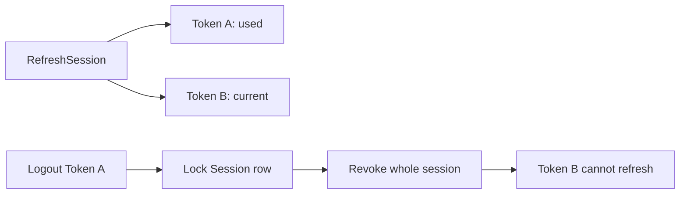

# ADR 0002: RefreshSession як стабільний session aggregate

- Status: Accepted
- Date: 2026-08-23
- Scope: Identity refresh sessions

## Контекст

Окремі rotating refresh-token rows не є стабільною точкою синхронізації. Після
rotation браузер може виконати logout старим token, тоді як replacement token
залишиться активним. Token family описує послідовність token-ів, але не має
власного row, який можна заблокувати незалежно від поточного token.

## Рішення

Кожен успішний login створює окремий `RefreshSession`. Її `Id` є стабільним
ідентифікатором login session, а refresh tokens належать цій session.

- `RefreshSession` зберігає owner, absolute expiration, last-use і revocation
  state, optional client metadata та PostgreSQL concurrency token.
- У БД зберігається лише SHA-256 hash opaque refresh token.
- Session row блокується `FOR UPDATE` перед refresh, logout або replay handling.
- Logout з будь-яким відомим token відкликає всю session.
- Replay rotated token відкликає всю session.
- В active session може існувати лише один current token; цей invariant
  серіалізується блокуванням стабільного session row і транзакцією.
- Partial unique index тут навмисно не використовується: через посилання на
  replacement token порядок `INSERT`/`UPDATE` створив би короткочасне порушення
  індексу всередині коректної транзакції.
- Існуючий `family_id` переноситься у `RefreshSession.Id`, тому migration не
  втрачає active або historical token records.

Migration legacy `family_id` виконує fail-fast preflight до створення таблиці
або зміни token rows. Підтримуваний legacy-стан — рівно один лінійний chain на
family з одним terminal token. Preflight зупиняє migration, якщо:

- одна family належить кільком `user_id`;
- replacement відсутній, посилається на самого себе, іншого user або іншу
  family;
- source replacement edge не має `revoked_at`, стану `Rotated` або узгодженого
  rotation timestamp;
- кілька source tokens посилаються на один replacement;
- recursive CTE знаходить cycle будь-якої довжини;
- family має не один terminal token, disconnected chains або більше одного
  current token (`revoked_at IS NULL` і `replaced_by_token_id IS NULL`);
- token lifecycle timestamps/reason суперечливі;
- `expires_at` не однаковий для всіх token rows family.

Legacy production rotation передавала replacement незмінний absolute
expiration поточного token, тому різні `expires_at` не нормалізуються. Після
перевірки migration переносить цей однаковий boundary через `MIN(expires_at)` і
ніколи не подовжує session. Для однозначного linear chain `Down()` відновлює
hashes, timestamps, replacement links і terminal revocation reason без втрати.
PostgreSQL виконує migration у транзакції, тому exception залишає legacy schema
й дані незмінними; повідомлення не містять token hashes або інших sensitive
values.

## Наслідки

Refresh, logout і replay конкурують за один стабільний row. Token history
залишається доступною для replay detection та аудиту. Session revocation не
відкликає вже видані stateless access JWT; їхнє окреме bounded lifetime описане
в ADR 0004.

[Authentication flow](../../identity/authentication-flow.md) · [Identity security](../identity-security.md)
