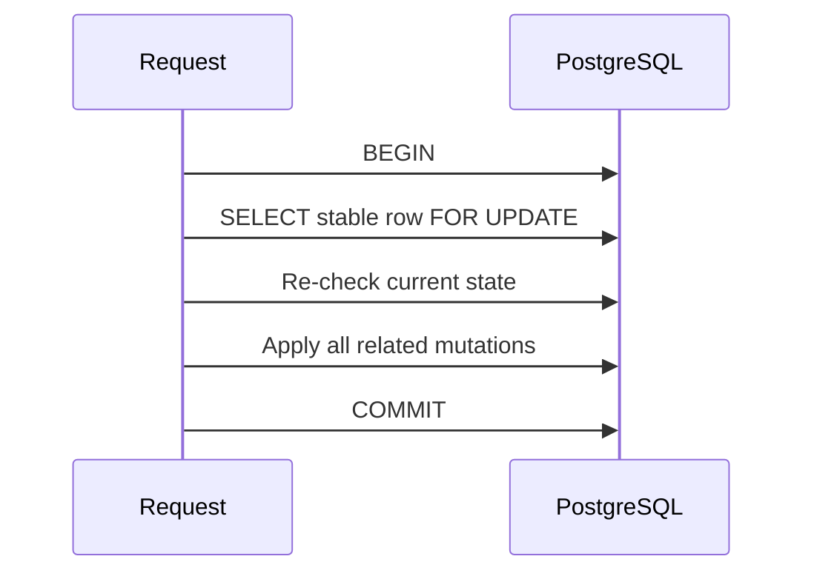

# ADR 0003: Concurrency rules для Identity

- Status: Accepted
- Date: 2026-08-23
- Scope: Refresh, logout, replay, login та password operations

## Контекст

Optimistic concurrency корисна для виявлення конфліктів, але сама по собі не
гарантує коректний security outcome. Lost failed-login increments послаблюють
lockout, а розділені password update і session revocation створюють частково
виконані операції.

## Рішення

- Refresh, logout і replay спочатку знаходять session через token hash, потім
  блокують стабільний `RefreshSession` row `FOR UPDATE` і повторно читають token
  state в тій самій транзакції.
- Refresh rotation, session state і replacement token commit-яться разом.
- Logout повертає `204` лише після commit; already-revoked session є idempotent
  success.
- Failed login використовує один atomic PostgreSQL update, який збільшує
  `access_failed_count` і встановлює `lockout_end` при досягненні limit.
- Password verification не виконується під довгим row lock. Успішний login
  коротко блокує user row, повторно перевіряє актуальний status/lockout і
  атомарно скидає failure state разом зі створенням session.
- Change/reset password блокують user row і в одній транзакції змінюють password
  state та відкликають усі active refresh sessions.
- Очікувані authentication conflicts не перетворюються на HTTP 500.

## Наслідки

Locks короткі й охоплюють лише database mutation window. Tests синхронізують
конкурентні операції через контрольовані locks/barriers, а не випадкові delays.
Refresh tests ставлять test-only `DbCommandInterceptor` безпосередньо на
production `SELECT refresh_sessions ... FOR UPDATE`. Interceptor фіксує PID
обох Npgsql connections і той самий `session_id`, після чого пропускає другий
command у PostgreSQL. Третя observer connection вимагає
`wait_event_type = 'Lock'` та наявність PID першої transaction у
`pg_blocking_pids(second_pid)`. Лише після цього test звільняє перший reader;
усі очікування мають bounded timeout із PID/state/wait diagnostics.

Failed-login test використовує statement-level PostgreSQL advisory barrier
перед production `UPDATE identity.users ... RETURNING` і доводить одночасну
присутність усіх десяти запитів у critical section. Production test hooks для
цього не додаються.

[RefreshSession aggregate](0002-refresh-session-aggregate.md) · [Authentication flow](../../identity/authentication-flow.md)
