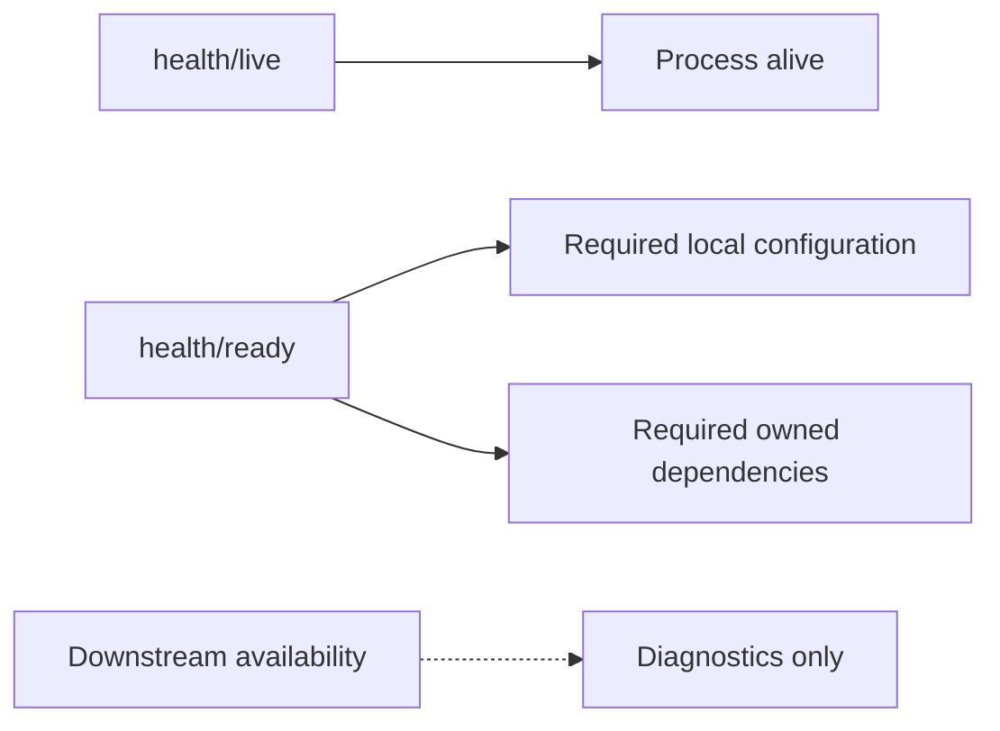

# ADR 0005: Liveness, readiness і dependency health

- Status: Accepted
- Date: 2026-08-23
- Scope: Service health endpoints і Docker health checks

## Контекст

Liveness та readiness мають різні operational наслідки. Якщо Gateway readiness
залежить від кожного downstream, падіння одного service може вивести всі
Gateway instances із балансування. Водночас порожній readiness report не
доводить, що YARP configuration успішно завантажена.

## Рішення

- `/health/live` перевіряє лише працездатність процесу.
- `/health/ready` перевіряє залежності, без яких конкретний service не може
  виконувати основну відповідальність.
- Identity readiness перевіряє PostgreSQL; RSA/JWT configuration є startup
  invariant і валідовується fail-fast.
- Orchestrator readiness реєструє PostgreSQL та health check MassTransit bus.
  Технічний gRPC `ServiceInfo` ControlPlane не є readiness dependency.
- Gateway readiness перевіряє, що YARP configuration завантажена і містить
  валідні routes/clusters. Поточна доступність destinations не впливає на
  Gateway readiness.
- Downstream health може публікуватися окремо для observability, але не керує
  restart або load-balancer readiness Gateway.

## Наслідки

Health tests перевіряють зміст reports, а не лише HTTP 200. Docker використовує
endpoint, що відповідає operational ролі контейнера, без каскадного restart при
частковій відмові платформи.

Негативні integration tests перевіряють конкретні registrations: invalid YARP
route/cluster робить `yarp-configuration` unhealthy, недоступний PostgreSQL —
`identity-database` unhealthy. Для RabbitMQ перевірено startup Orchestrator із
broker endpoint, який від початку недоступний: MassTransit bus registration є
unhealthy при здоровому `orchestrator-database`.

Runtime-перехід після втрати вже встановленого RabbitMQ connection, час зміни
стану та reconnect semantics окремим відтворюваним test поки не перевірені.
Отже ADR не стверджує, що readiness гарантовано й негайно відображає кожен
runtime disconnect; це залишається verification gap.

[Communication](../communication.md) · [Service boundaries](../service-boundaries.md)
