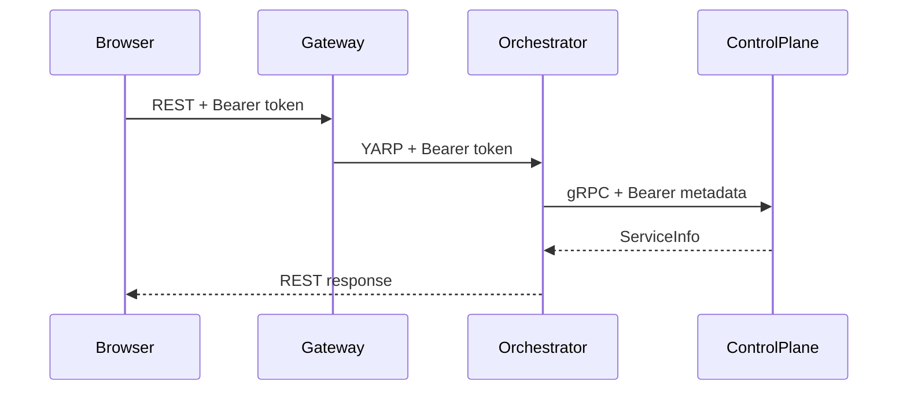
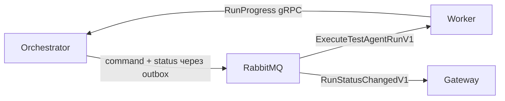

# Взаємодія компонентів

## Синхронні запити

- Браузер звертається до frontend Nginx, який обслуговує Angular SPA і проксіює `/api` та `/hubs` у Gateway.
- Gateway маршрутизує REST через YARP до Identity, ControlPlane, Orchestrator та Integrations.
- Gateway передає delegated Bearer token; кожен внутрішній API повторно перевіряє JWT і власні policies.
- Angular працює з Directions через `/api/control-plane/v1/directions`; YARP знімає prefix `/api/control-plane` і передає запит до ControlPlane `/v1/directions` разом із Bearer token.
- Orchestrator викликає versioned `ServiceInfo` і `AgentCatalog.GetRunnableAgent` ControlPlane напряму через HTTP/2 gRPC за Docker DNS і передає Bearer token у metadata.

## RabbitMQ і MassTransit

Orchestrator атомарно записує `AgentRun` і `ExecuteTestAgentRunV1`/`RunStatusChangedV1` через EF transactional bus outbox. Worker споживає command зі стабільної черги, виконує bounded Test workflow і повертає progress через gRPC. Доставка at least once; повтори нейтралізуються stable message ID, row lock та idempotent transitions.

Докладно: [Agents, Runs і Worker](agents-runs-worker.md#запуск-і-transactional-outbox).

## SignalR

Gateway надає `/hubs/system` із технічним методом `Ping`. Hub потребує валідного access token і `PasswordChanged`. Angular передає token через `accessTokenFactory`; SignalR використовує `access_token` query parameter для WebSocket, який Security приймає лише на цьому Hub path.

`SystemHub` розміщений безпосередньо в процесі Gateway: Nginx проксіює `/hubs/system`
до Gateway, а Gateway завершує SignalR/WebSocket-з'єднання сам. Цей шлях не проходить
через YARP і не має downstream service. Тому інтеграційна перевірка через справжній
Kestrel/WebSocket transport доводить роботу Gateway hub, JWT extraction та policy,
але не перевіряє YARP forwarding.

Для Run events Gateway додає не-Admin connection лише до групи власника з JWT `sub`, а Admin connection — лише до загальної admin-групи. Memberships взаємовиключні, тому Admin-власник не отримує одну подію через дві групи; клієнт ними не керує. Після event або reconnect Angular перечитує REST; stale/duplicate revisions ігноруються.

## Correlation ID

`CorrelationIdMiddleware` приймає trimmed `X-Correlation-ID` довжиною до 128 символів без control characters. Інакше використовується ASP.NET Core `TraceIdentifier`. Обране значення записується у response header, `HttpContext.TraceIdentifier` та logging scope як `CorrelationId`.

Окремого outgoing HTTP/gRPC propagator немає. End-to-end значення зберігається, лише якщо caller надіслав валідний header і transport передав його далі; без нього кожен service може створити власний локальний trace ID.

[Головний README](../../README.md) · [Межі сервісів](service-boundaries.md) · [gRPC contracts](../../src/BuildingBlocks/AiControlCenter.Grpc.Contracts/README.md)
