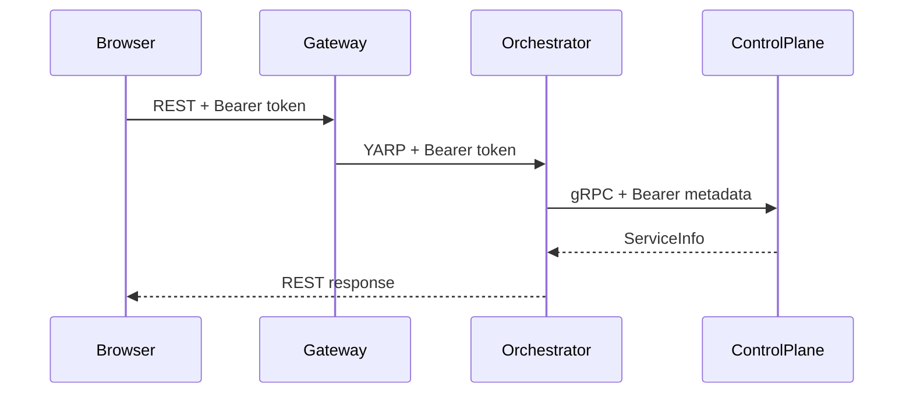
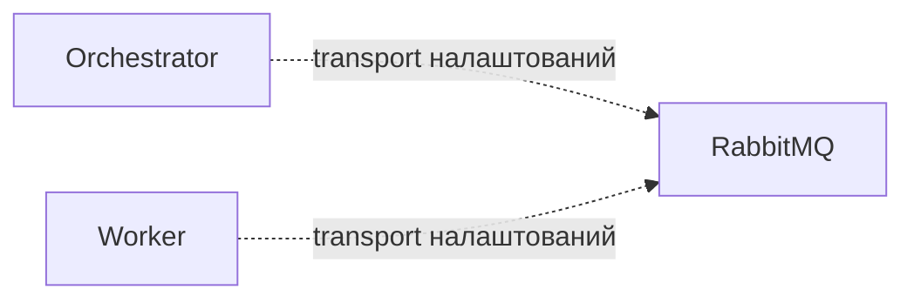

# Взаємодія компонентів

## Синхронні запити

- Браузер звертається до frontend Nginx, який обслуговує Angular SPA і проксіює `/api` та `/hubs` у Gateway.
- Gateway маршрутизує REST через YARP до Identity, ControlPlane, Orchestrator та Integrations.
- Gateway передає delegated Bearer token; кожен внутрішній API повторно перевіряє JWT і власні policies.
- Orchestrator викликає versioned `ServiceInfo` ControlPlane напряму через HTTP/2 gRPC за Docker DNS і передає Bearer token у metadata.

## RabbitMQ і MassTransit

Orchestrator та Worker реєструють MassTransit buses, RabbitMQ transport і readiness checks. Production messages, queues, consumers, outbox/inbox та бізнес-процес виконання робіт у коді відсутні. Integration test використовує окремий test-only contract лише для перевірки publish/consume transport.

Пунктир означає доступний технічний канал, а не реалізований message flow. gRPC не використовується для перевірки Worker; стан bus/queue спостерігається через RabbitMQ, MassTransit health і telemetry.

## SignalR

Gateway надає `/hubs/system` із технічним методом `Ping`. Hub потребує валідного access token і `PasswordChanged`. Angular передає token через `accessTokenFactory`; SignalR використовує `access_token` query parameter для WebSocket, який Security приймає лише на цьому Hub path.

## Correlation ID

`CorrelationIdMiddleware` приймає trimmed `X-Correlation-ID` довжиною до 128 символів без control characters. Інакше використовується ASP.NET Core `TraceIdentifier`. Обране значення записується у response header, `HttpContext.TraceIdentifier` та logging scope як `CorrelationId`.

Окремого outgoing HTTP/gRPC propagator немає. End-to-end значення зберігається, лише якщо caller надіслав валідний header і transport передав його далі; без нього кожен service може створити власний локальний trace ID.

[Головний README](../../README.md) · [Межі сервісів](service-boundaries.md) · [gRPC contracts](../../src/BuildingBlocks/AiControlCenter.Grpc.Contracts/README.md)
