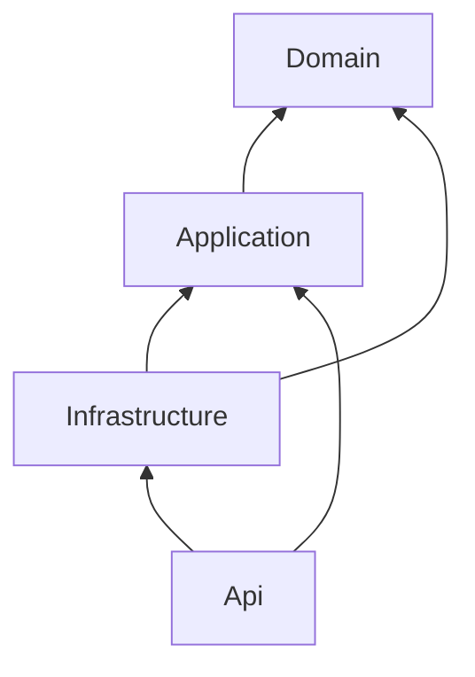

# Правила залежностей

Дозволені напрямки всередині одного сервісу:

- Domain не має project dependencies і не використовує EF Core, ASP.NET Core, MassTransit або зовнішні SDK.
- Application посилається лише на власний Domain.
- Infrastructure посилається лише на власні Application та Domain.
- API посилається на власні Application/Infrastructure і потрібні технічні Building Blocks.
- Сервіс не може посилатися на Domain, Application або Infrastructure іншого сервісу.
- Gateway може посилатися лише на Contracts, Grpc.Contracts, Observability і Security.
- Worker може посилатися лише на Contracts, Grpc.Contracts і Observability.
- Building Blocks містять transport contracts і технічні defaults, але не спільні domain entities.
- `AiControlCenter.Security` обмежений JWT validation, claim/policy names, SignalR token extraction та endpoint authorization helpers.

`AiControlCenter.ArchitectureTests` читає project/package references безпосередньо з `.csproj`, зокрема для порожніх шарів, і перевіряє ці правила на Windows та Linux.

[Architecture tests](../../tests/Architecture/AiControlCenter.ArchitectureTests/README.md) · [Building Blocks](../../src/BuildingBlocks/README.md) · [Межі сервісів](service-boundaries.md)
