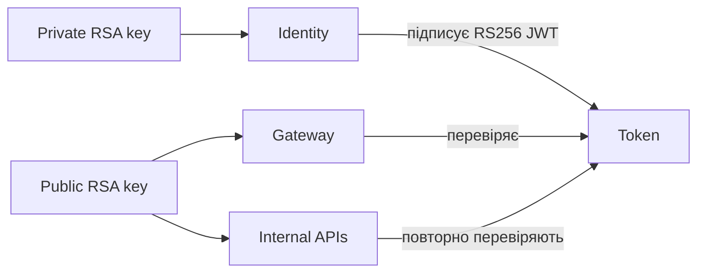

# Експлуатація безпеки Identity

## Development setup

Створіть ignored 3072-bit RSA pair без зовнішніх пакетів:

```powershell
powershell -NoProfile -ExecutionPolicy Bypass -File .\scripts\security\New-IdentityDevelopmentKeys.ps1
```

Скопіюйте `.env.example` у ignored `.env` і задайте `IDENTITY_BOOTSTRAP_EMAIL` та `IDENTITY_BOOTSTRAP_TEMPORARY_PASSWORD`. Тимчасовий пароль має 12–128 символів. Values і key material не можна commit або log.

Identity API отримує private key. Gateway, ControlPlane, Orchestrator та Integrations мають лише read-only mount public key.



## Ручна ротація signing key

Discovery/JWKS і одночасна підтримка кількох keys не реалізовані. Ротація є координованою операцією:

1. Згенерувати нову pair у захищеному місці.
2. Змінити `Authentication:KeyId` і `JwtIssuer:KeyId` на нове унікальне значення.
3. Зупинити traffic, що створює sessions.
4. Замінити public-key mounts validators і private-key mount Identity.
5. Разом перезапустити validators та Identity.
6. Перевірити login і protected API/SignalR/gRPC calls.
7. Безпечно утилізувати old private key.

Це створює контрольоване restart window. Zero-downtime rotation потребуватиме повного OIDC/JWKS рішення.

## Bootstrap і secrets

Bootstrap є idempotent і запускається, лише коли немає active Admin. Production має передавати `IdentityBootstrap:EmailFile` і `IdentityBootstrap:TemporaryPasswordFile` через deployment secret store. Прямі configuration values призначені лише для ignored Development `.env`.

## Data Protection

Docker Development зберігає ASP.NET Core Data Protection keys у named volume `identity_data_protection`. Production потребує durable storage, спільного для всіх Identity replicas, і platform key-management protection at rest.

Application працює як non-root user `1654:1654`. One-shot Compose initializer призначає volume цьому user, каталогові mode `700`, а key files — `600`; Identity не запускається як root і не використовує world-writable permissions.

## Session behavior

- Access lifetime — не більше 10 хвилин; clock skew — не більше 30 секунд.
- Absolute lifetime refresh family — не більше 30 днів.
- Refresh, logout і cookie-based session mutation потребують trusted Origin та antiforgery token.
- П’ять невдалих password attempts блокують login на 15 хвилин.
- Angular серіалізує refresh у вкладці й між вкладками через Web Locks. Без Web Locks лишається same-tab single-flight; справжня cross-tab race вважається token reuse і відкликає family.

[Identity](../../src/Services/Identity/README.md) · [Authentication flow](../identity/authentication-flow.md) · [Security Building Block](../security/security-overview.md)
