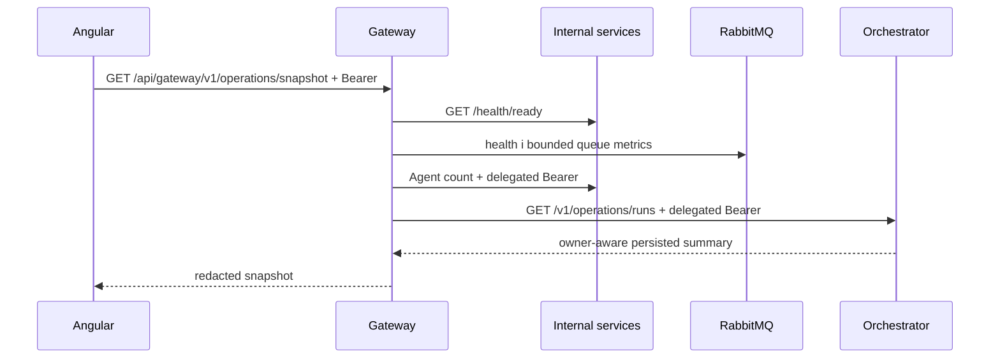

# Operations Center і live observability

## Призначення

`/home` — оглядова панель поточного стану AiControlCenter. Вона показує readiness сервісів, latency перевірок, RabbitMQ queues, persisted статистику Runs і останні доступні запуски. Робочі таблиці `Напрямки`, `Агенти` й `Запуски` залишаються окремими маршрутами.

Панель не є системою моніторингу на кшталт Prometheus/Grafana і не вигадує метрики у браузері. Її значення походять із health endpoints, RabbitMQ Management API та read-only запитів до ControlPlane й Orchestrator.

## Потік snapshot

Gateway виступає read-only BFF-агрегатором. Endpoint потребує `AnyPlatformUser` і `PasswordChanged`. Bearer token делегується тільки бізнес-запитам ControlPlane та Orchestrator; RabbitMQ credentials використовуються лише server-side і ніколи не повертаються в DTO.

## Дані й межі доступу

- Admin бачить загальні persisted Run counts і останні Runs.
- Developer/User бачать лише власні Runs, оскільки фільтрація виконується Orchestrator до формування DTO.
- Run summary не містить input, повних logs, credentials або connection strings.
- Деталі вибраного Run завантажуються через наявний owner-aware REST endpoint. Його bounded logs і terminal result доступні лише користувачу, який і раніше мав право читати цей Run.
- PostgreSQL не опитується Gateway напряму: стан формується з database readiness checks сервісів-власників.

## Стани

| Стан           | Значення                                                                    |
| -------------- | --------------------------------------------------------------------------- |
| `Connected`    | свіжий snapshot, SignalR з'єднаний, залежність відповідає успішно           |
| `Degraded`     | одна невдала poll-спроба, SignalR reconnect або часткова деградація         |
| `Disconnected` | щонайменше дві послідовні невдалі poll-спроби чи недоступний вузол          |
| `Unknown`      | snapshot відсутній/прострочений або джерело ще не дало достовірного сигналу |

Gateway зберігає в пам'яті час останнього успішного сигналу для кожного вузла/черги. Це diagnostic timestamp поточного процесу, а не persisted audit trail.

## SignalR, reconciliation і offline

`RunStatusChanged` є тригером швидкого REST refresh, але не джерелом істини. Після SignalR reconnect Angular також перечитує snapshot і persisted Run. Звичайне polling виконується кожні 5 секунд, а після помилок використовує bounded backoff `5 → 10 → 20 → 30` секунд.

Під час недоступності backend останній snapshot залишається на екрані з явним degraded/disconnected станом. Початкове SignalR-з'єднання та подальші reconnect мають backoff із верхньою межею 30 секунд. Network error, timeout, `429` або `5xx` під час refresh token не очищає вже активну memory-only сесію; підтверджена client/auth помилка очищає її як раніше.

Behavioral Angular tests запускають production `RealtimeService` із керованою injectable SignalR factory та перевіряють initial connect, reconnect callbacks, bounded retry, `reconnectGeneration`, незмінність memory-only session і відсутність duplicate subscriptions. Transport integration test використовує реальний Kestrel/WebSocket endpoint: той самий SignalR client залишається активним, поки Gateway зупиняється й відновлюється на тому самому порту, після чого отримує наступну подію рівно один раз. Operations Center component test окремо підтверджує REST reconciliation після reconnect.

Якщо frontend-контейнер також вимкнений, нова вкладка не може завантажити SPA. Для такого тесту Angular слід попередньо відкрити або запускати окремим development/static host.

## Доступність інтерфейсу

Карта реалізована через DOM/CSS без WebGL. Вузли є keyboard-focusable buttons, статуси мають текстові labels, layout адаптується до вузьких екранів, а `prefers-reduced-motion` вимикає декоративний рух.

[Комунікація](communication.md) · [Межі сервісів](service-boundaries.md) · [Agents, Runs і Worker](agents-runs-worker.md)
