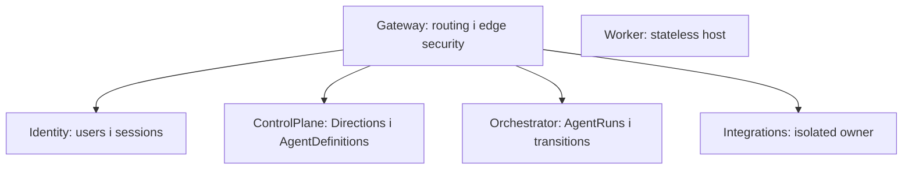

# Межі сервісів

## Gateway

Публічна точка входу для REST і технічного SignalR Hub. Не володіє даними, не посилається на service layers, перевіряє Identity-issued JWT і застосовує YARP policies.

## Identity

Володіє users, fixed system roles, password hashes, стабільними `RefreshSession`, історією rotating refresh tokens та схемою `identity`. Це єдиний сервіс із private signing key. Public registration відсутня; users створює Admin.

## ControlPlane

Володіє схемою `control_plane`, aggregates `Direction` і `AgentDefinition`, REST-каталогом та versioned gRPC snapshot для запуску активного Test agent. REST і gRPC захищені delegated user authentication; інші сервіси не читають цю схему напряму.

## Orchestrator

Володіє схемою `orchestrator`, `AgentRun`/`RunStep`, переходами стану й transactional outbox. Отримує Agent snapshot через ControlPlane gRPC, публікує commands/status events і приймає Worker progress через окремо authenticated gRPC.

## Worker

Stateless host з MassTransit consumer для bounded deterministic Test workflow, observability та health. База даних, private signing key, shell і довільне виконання відсутні.

## Integrations

Володіє схемою `integrations`. External API adapters, OAuth accounts, provider SDKs і business endpoints відсутні.

## Власність даних

Development використовує один PostgreSQL server, але кожен data owner має окрему schema, login role і connection string. Role не отримує privileges на чужу schema. Cross-service reads можливі лише через versioned REST, gRPC або message contracts.

[Сервіси](../../src/Services/README.md) · [Правила залежностей](dependency-rules.md) · [Комунікація](communication.md)
