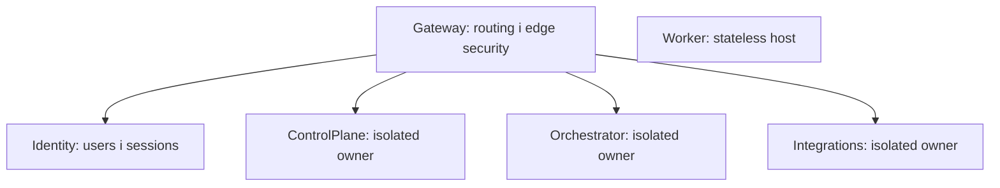

# Межі сервісів

## Gateway

Публічна точка входу для REST і технічного SignalR Hub. Не володіє даними, не посилається на service layers, перевіряє Identity-issued JWT і застосовує YARP policies.

## Identity

Володіє users, fixed system roles, password hashes, стабільними `RefreshSession`, історією rotating refresh tokens та схемою `identity`. Це єдиний сервіс із private signing key. Public registration відсутня; users створює Admin.

## ControlPlane

Володіє схемою `control_plane`, aggregate `Direction` і REST use cases каталогу напрямків. Також надає versioned technical `ServiceInfo` gRPC service. REST і gRPC захищені delegated user authentication; дані Directions не читаються напряму іншими сервісами.

## Orchestrator

Володіє схемою `orchestrator`, має direct gRPC client ControlPlane і MassTransit bus connection. Бізнес-оркестрація, state machines та production messages не реалізовані.

## Worker

Stateless `BackgroundService` host з MassTransit, observability, liveness/readiness. Database і business consumers відсутні.

## Integrations

Володіє схемою `integrations`. External API adapters, OAuth accounts, provider SDKs і business endpoints відсутні.

## Власність даних

Development використовує один PostgreSQL server, але кожен data owner має окрему schema, login role і connection string. Role не отримує privileges на чужу schema. Cross-service reads можливі лише через versioned REST, gRPC або message contracts.

[Сервіси](../../src/Services/README.md) · [Правила залежностей](dependency-rules.md) · [Комунікація](communication.md)
