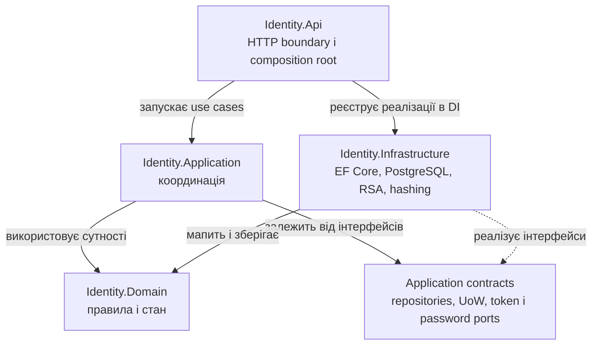
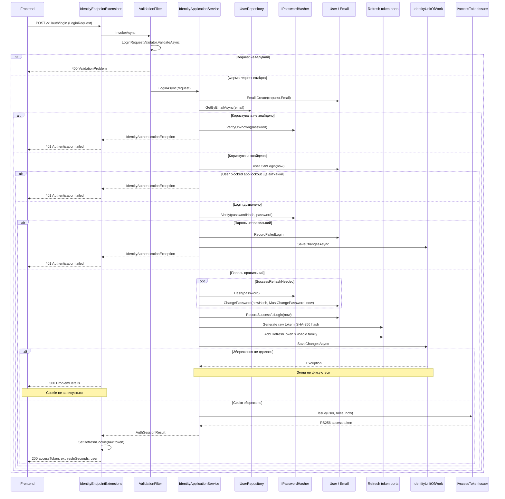
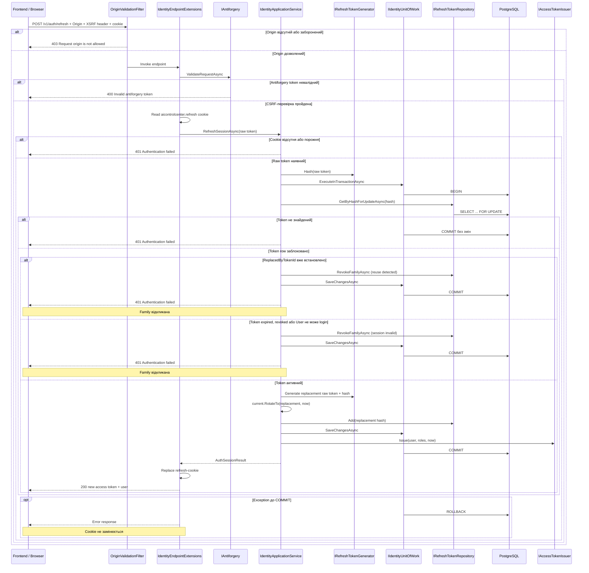
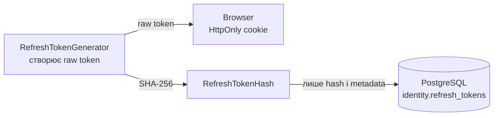
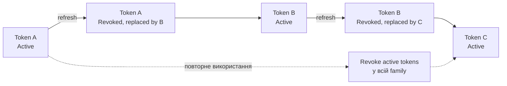
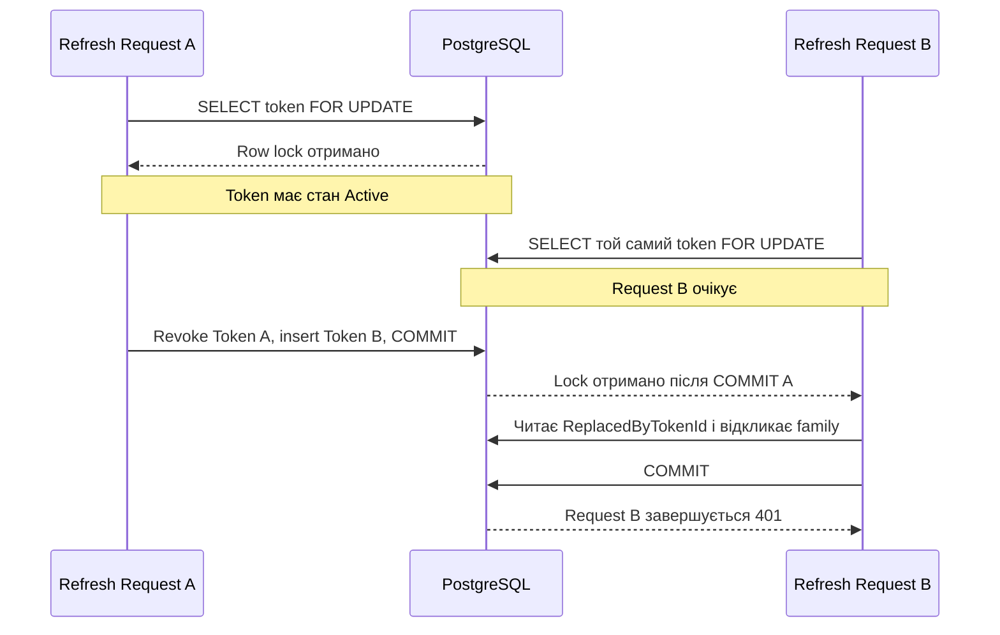

# Identity: автентифікація, токени та сесії

Цей документ описує фактичну реалізацію Identity у поточному репозиторії:
від HTTP-запиту Angular до доменних правил, PostgreSQL, JWT і refresh-cookie.

## Зміст

1. [Призначення Identity](#призначення-identity)
2. [Відповідальність архітектурних шарів](#відповідальність-архітектурних-шарів)
3. [Повний процес Login](#повний-процес-login)
4. [Повний процес Refresh](#повний-процес-refresh)
5. [Де зберігаються токени](#де-зберігаються-токени)
6. [Ротація refresh-токенів](#ротація-refresh-токенів)
7. [Повторне використання токена](#повторне-використання-токена)
8. [Транзакції та блокування](#транзакції-та-блокування)
9. [Основні класи та інтерфейси](#основні-класи-та-інтерфейси)
10. [Типові помилки](#типові-помилки)
11. [Коротка шпаргалка](#коротка-шпаргалка)
12. [Як читати код Login](#як-читати-код-login)
13. [Як читати код Refresh](#як-читати-код-refresh)

## Призначення Identity

Identity є власником таких даних і процесів:

- користувачів, нормалізованих email, display name і статусів;
- password hashes і тимчасового блокування після невдалих login-спроб;
- фіксованих ролей `Admin`, `Developer` і `User`;
- короткоживучих RSA-signed JWT access-токенів;
- refresh-сесій, їх ротації, відкликання та token families;
- endpoint-ів login, refresh, logout і logout-all;
- блокування та активації користувачів;
- примусової зміни тимчасового пароля через `MustChangePassword` і claim
  `pwd_change_required`;
- захисту останнього активного Admin від блокування або втрати ролі `Admin`.

Публічної реєстрації немає: користувачів створює Admin. Поточний протокол є
закритим first-party session protocol для Angular-клієнта, а не OAuth/OIDC
authorization server.

## Відповідальність архітектурних шарів

| Шар                       | Відповідальність                                                                           | Чого він не повинен робити                                          |
| ------------------------- | ------------------------------------------------------------------------------------------ | ------------------------------------------------------------------- |
| `Identity.Api`            | HTTP endpoint-и, cookie, CSRF, Origin, authorization, rate limiting і формування відповіді | Не працює напряму з PostgreSQL і не містить основну бізнес-логіку   |
| `Identity.Application`    | Координує use cases та залежності через інтерфейси                                         | Не знає деталей EF Core, SQL, RSA і конкретного алгоритму хешування |
| `Identity.Domain`         | Сутності, value objects, бізнес-стан та інваріанти                                         | Не залежить від API та Infrastructure                               |
| `Identity.Infrastructure` | EF Core, PostgreSQL, репозиторії, транзакції, JWT, RSA і password hashing                  | Не визначає HTTP-контракт і не повинна визначати бізнес-процес      |

Dependency Inversion полягає в тому, що `Identity.Application` знає лише
`IUserRepository`, `IRefreshTokenRepository`, `IIdentityUnitOfWork`,
`IPasswordHasher`, `IAccessTokenIssuer` та інші contracts. Infrastructure
залежить від Application і реалізує ці contracts. Domain не посилається ні на
Infrastructure, ні на API.

## Повний процес Login

Зовнішній маршрут через Gateway — `POST /api/identity/v1/auth/login`. YARP
знімає prefix `/api/identity`, тому Identity API отримує
`POST /v1/auth/login`. Gateway та Identity позначають цей маршрут anonymous,
але на Identity діє rate limit: не більше 10 запитів за хвилину на IP.

1. `IdentityEndpointExtensions` приймає `LoginRequest`. Cookie та access token
   ще не створені.
2. `ValidationFilter<LoginRequest>` викликає `LoginRequestValidator`. Він
   перевіряє непорожні email/password, формат email і максимальні довжини. При
   помилці повертається `400 ValidationProblem`, а Application не запускається.
3. `IdentityApplicationService.LoginAsync` створює `Email` через
   `Email.Create`: значення обрізається, переводиться в lower case і повторно
   перевіряється як email.
4. `IUserRepository.GetByEmailAsync` шукає user разом із ролями. Реалізація
   `UserRepository` виконує запит через EF Core.
5. Якщо user не знайдений, `IPasswordHasher.VerifyUnknown` все одно виконує
   перевірку dummy hash. Це зменшує різницю часу між невідомим email і
   неправильним паролем. В обох випадках назовні повертається однаковий `401`.
6. `User.CanLogin` дозволяє login лише для `UserStatus.Active`, коли
   `LockoutEnd` відсутній або завершився. Blocked і temporarily locked user
   отримують загальний `401` без розкриття причини.
7. `IPasswordHasher.Verify` перевіряє hash. Неправильний пароль викликає
   `User.RecordFailedLogin`; п'ята невдала спроба встановлює 15-хвилинний
   lockout. Стан зберігається перед поверненням `401`.
8. Якщо hasher повертає `SuccessRehashNeeded`, Application створює новий hash
   і викликає `User.ChangePassword`, зберігаючи поточне значення
   `MustChangePassword`. Потім `RecordSuccessfulLogin` скидає failed count і
   lockout та записує `LastLoginAt`.
9. `IRefreshTokenGenerator.Generate` створює 32 cryptographically random bytes,
   кодує raw token як Base64Url і одразу обчислює SHA-256 hash.
10. `RefreshToken.Create` створює нову `RefreshTokenFamilyId` з абсолютним
    строком життя 30 днів. `IRefreshTokenRepository.Add` додає до DbContext
    лише hash та metadata сесії.
11. Один `SaveChangesAsync` фіксує login state, можливий rehash і refresh
    session. У login немає явного `ExecuteInTransactionAsync`; EF Core
    використовує транзакцію для одного `SaveChanges`. Якщо збереження падає,
    помилка доходить до `GlobalExceptionHandler` як `500`, а API не встигає
    записати refresh-cookie.
12. Лише після успішного збереження `IAccessTokenIssuer.Issue` створює JWT,
    `AuthSessionResult` повертає access token, user DTO, raw refresh token і
    refresh expiration до API.
13. API записує raw refresh token у `HttpOnly`, `SameSite=Strict` cookie з
    path `/api/identity/v1/auth`, а в JSON повертає лише access token,
    `expiresInSeconds` і user. Refresh token у response body відсутній.

## Повний процес Refresh

Зовнішній маршрут — `POST /api/identity/v1/auth/refresh`. Angular надсилає
request з `withCredentials: true`; браузер автоматично додає refresh-cookie,
а Angular XSRF integration читає `XSRF-TOKEN` і додає `X-XSRF-TOKEN`.

Фактичний порядок boundary-перевірок відрізняється від інтуїтивного
«спочатку CSRF, потім Origin»: `OriginValidationFilter` огортає endpoint і
виконується першим. Лише після дозволеного Origin handler викликає
`IAntiforgery.ValidateRequestAsync`.

1. Browser автоматично додає raw refresh token із HttpOnly cookie. JavaScript
   не читає його напряму.
2. `OriginValidationFilter` порівнює `Origin` зі списком
   `Security:AllowedOrigins`. Відсутній або невідомий Origin дає `403`.
3. `IAntiforgery.ValidateRequestAsync` звіряє antiforgery cookie із
   `X-XSRF-TOKEN`. `AntiforgeryValidationException` мапиться на `400`.
4. API читає `aicontrolcenter.refresh`. Порожнє значення передається в
   `RefreshSessionAsync` і завершується `IdentityAuthenticationException` та
   `401` ще до відкриття транзакції.
5. `IRefreshTokenGenerator.Hash` обчислює SHA-256 raw token. Raw значення не
   використовується в SQL.
6. `IIdentityUnitOfWork.ExecuteInTransactionAsync` відкриває transaction.
   `GetByHashForUpdateAsync` виконує `SELECT ... FOR UPDATE`, завантажуючи
   refresh token, user і ролі та блокуючи рядок до COMMIT/ROLLBACK.
7. Якщо hash не знайдений, operation повертає invalid outcome. Транзакція
   завершується без змін, після чого Application повертає загальний `401`.
8. Якщо `ReplacedByTokenId` уже встановлений, старий token повторно
   використали. `RevokeFamilyAsync` відкликає всі ще активні записи family,
   зміни зберігаються і commit виконують до повернення `401`.
9. Прострочений, відкликаний token або user, який більше не може login,
   проходить через іншу invalid-гілку. Family також відкликається і запит
   завершується `401`.
10. Для активного token `Generate` створює replacement. `RefreshToken.RotateTo`
    відкликає старий запис із reason `Rotated` та встановлює
    `ReplacedByTokenId`; replacement успадковує ту саму family і початковий
    абсолютний `ExpiresAt`.
11. Новий hash додається в PostgreSQL, `SaveChangesAsync` виконується всередині
    transaction, а `IAccessTokenIssuer` створює новий access token.
12. Після успішного COMMIT API замінює refresh-cookie та повертає access token
    і user. Якщо operation або COMMIT кидає exception, Unit of Work виконує
    ROLLBACK, а cookie не замінюється.

## Де зберігаються токени

| Значення           | Де зберігається                                               | Чи доступне JavaScript | Призначення                                    |
| ------------------ | ------------------------------------------------------------- | ---------------------- | ---------------------------------------------- |
| Access token       | Пам'ять Angular-застосунку в `AccessTokenStore`               | Так                    | Authorization API-запитів і SignalR connection |
| Raw refresh token  | `HttpOnly`, `SameSite=Strict` cookie                          | Ні                     | Отримання нового access token                  |
| Refresh token hash | PostgreSQL, `identity.refresh_tokens.token_hash`              | Не застосовується      | Пошук, ротація та відкликання refresh session  |
| RSA private key    | Тільки Identity API                                           | Ні                     | Підпис JWT через `RsaAccessTokenIssuer`        |
| RSA public key     | Identity, Gateway, ControlPlane, Orchestrator та Integrations | Ні                     | Перевірка підпису JWT                          |

Raw refresh token не зберігається в PostgreSQL: при витоку БД attacker не
отримує готову credential для refresh. Identity хешує значення з cookie і
шукає рівний hash. Оскільки token має 256 біт cryptographic randomness,
перебір за SHA-256 hash практично непридатний.

Access token не записується в `localStorage` або `sessionStorage`, а живе лише
в Angular signal. Це зменшує час і поверхню його викрадення через XSS;
перезавантаження сторінки очищає access token, після чого `AuthStore.initialize`
намагається відновити session через refresh.

HttpOnly не робить cookie невразливою до XSS повністю, але забороняє
JavaScript прочитати raw refresh token. Водночас browser додає cookie
автоматично, тому refresh/logout захищені `SameSite=Strict`, перевіркою Origin
та antiforgery cookie/header pair.

Access token — короткоживучий signed JWT, який frontend явно передає як
`Authorization: Bearer`. Refresh token — довгоживуче opaque random value; він
не є JWT, не передається як Bearer і використовується лише session endpoint-ом
Identity для ротації.

## Ротація refresh-токенів

Кожен успішний refresh є одноразовим використанням поточного token:

- Token A після першого використання отримує `RevokedAt`, reason `Rotated` і
  посилання `ReplacedByTokenId` на Token B.
- Browser отримує raw Token B; у БД зберігається лише його hash.
- Token B зберігає `FamilyId` і абсолютний `ExpiresAt` Token A. Rotation не
  створює нескінченну sliding session.
- Повторне використання Token A розпізнається за `ReplacedByTokenId` і
  відкликає всі ще активні tokens тієї самої family.

## Повторне використання токена

Reuse може означати, що старе cookie викрали, або що два browser context
одночасно використали той самий token. Система навмисно обирає fail-closed
поведінку:

1. знаходить старий token за hash і блокує його row;
2. бачить `ReplacedByTokenId`;
3. викликає `RevokeFamilyAsync` із reason `Refresh token reuse detected`;
4. зберігає відкликання та виконує COMMIT;
5. повертає `401`, не видаючи нову session.

Angular зменшує випадкові races через same-tab `refreshPromise` та browser Web
Locks API з ім'ям `aicontrolcenter-refresh`. У browser без Web Locks справжній
cross-tab race усе одно трактується як reuse і відкликає family.

## Транзакції та блокування

`IIdentityUnitOfWork` надає два методи:

- `SaveChangesAsync` делегує збереження в `IdentityDbContext`;
- `ExecuteInTransactionAsync<T>` виконує operation між `BEGIN` і `COMMIT`, а
  при exception викликає `ROLLBACK` та повторно кидає exception.

`GetByHashForUpdateAsync` виконує PostgreSQL `SELECT ... FOR UPDATE`. Row lock
не дозволяє двом транзакціям одночасно побачити один refresh token активним.

Без row lock обидва requests могли б прочитати Token A як active і створити
дві replacement-гілки. З lock Request B читає вже оновлений стан і переходить
у reuse detection.

`AcquireAdminMutationLockAsync` використовує `SELECT` ролі `Admin` із
`FOR UPDATE`. Один стабільний row серіалізує `BlockUserAsync`,
`ReplaceUserRolesAsync` і `BootstrapAdminAsync`. Після lock Application рахує
active Admin users. Якщо операція заблокує останнього active Admin або забере
в нього роль, кидається `IdentityConflictException`, transaction виконує
ROLLBACK, а стан не змінюється. `User.Version`, замаплений на PostgreSQL `xmin`,
додатково є optimistic concurrency token для update user row.

## Основні класи та інтерфейси

| Компонент                                                                                                                           | Шар                  | Роль у процесі                                                    |
| ----------------------------------------------------------------------------------------------------------------------------------- | -------------------- | ----------------------------------------------------------------- |
| [`IdentityApplicationService`](../../src/Services/Identity/AiControlCenter.Identity.Application/IdentityApplicationService.cs)      | Application          | Координує Identity use cases                                      |
| [`IUserRepository`](../../src/Services/Identity/AiControlCenter.Identity.Application/Abstractions.cs)                               | Application contract | Пошук, список, count Admin і додавання users                      |
| [`IRoleRepository`](../../src/Services/Identity/AiControlCenter.Identity.Application/Abstractions.cs)                               | Application contract | Отримання roles і блокування Admin mutations                      |
| [`IRefreshTokenRepository`](../../src/Services/Identity/AiControlCenter.Identity.Application/Abstractions.cs)                       | Application contract | Пошук із row lock, додавання та revoke refresh sessions           |
| [`IIdentityUnitOfWork`](../../src/Services/Identity/AiControlCenter.Identity.Application/Abstractions.cs)                           | Application contract | Збереження і явні transactions                                    |
| [`IPasswordHasher`](../../src/Services/Identity/AiControlCenter.Identity.Application/Abstractions.cs)                               | Application contract | Hash, verify і timing-safe unknown-user verify                    |
| [`IAccessTokenIssuer`](../../src/Services/Identity/AiControlCenter.Identity.Application/Abstractions.cs)                            | Application contract | Створення JWT access token                                        |
| [`IRefreshTokenGenerator`](../../src/Services/Identity/AiControlCenter.Identity.Application/Abstractions.cs)                        | Application contract | Створення raw token і SHA-256 hash                                |
| [`LoginRequestValidator`](../../src/Services/Identity/AiControlCenter.Identity.Application/IdentityValidators.cs)                   | Application          | Перевірка форми login request                                     |
| [`AuthSessionResult`](../../src/Services/Identity/AiControlCenter.Identity.Application/IdentityModels.cs)                           | Application          | Внутрішній результат login/refresh                                |
| [`User`](../../src/Services/Identity/AiControlCenter.Identity.Domain/User.cs)                                                       | Domain               | Login state, password state, roles і status transitions           |
| [`RefreshToken`](../../src/Services/Identity/AiControlCenter.Identity.Domain/RefreshToken.cs)                                       | Domain               | Active/revoked state, rotation і replacement link                 |
| [Value objects](../../src/Services/Identity/AiControlCenter.Identity.Domain/ValueObjects.cs)                                        | Domain               | Нормалізовані email, role names, token hash і family ID           |
| [`UserRepository`](../../src/Services/Identity/AiControlCenter.Identity.Infrastructure/Persistence/IdentityRepositories.cs)         | Infrastructure       | EF Core реалізація `IUserRepository`                              |
| [`RoleRepository`](../../src/Services/Identity/AiControlCenter.Identity.Infrastructure/Persistence/IdentityRepositories.cs)         | Infrastructure       | EF Core реалізація `IRoleRepository`, `FOR UPDATE` для Admin role |
| [`RefreshTokenRepository`](../../src/Services/Identity/AiControlCenter.Identity.Infrastructure/Persistence/IdentityRepositories.cs) | Infrastructure       | EF Core/SQL реалізація refresh repository                         |
| [`IdentityUnitOfWork`](../../src/Services/Identity/AiControlCenter.Identity.Infrastructure/Persistence/IdentityRepositories.cs)     | Infrastructure       | Реалізація save, COMMIT і ROLLBACK                                |
| [`PasswordHasherAdapter`](../../src/Services/Identity/AiControlCenter.Identity.Infrastructure/Security/PasswordHasherAdapter.cs)    | Infrastructure       | ASP.NET Core Identity V3 hashing, 210000 iterations               |
| [`RsaAccessTokenIssuer`](../../src/Services/Identity/AiControlCenter.Identity.Infrastructure/Security/RsaAccessTokenIssuer.cs)      | Infrastructure       | Створення і RS256 signing access JWT                              |
| [`RefreshTokenGenerator`](../../src/Services/Identity/AiControlCenter.Identity.Infrastructure/Security/RefreshTokenGenerator.cs)    | Infrastructure       | CSPRNG raw token і SHA-256 hash                                   |
| [`IdentityDbContext`](../../src/Services/Identity/AiControlCenter.Identity.Infrastructure/Persistence/IdentityDbContext.cs)         | Infrastructure       | EF Core unit of persistence для schema `identity`                 |
| [`IdentityEndpointExtensions`](../../src/Services/Identity/AiControlCenter.Identity.Api/IdentityEndpointExtensions.cs)              | API                  | HTTP routes, cookie, antiforgery і response mapping               |
| [`ValidationFilter<T>`](../../src/Services/Identity/AiControlCenter.Identity.Api/ValidationFilter.cs)                               | API                  | Запускає FluentValidation до use case                             |
| [`OriginValidationFilter`](../../src/Services/Identity/AiControlCenter.Identity.Api/OriginValidationFilter.cs)                      | API                  | Перевіряє Origin refresh/logout requests                          |
| [`IdentityExceptionHandler`](../../src/Services/Identity/AiControlCenter.Identity.Api/IdentityExceptionHandler.cs)                  | API                  | Мапить очікувані exceptions у Problem Details                     |

## Типові помилки

| Ситуація                                                                     | Application exception або механізм                                            | HTTP-статус                |
| ---------------------------------------------------------------------------- | ----------------------------------------------------------------------------- | -------------------------- |
| Неправильний email/password, blocked user, lockout або invalid refresh token | `IdentityAuthenticationException`                                             | 401                        |
| Немає дозволу на endpoint                                                    | ASP.NET Core authorization policy                                             | 403                        |
| `IdentityForbiddenException`                                                 | Мапінг у `IdentityExceptionHandler`; поточні use cases його не кидають        | 403                        |
| Користувача не знайдено                                                      | `IdentityNotFoundException`                                                   | 404                        |
| Конфлікт поточного стану або захист останнього Admin                         | `IdentityConflictException`                                                   | 409                        |
| Невалідний request                                                           | FluentValidation / `ValidationFilter<T>`                                      | 400                        |
| Невалідний antiforgery token                                                 | `AntiforgeryValidationException`                                              | 400                        |
| Відсутній або заборонений Origin                                             | `OriginValidationFilter`                                                      | 403                        |
| Перевищено login/refresh rate limit                                          | `identity-auth` fixed-window limiter; custom rejection status не налаштований | 503 (ASP.NET Core default) |
| Неочікувана database/commit помилка                                          | `GlobalExceptionHandler`                                                      | 500                        |

Для login невідомий email, неправильний password, blocked status і lockout
навмисно мають однакові status/title, щоб відповідь не пояснювала attacker,
яка саме перевірка не пройшла.

## Коротка шпаргалка

- API відповідає за HTTP і security boundary.
- Application координує процес.
- Domain контролює бізнес-стан та правила.
- Infrastructure виконує технічну роботу.
- Access token повертається frontend і зберігається тільки в пам'яті.
- Raw refresh token зберігається тільки в HttpOnly cookie.
- У PostgreSQL зберігається лише hash refresh token.
- Refresh виконується у transaction з row lock.
- Старий refresh token відкликається під час rotation.
- Повторне використання token відкликає всю активну family.
- Login використовує один `SaveChangesAsync`, а не явний
  `ExecuteInTransactionAsync`.

## Як читати код Login

1. HTTP route і response: [`IdentityEndpointExtensions.cs`](../../src/Services/Identity/AiControlCenter.Identity.Api/IdentityEndpointExtensions.cs).
2. Endpoint validation adapter: [`ValidationFilter.cs`](../../src/Services/Identity/AiControlCenter.Identity.Api/ValidationFilter.cs).
3. Форма request: [`LoginRequestValidator` в `IdentityValidators.cs`](../../src/Services/Identity/AiControlCenter.Identity.Application/IdentityValidators.cs).
4. Use case: [`IdentityApplicationService.LoginAsync`](../../src/Services/Identity/AiControlCenter.Identity.Application/IdentityApplicationService.cs).
5. Domain state і value objects: [`User.cs`](../../src/Services/Identity/AiControlCenter.Identity.Domain/User.cs), [`ValueObjects.cs`](../../src/Services/Identity/AiControlCenter.Identity.Domain/ValueObjects.cs), [`RefreshToken.cs`](../../src/Services/Identity/AiControlCenter.Identity.Domain/RefreshToken.cs).
6. Contracts: [`Abstractions.cs`](../../src/Services/Identity/AiControlCenter.Identity.Application/Abstractions.cs).
7. Repository та Unit of Work implementations: [`IdentityRepositories.cs`](../../src/Services/Identity/AiControlCenter.Identity.Infrastructure/Persistence/IdentityRepositories.cs).
8. Password, refresh і JWT implementations: [`PasswordHasherAdapter.cs`](../../src/Services/Identity/AiControlCenter.Identity.Infrastructure/Security/PasswordHasherAdapter.cs), [`RefreshTokenGenerator.cs`](../../src/Services/Identity/AiControlCenter.Identity.Infrastructure/Security/RefreshTokenGenerator.cs), [`RsaAccessTokenIssuer.cs`](../../src/Services/Identity/AiControlCenter.Identity.Infrastructure/Security/RsaAccessTokenIssuer.cs).
9. EF Core і PostgreSQL mapping: [`IdentityDbContext.cs`](../../src/Services/Identity/AiControlCenter.Identity.Infrastructure/Persistence/IdentityDbContext.cs), [`IdentityEntityConfigurations.cs`](../../src/Services/Identity/AiControlCenter.Identity.Infrastructure/Persistence/IdentityEntityConfigurations.cs).
10. Exception-to-HTTP mapping: [`IdentityExceptionHandler.cs`](../../src/Services/Identity/AiControlCenter.Identity.Api/IdentityExceptionHandler.cs).

## Як читати код Refresh

1. Refresh endpoint, cookie read/write й antiforgery call: [`IdentityEndpointExtensions.cs`](../../src/Services/Identity/AiControlCenter.Identity.Api/IdentityEndpointExtensions.cs).
2. Origin boundary: [`OriginValidationFilter.cs`](../../src/Services/Identity/AiControlCenter.Identity.Api/OriginValidationFilter.cs).
3. XSRF configuration і middleware order: [`Program.cs`](../../src/Services/Identity/AiControlCenter.Identity.Api/Program.cs) та [`app.config.ts`](../../frontend/ai-control-center-angular/src/app/app.config.ts).
4. Angular refresh orchestration: [`auth.service.ts`](../../frontend/ai-control-center-angular/src/app/core/auth/auth.service.ts), [`auth.store.ts`](../../frontend/ai-control-center-angular/src/app/core/auth/auth.store.ts), [`auth.interceptor.ts`](../../frontend/ai-control-center-angular/src/app/core/auth/auth.interceptor.ts).
5. Use case: [`IdentityApplicationService.RefreshSessionAsync`](../../src/Services/Identity/AiControlCenter.Identity.Application/IdentityApplicationService.cs).
6. Hashing: [`RefreshTokenGenerator.cs`](../../src/Services/Identity/AiControlCenter.Identity.Infrastructure/Security/RefreshTokenGenerator.cs).
7. Rotation rules: [`RefreshToken.cs`](../../src/Services/Identity/AiControlCenter.Identity.Domain/RefreshToken.cs).
8. `SELECT ... FOR UPDATE`, family revoke і transaction: [`IdentityRepositories.cs`](../../src/Services/Identity/AiControlCenter.Identity.Infrastructure/Persistence/IdentityRepositories.cs).
9. PostgreSQL mapping та indexes: [`IdentityEntityConfigurations.cs`](../../src/Services/Identity/AiControlCenter.Identity.Infrastructure/Persistence/IdentityEntityConfigurations.cs).
10. Новий access token: [`RsaAccessTokenIssuer.cs`](../../src/Services/Identity/AiControlCenter.Identity.Infrastructure/Security/RsaAccessTokenIssuer.cs).
11. HTTP error mapping: [`IdentityExceptionHandler.cs`](../../src/Services/Identity/AiControlCenter.Identity.Api/IdentityExceptionHandler.cs).
