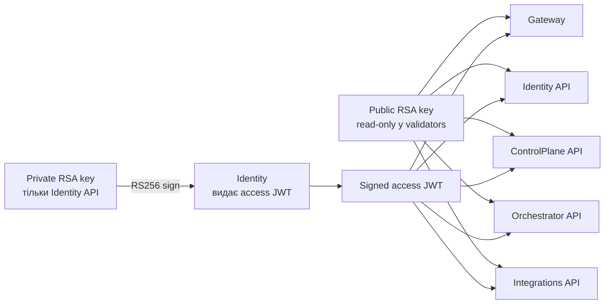
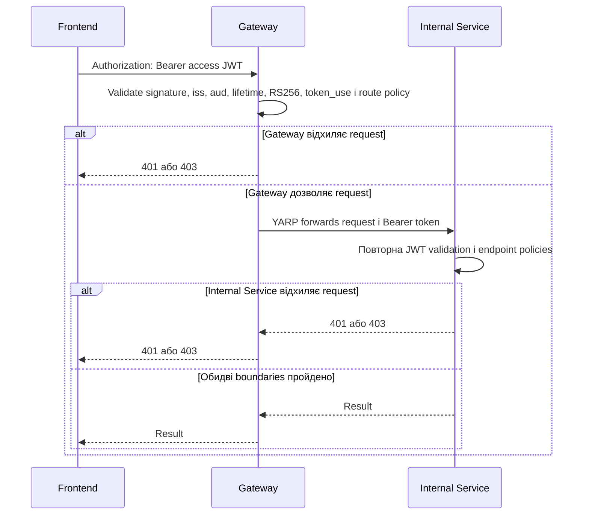

# AiControlCenter.Security: перевірка JWT та authorization

`AiControlCenter.Security` — технічний Building Block для однакової Bearer JWT
authentication та authorization у Gateway і внутрішніх API. Він не є Identity
provider і не видає токени.

## Зміст

- [Призначення AiControlCenter.Security](#призначення-aicontrolcentersecurity)
- [Розподіл RSA-ключів](#розподіл-rsa-ключів)
- [Перевірка JWT](#перевірка-jwt)
- [Claims](#claims)
- [Authorization policies](#authorization-policies)
- [Defense in depth](#defense-in-depth)
- [Підключення в сервісах](#підключення-в-сервісах)
- [SignalR](#signalr)
- [Межі відповідальності](#межі-відповідальності)

## Призначення AiControlCenter.Security

Building Block централізує те, що кожен service інакше міг би налаштувати
по-різному:

- читання `Authentication` configuration через
  [`PlatformAuthenticationOptions`](../../src/BuildingBlocks/AiControlCenter.Security/PlatformAuthenticationOptions.cs);
- завантаження public RSA key;
- параметри JWT validation;
- незмінні назви custom claims у
  [`SecurityClaimNames`](../../src/BuildingBlocks/AiControlCenter.Security/SecurityClaimNames.cs);
- імена та правила policies у
  [`SecurityPolicyNames`](../../src/BuildingBlocks/AiControlCenter.Security/SecurityPolicyNames.cs);
- `FallbackPolicy`, яка закриває endpoints за замовчуванням;
- обмежене читання SignalR `access_token` із query string;
- helper `RequirePlatformAuthorization` для endpoint mapping.

Реалізація зосереджена у
[`PlatformSecurityExtensions`](../../src/BuildingBlocks/AiControlCenter.Security/PlatformSecurityExtensions.cs).
Створення користувачів, перевірка passwords, видача JWT, refresh rotation і
session storage залишаються відповідальністю Identity.

## Розподіл RSA-ключів

Identity API — єдиний runtime service, який отримує private RSA key. Клас
[`RsaAccessTokenIssuer`](../../src/Services/Identity/AiControlCenter.Identity.Infrastructure/Security/RsaAccessTokenIssuer.cs)
імпортує private PEM, створює `SigningCredentials` з алгоритмом `RS256` і
підписує access JWT.

Gateway, Identity API, ControlPlane API, Orchestrator API та Integrations API
отримують public key. Identity потребує обидва ключі: private — для issuance,
public — для перевірки Bearer token на власних protected endpoints.



Public key перевіряє математичний підпис, але не містить private exponent і не
дає змоги створити валідний підпис. Компрометація validator service з public
key не перетворює його на token issuer.

У Docker private-key bind mount є лише в `identity-api`; інші runtime services
мають read-only mount public key. Операційний процес генерації та ротації
описаний у [Identity security operations](../architecture/identity-security.md).

## Перевірка JWT

`AddPlatformAuthentication` виконується під час startup і fail-fast перевіряє
`Issuer`, `Audience`, `KeyId`, `PublicKeyPath`, існування public-key file та
`ClockSkewSeconds` у межах 0–30 секунд.

Поточні `TokenValidationParameters` вимагають:

| Налаштування | Фактична перевірка |
| --- | --- |
| `ValidateIssuerSigningKey` | RSA signature має відповідати налаштованому public key |
| `ValidateIssuer` | `iss` має дорівнювати `Authentication:Issuer` |
| `ValidateAudience` | `aud` має дорівнювати `Authentication:Audience` |
| `ValidateLifetime` | Перевіряються `nbf` і `exp` з урахуванням `ClockSkew` |
| `RequireExpirationTime` | JWT без `exp` відхиляється |
| `RequireSignedTokens` | Unsigned JWT відхиляється |
| `ValidAlgorithms` | Дозволено лише `RS256` (`RsaSha256`) |
| `NameClaimType` | `sub` є claim ідентичності user |
| `RoleClaimType` | `role` використовується role policies |

`options.MapInboundClaims = false` залишає назви `sub`, `role`, `token_use`
без перетворення на Microsoft URI claim names. Після стандартної validation
`OnTokenValidated` окремо вимагає `token_use=access`.

Результат authentication:

- missing, malformed, expired, unsigned, forged або wrong issuer/audience JWT
  дає `401 Unauthorized` на protected route;
- valid JWT створює `ClaimsPrincipal`, після чого authorization перевіряє
  policies;
- valid JWT без потрібної role або з обов'язковою зміною password дає
  `403 Forbidden`.

## Claims

[`RsaAccessTokenIssuer`](../../src/Services/Identity/AiControlCenter.Identity.Infrastructure/Security/RsaAccessTokenIssuer.cs)
створює такі claims і JWT properties:

| Claim | Хто створює | Як використовується |
| --- | --- | --- |
| `sub` | Identity | `Guid` user; `NameClaimType` і пошук current user |
| `jti` | Identity | Унікальний ID access JWT; окремий deny-list зараз не реалізований |
| `iat` | Identity | Unix-час issuance |
| `nbf` | Identity token descriptor | Token не валідний до issuance time |
| `exp` | Identity token descriptor | Кінець короткого access lifetime, максимум 10 хвилин |
| `iss` | Identity token descriptor | Має збігатися з configured issuer |
| `aud` | Identity token descriptor | Має збігатися з configured audience |
| `role` | Identity, один claim на role | `Admin`, `Developer` або `User` policies |
| `token_use` | Identity | Має дорівнювати `access` |
| `pwd_change_required` | Identity | Обмежує endpoints через `PasswordChanged` |

`SecurityClaimNames.AccessTokenUse` містить значення `"access"`, а не назву
claim. Назвою claim є `SecurityClaimNames.TokenUse` зі значенням
`"token_use"`. Email навмисно не включається в access JWT.

## Authorization policies

`AddPlatformAuthorization` реєструє чотири реальні policies:

| Policy | Умова доступу |
| --- | --- |
| `AdminOnly` | User має role `Admin` |
| `AdminOrDeveloper` | User має role `Admin` або `Developer` |
| `AnyPlatformUser` | User має role `Admin`, `Developer` або `User` |
| `PasswordChanged` | User authenticated і не має `pwd_change_required=true` |

`PasswordChanged` не вимагає claim зі значенням `false`; він відхиляє лише
явне значення `true`. Поточний Identity issuer завжди додає цей claim.

Кілька policies на одному endpoint об'єднуються як `AND`. Наприклад, Identity
group `/v1/users` і `/v1/roles` вимагає одночасно `AdminOnly` та
`PasswordChanged`: user має бути Admin і вже змінити temporary password.

```csharp
var adminUsers = endpoints.MapGroup("/v1/users")
    .RequireAuthorization(
        SecurityPolicyNames.AdminOnly,
        SecurityPolicyNames.PasswordChanged);
```

ControlPlane, Orchestrator та Integrations service-info endpoints поєднують
`AnyPlatformUser` і `PasswordChanged`. Gateway YARP routes до цих services
перевіряють `PasswordChanged`, а внутрішній endpoint повторно додає role
boundary через `AnyPlatformUser`.

`FallbackPolicy` вимагає authenticated user для нового endpoint без явних
authorization metadata. Публічний route має бути свідомо позначений
`.AllowAnonymous()`. Health endpoints залишаються anonymous; session routes
CSRF, login, refresh і logout мають explicit anonymous configuration, бо
login/refresh ще не мають або вже не покладаються на valid access JWT.

## Defense in depth



Gateway є першою public boundary, але не є єдиною довірою. Internal service
можна помилково опублікувати, викликати з іншого container або досягти після
компрометації частини network. Повторна перевірка означає, що такий request
усе одно повинен мати справжній access JWT і пройти policy самого owner
service.

YARP не замінює JWT на service credential: delegated
`Authorization: Bearer ...` передається далі. Так само Orchestrator явно
копіює Authorization header у gRPC metadata при технічному виклику
ControlPlane, де token знову перевіряється.

## Підключення в сервісах

Кожен validator викликає `AddPlatformAuthentication`,
`AddPlatformAuthorization`, а в pipeline — `UseAuthentication` перед
`UseAuthorization`.

| Компонент | Як використовує Building Block |
| --- | --- |
| [`Gateway`](../../src/Gateway/AiControlCenter.Gateway/Program.cs) | Перевіряє YARP routes, host-ить protected SignalR hub, є першою public boundary |
| [`Identity API`](../../src/Services/Identity/AiControlCenter.Identity.Api/Program.cs) | Перевіряє access JWT на own user/admin endpoints; окремо видає JWT через Infrastructure |
| [`ControlPlane API`](../../src/Services/ControlPlane/AiControlCenter.ControlPlane.Api/Program.cs) | Захищає REST service-info та gRPC `ServiceInfo` |
| [`Orchestrator API`](../../src/Services/Orchestrator/AiControlCenter.Orchestrator.Api/Program.cs) | Захищає REST і делегує Bearer token у ControlPlane gRPC metadata |
| [`Integrations API`](../../src/Services/Integrations/AiControlCenter.Integrations.Api/Program.cs) | Захищає внутрішній REST endpoint |
| Майбутній authenticated API | Має підключити ті самі extensions, public key і middleware order |

Worker Service зараз не приймає user-authenticated API calls і не використовує
`AiControlCenter.Security`.

## SignalR

REST передає JWT через Authorization header. Browser SignalR transport може
передати token як `access_token` у query string. `OnMessageReceived` читає
query token лише коли path починається з `/hubs/system`; інші routes не
отримують такої поведінки.

Після extraction token проходить ті самі validation parameters і
`token_use=access`. Gateway map-ить hub із `PasswordChanged` і
`CloseOnAuthenticationExpiration = true`. У production потрібні HTTPS/WSS,
query string із token не можна логувати, а Angular тримає access token лише в
memory `AccessTokenStore`.

## Межі відповідальності

| Компонент | Відповідальність |
| --- | --- |
| Identity | Users, passwords, roles, access JWT issuance і refresh sessions |
| `AiControlCenter.Security` | Єдині JWT validation rules, claims/policy names і authorization defaults |
| Gateway | Public entry point, перша validation, YARP і SignalR |
| Internal API | Повторна validation та policies власного endpoint |
| Angular | Memory-only access token, interceptor, guards і controlled refresh |
| PostgreSQL | Users, roles, password hashes і refresh-token hashes |
| Data Protection | Захист antiforgery token material і пов'язаних cookie mechanisms |

Building Block не управляє refresh cookie, не перевіряє password, не читає
Identity database, не відкликає access JWT і не замінює повноцінний OIDC
provider. Session protocol детально описаний у
[Identity: автентифікація, токени та сесії](../identity/authentication-flow.md).
