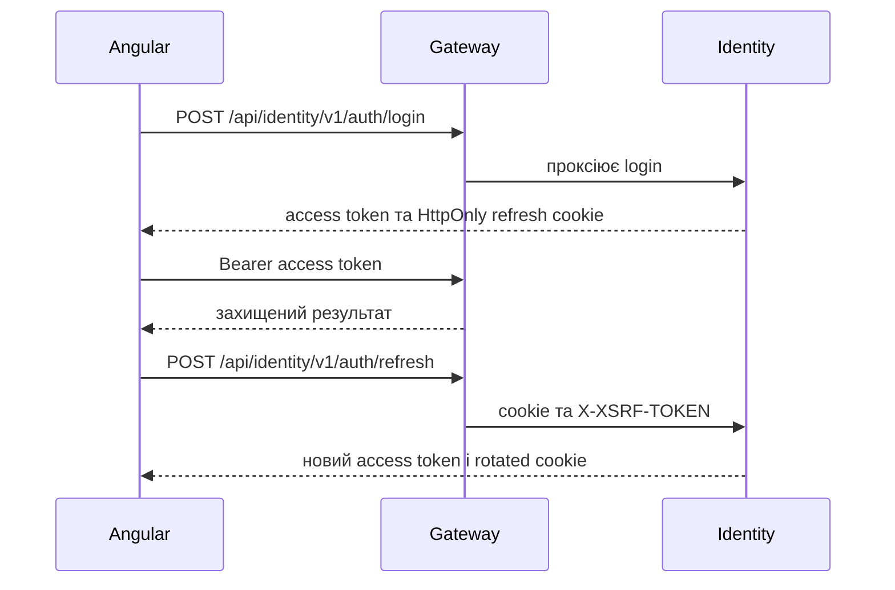

# AiControlCenter Angular

Односторінковий Angular-клієнт працює за тим самим origin, що й Nginx/Gateway. Він реалізує вхід, відновлення сесії, зміну тимчасового пароля, захист маршрутів, технічне SignalR-підключення та панель Directions.

## Потік сесії



## Основні компоненти

- `AuthStore` ініціалізує CSRF cookie, пробує refresh під час старту, зберігає користувача та координує паралельні refresh-запити. Невдалий runtime refresh очищає session і переводить на login один раз.
- `AccessTokenStore` тримає access token лише в оперативній пам’яті; `localStorage` і `sessionStorage` не використовуються.
- `authInterceptor` додає Bearer token лише до захищених same-origin API. Він координує один refresh, а staggered `401` для старого token повторює з уже актуальним token без другого refresh; `403` та auth endpoints refresh не запускають.
- `authGuard`, `passwordChangedGuard` і `roleGuard` контролюють маршрути клієнта; серверні policies залишаються остаточним захистом.
- `RealtimeService` підключається до `/hubs/system`, передає актуальний access token і викликає технічний `Ping`.
- `LoginComponent`, `ChangePasswordComponent`, `ShellComponent` та `ForbiddenComponent` формують наявний UI.
- `DirectionListComponent` показує loading/empty/error states, pagination, фільтри та дозволені дії; `DirectionFormComponent` надає reactive create/edit form з одним atomic update request. `DirectionApiService` звертається лише до same-origin Gateway route.

## Маршрути

| URL                    | Компонент і захист                                     |
| ---------------------- | ------------------------------------------------------ |
| `/login`               | `LoginComponent`, публічний                            |
| `/change-password`     | `ChangePasswordComponent`, `authGuard`                 |
| `/forbidden`           | `ForbiddenComponent`, `authGuard`                      |
| `/`                    | `ShellComponent`, `authGuard` + `passwordChangedGuard` |
| `/directions`          | список, усі platform roles після зміни пароля          |
| `/directions/new`      | створення, додатково `roleGuard(Admin)`                |
| `/directions/:id/edit` | редагування, додатково `roleGuard(Admin)`              |

## Запуск і перевірка

Із кореня репозиторію:

```powershell
npm.cmd ci --prefix .\frontend\ai-control-center-angular
npm.cmd start --prefix .\frontend\ai-control-center-angular
npm.cmd test --prefix .\frontend\ai-control-center-angular -- --watch=false
npm.cmd run build --prefix .\frontend\ai-control-center-angular -- --configuration production
```

Тести перевіряють ініціалізацію/refresh сесії, memory-only token, захисні guards, поведінку interceptor без циклу повторних refresh, API mapping і UI states/actions Directions.

## Пов’язана документація

- [Головний README](../../README.md)
- [Повний authentication flow](../../docs/identity/authentication-flow.md)
- [Спільна JWT-безпека](../../docs/security/security-overview.md)
- [Gateway](../../src/Gateway/AiControlCenter.Gateway/README.md)
- [Directions](../../docs/architecture/directions.md)
