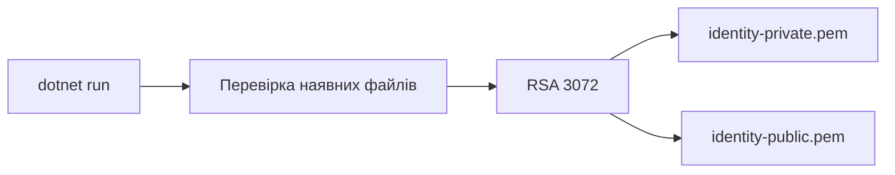

# IdentityKeyGenerator

Консольна .NET-утиліта створює пару 3072-bit RSA PEM-ключів для локального запуску Identity та валідаторів JWT.

## Процес



Утиліта не перезаписує ключі без `--force`. Приватний ключ передається лише Identity; публічний — Gateway та API. Ключі не можна додавати до Git.

```powershell
dotnet run --project .\scripts\security\IdentityKeyGenerator\IdentityKeyGenerator.csproj -- .\secrets\identity
```

Проєкт не має `ProjectReference` або NuGet-залежностей.

[Security scripts](../README.md) · [Огляд Security](../../../docs/security/security-overview.md)
