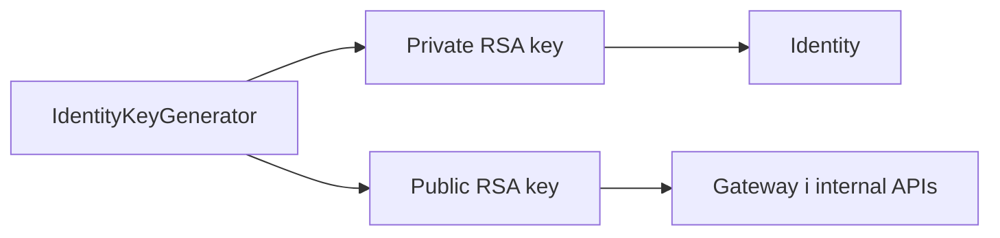

# Security scripts

Каталог містить локальні утиліти для підготовки криптографічних матеріалів Identity.

- [IdentityKeyGenerator](IdentityKeyGenerator/README.md)
- [Огляд Security](../../docs/security/security-overview.md)
