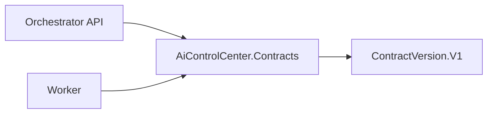

# AiControlCenter.Contracts

Мінімальний .NET class library для спільних асинхронних transport contracts. Зараз він містить лише `ContractVersion.V1`; бізнес-команд, events і consumers у репозиторії немає.

## Межі та місце в системі

Проєкт не залежить від сервісів і не повинен містити entities або application use cases. Його можуть посилати Gateway, Orchestrator і Worker без порушення меж сервісів.



## Компоненти й залежності

- `ContractVersion` — узгоджене значення `v1`.
- `ProjectReference`: відсутні.
- NuGet-пакети: відсутні.
- Зовнішні сервіси: відсутні.

## Перевірка

```powershell
dotnet build .\src\BuildingBlocks\AiControlCenter.Contracts\AiControlCenter.Contracts.csproj --configuration Release
```

[Building Blocks](../README.md) · [Комунікація](../../../docs/architecture/communication.md)
