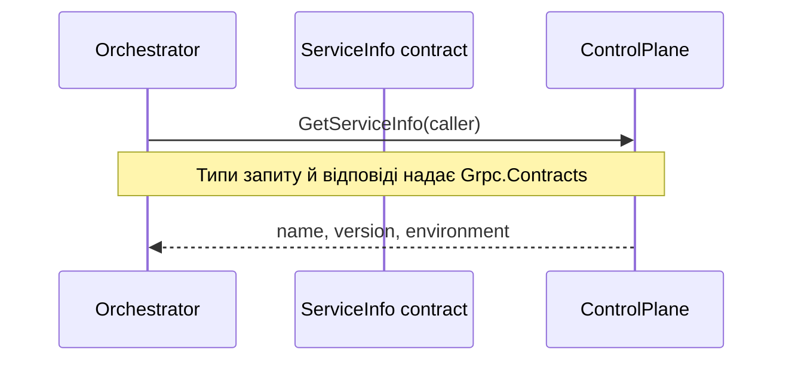

# AiControlCenter.Grpc.Contracts

Class library генерує клієнтські та серверні C#-типи з `Protos/service_info.proto`. Контракт призначений лише для технічного запиту інформації про сервіс.

## Основний процес

`ServiceInfo.GetServiceInfo` приймає `ServiceInfoRequest.caller` і повертає `service_name`, `version` та `environment`.

## Залежності

- `Google.Protobuf`, `Grpc.Core.Api`.
- `Grpc.Tools` використовується лише під час build.
- `ProjectReference`: відсутні.

Зміна `.proto` є зміною transport contract і потребує перевірки обох сторін виклику.

[Building Blocks](../README.md) · [Комунікація](../../../docs/architecture/communication.md)
