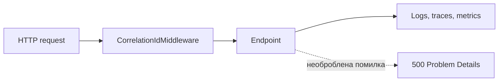

# AiControlCenter.Observability

Спільний технічний модуль уніфікує JSON-логування, OpenTelemetry, correlation ID, health endpoints і відповіді Problem Details.

## Потік HTTP-запиту

## Основні компоненти

- `AddServiceDefaults` додає JSON console logging, ASP.NET Core/HTTP instrumentation, runtime metrics і OTLP exporter, якщо endpoint налаштований.
- `AddApiFoundation` реєструє Problem Details і global exception handler, а `UseApiFoundation` вмикає correlation та exception middleware.
- `MapDefaultHealthEndpoints` додає `/health/live` і `/health/ready`.
- Health endpoints явно анонімні, щоб їх могли викликати Docker і моніторинг.
- `CorrelationIdMiddleware` приймає або створює correlation ID і повертає його у response header.

## Залежності

OpenTelemetry hosting, ASP.NET Core instrumentation, HTTP instrumentation, runtime instrumentation і OTLP exporter. `ProjectReference` відсутні.

[Building Blocks](../README.md) · [Gateway](../../Gateway/AiControlCenter.Gateway/README.md)
