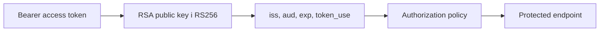

# AiControlCenter.Security

Спільний модуль задає однакову JWT authentication та authorization для Gateway і захищених API. Він не створює токени й не має доступу до приватного RSA-ключа.

## Перевірка запиту

## Основні компоненти

- `PlatformAuthenticationOptions` читає `Authentication` і валідує issuer, audience, public key path, key ID та clock skew.
- `AddPlatformAuthentication` налаштовує `JwtBearer`, `MapInboundClaims = false` та allowed algorithm `RS256`; `AddPlatformAuthorization` реєструє policies і fallback policy.
- `SecurityClaimNames` та `SecurityPolicyNames` усувають розбіжності в рядкових назвах.
- Policies: `AdminOnly`, `AdminOrDeveloper`, `AnyPlatformUser`, `PasswordChanged`.
- Query-параметр `access_token` приймається тільки для `/hubs/system`.

Кілька policies на endpoint застосовуються разом як AND. Public endpoints треба явно позначати `AllowAnonymous()`.

## Залежності

`Microsoft.AspNetCore.Authentication.JwtBearer`; `ProjectReference` відсутні.

[Повний огляд Security](../../../docs/security/security-overview.md) · [Identity security](../../../docs/architecture/identity-security.md) · [Building Blocks](../README.md)
