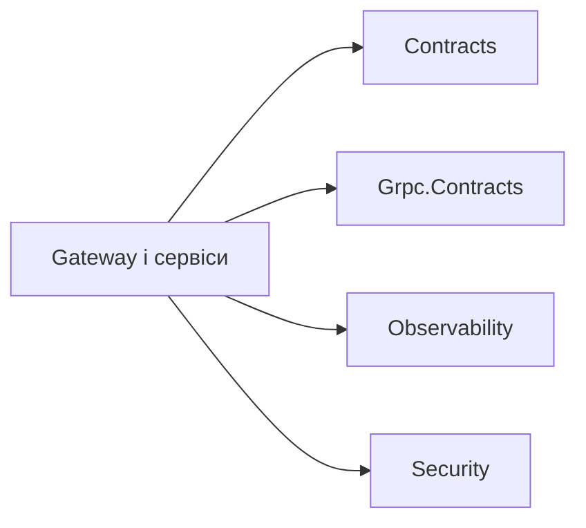

# Building Blocks

Спільні проєкти містять лише технічні можливості, потрібні кільком сервісам. Тут немає доменної логіки Identity, ControlPlane, Orchestrator або Integrations.

- [AiControlCenter.Contracts](AiControlCenter.Contracts/README.md) — версія спільних transport contracts.
- [AiControlCenter.Grpc.Contracts](AiControlCenter.Grpc.Contracts/README.md) — технічний `ServiceInfo` gRPC-контракт.
- [AiControlCenter.Observability](AiControlCenter.Observability/README.md) — telemetry, correlation, health і Problem Details.
- [AiControlCenter.Security](AiControlCenter.Security/README.md) — єдина перевірка JWT і authorization policies.

[Головна документація](../../README.md) · [Правила залежностей](../../docs/architecture/dependency-rules.md)
