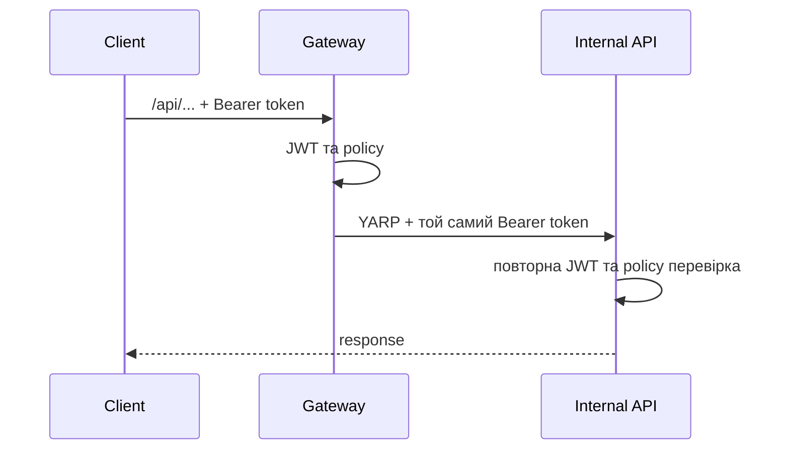

# AiControlCenter.Gateway

Публічна точка входу платформи. Gateway перевіряє JWT і policies, проксіює `/api/*` через YARP та надає технічний SignalR Hub.

## Потік запиту



## Маршрути й компоненти

- `/api/identity/v1/auth/csrf|login|refresh|logout` — anonymous proxy routes; решта Identity routes захищені.
- `/api/control-plane/**`, включно з `/api/control-plane/v1/directions`, а також `/api/orchestrator/**` і `/api/integrations/**` — потребують `PasswordChanged`.
- `/api/gateway/service-info` і `/service-info` — технічна інформація; anonymous лише в Development.
- `/hubs/system` — `SystemHub.Ping`, authenticated і `PasswordChanged`, з закриттям підключення після завершення token.
- YARP передає вхідний `Authorization` header стандартною поведінкою; окремого transform provider для Bearer token немає.

Gateway не містить use cases сервісів і посилається лише на `Contracts`, `Grpc.Contracts`, `Observability`, `Security`.

## Запуск

```powershell
dotnet run --project .\src\Gateway\AiControlCenter.Gateway\AiControlCenter.Gateway.csproj
```

[Головний README](../../../README.md) · [Security](../../BuildingBlocks/AiControlCenter.Security/README.md) · [Gateway integration tests](../../../tests/Integration/AiControlCenter.Gateway.IntegrationTests/README.md)
