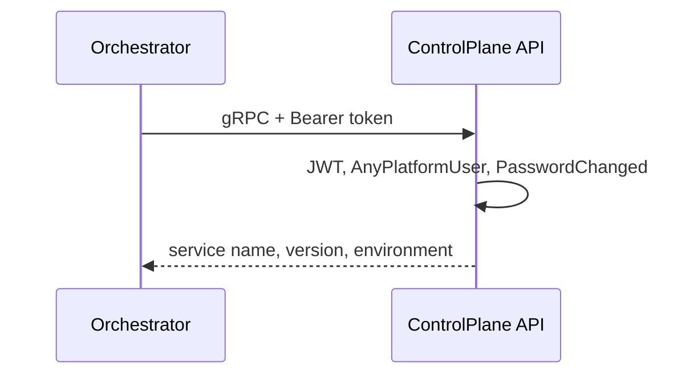

# AiControlCenter.ControlPlane.Api

ASP.NET Core host надає захищений REST API Directions, HTTP `/service-info`, gRPC `ServiceInfo.GetServiceInfo`, health endpoints і reflection у Development.

HTTP слухає порт 8080 (HTTP/1.1), gRPC — 8081 (HTTP/2). Обидва service-info transports застосовують `AnyPlatformUser` і `PasswordChanged`. `/health/live` та `/health/ready` надає Observability; readiness перевіряє БД.

Directions доступні під `/v1/directions`. GET list підтримує `page`/`pageSize` (20 за замовчуванням, максимум 100) і повертає pagination metadata. GET endpoints застосовують `AnyPlatformUser` + `PasswordChanged`; POST/PUT/PATCH additionally require `AdminOnly`. Основний PUT атомарно зберігає всі editable fields і відхиляє пропущені required fields. POST повертає `201` зі створеним DTO без context-dependent `Location`. FluentValidation повертає validation problem, а expected not-found/concurrency/unique/domain conflicts — стандартний Problem Details із 404 або 409. Режим `--migrate` застосовує migrations і завершує процес до запуску HTTP host.

Посилається на власні Application/Infrastructure та спільні Grpc.Contracts, Observability, Security. Використовує gRPC ASP.NET Core, FluentValidation, EF health і Swagger/OpenAPI.

[ControlPlane](../README.md) · [Directions API](../../../../docs/architecture/directions.md#rest-api) · [gRPC contracts](../../../BuildingBlocks/AiControlCenter.Grpc.Contracts/README.md) · [Integration tests](../../../../tests/Integration/AiControlCenter.Services.IntegrationTests/README.md)
