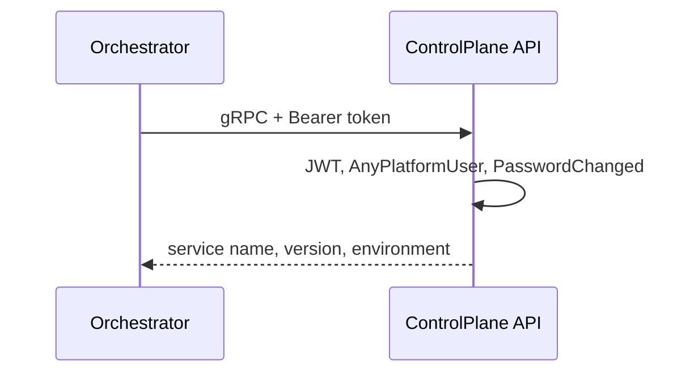

# AiControlCenter.ControlPlane.Api

ASP.NET Core host надає захищений HTTP `/service-info`, gRPC `ServiceInfo.GetServiceInfo`, health endpoints і reflection у Development.

HTTP слухає порт 8080 (HTTP/1.1), gRPC — 8081 (HTTP/2). Обидва service-info transports застосовують `AnyPlatformUser` і `PasswordChanged`. `/health/live` та `/health/ready` надає Observability; readiness перевіряє БД.

Посилається на власні Application/Infrastructure та спільні Grpc.Contracts, Observability, Security. Використовує gRPC ASP.NET Core, FluentValidation, EF health і Swagger/OpenAPI.

[ControlPlane](../README.md) · [gRPC contracts](../../../BuildingBlocks/AiControlCenter.Grpc.Contracts/README.md) · [Integration tests](../../../../tests/Integration/AiControlCenter.Services.IntegrationTests/README.md)
