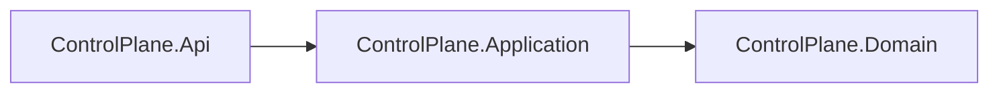

# AiControlCenter.ControlPlane.Application

Application layer ControlPlane координує use cases `Direction` і `AgentDefinition` через services, repository/unit-of-work ports, DTO, commands, queries та FluentValidation validators.

Для AgentDefinition реалізовано paged search/status/direction filter, CRUD без hard delete, status/archive/restore і runnable snapshot. Application не залежить від ASP.NET Core або EF Core; version передається як `uint`, а persistence adapter реалізує optimistic concurrency.

`ProjectReference`: `ControlPlane.Domain`. FluentValidation забезпечує однакову перевірку в endpoint filter і application boundary.

[ControlPlane](../README.md) · [Domain](../AiControlCenter.ControlPlane.Domain/README.md) · [Directions](../../../../docs/architecture/directions.md) · [Правила залежностей](../../../../docs/architecture/dependency-rules.md)
