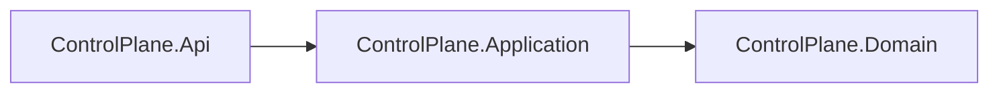

# AiControlCenter.ControlPlane.Application

Application layer ControlPlane координує всі use cases `Direction` через `DirectionApplicationService`, repository/unit-of-work ports, DTO, commands, queries та FluentValidation validators.

Реалізовано paged список із фільтрами й metadata, читання за ID, створення, атомарне редагування всіх editable fields, окремі quick actions status/sort order, архівування та відновлення. Application не залежить від ASP.NET Core або EF Core; version передається як звичайний `uint`, а persistence adapter реалізує optimistic concurrency.

`ProjectReference`: `ControlPlane.Domain`. FluentValidation забезпечує однакову перевірку в endpoint filter і application boundary.

[ControlPlane](../README.md) · [Domain](../AiControlCenter.ControlPlane.Domain/README.md) · [Directions](../../../../docs/architecture/directions.md) · [Правила залежностей](../../../../docs/architecture/dependency-rules.md)
