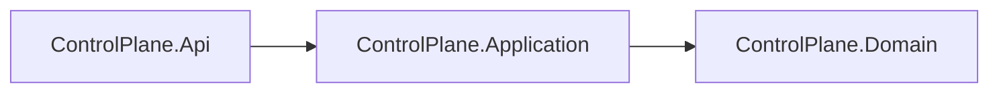

# AiControlCenter.ControlPlane.Application

Зарезервований application layer ControlPlane. Проєкт уже відокремлений і посилається на Domain, але application services, ports і validators ще не створені.

Майбутні use cases мають координувати домен через interfaces, не залежачи від ASP.NET Core або EF Core. Поточний технічний `ServiceInfo` реалізований безпосередньо в API й не є бізнес-use case.

`ProjectReference`: `ControlPlane.Domain`. NuGet-залежності відсутні.

[ControlPlane](../README.md) · [Domain](../AiControlCenter.ControlPlane.Domain/README.md) · [Правила залежностей](../../../../docs/architecture/dependency-rules.md)
