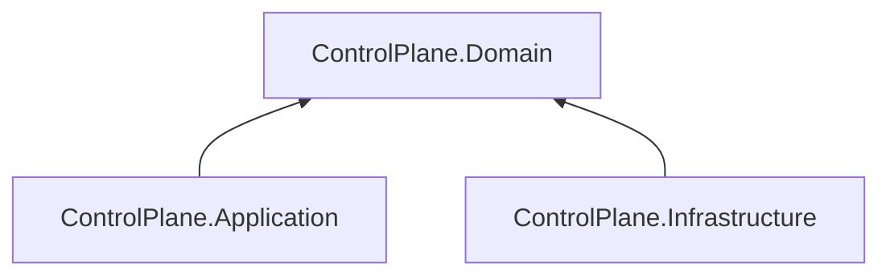

# AiControlCenter.ControlPlane.Domain

Чистий доменний шар ControlPlane містить aggregate roots `Direction` і `AgentDefinition` та їхні invariants без залежностей від Application, EF Core або ASP.NET Core.

Обидва aggregates нормалізують Unicode-назву й code, ведуть UTC timestamps та виконують явні `Archive`/`Restore`. AgentDefinition посилається на Direction, підтримує лише execution type `Test` і не дозволяє mutation в архіві.

`ProjectReference` і NuGet-залежності відсутні.

[ControlPlane](../README.md) · [Application](../AiControlCenter.ControlPlane.Application/README.md) · [Directions](../../../../docs/architecture/directions.md) · [Правила залежностей](../../../../docs/architecture/dependency-rules.md)
