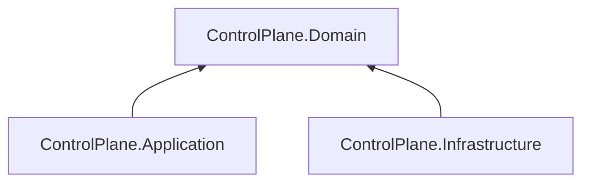

# AiControlCenter.ControlPlane.Domain

Чистий доменний шар ControlPlane. У поточному коді entities, value objects і business rules ще відсутні.

Коли модель з’явиться, цей проєкт володітиме лише доменними invariants і не залежатиме від Application, EF Core, ASP.NET Core, MassTransit або зовнішніх SDK.

`ProjectReference` і NuGet-залежності відсутні.

[ControlPlane](../README.md) · [Application](../AiControlCenter.ControlPlane.Application/README.md) · [Правила залежностей](../../../../docs/architecture/dependency-rules.md)
