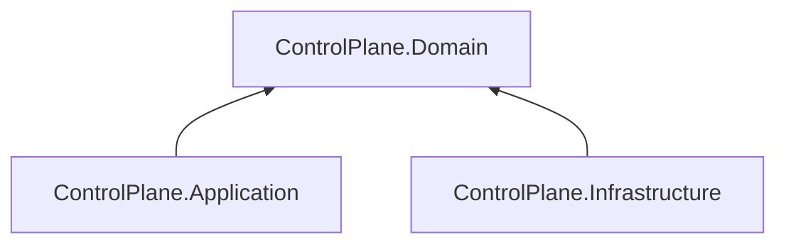

# AiControlCenter.ControlPlane.Domain

Чистий доменний шар ControlPlane містить aggregate root `Direction` і його invariants без залежностей від Application, EF Core або ASP.NET Core.

`Direction` нормалізує назву та унікальний code, перевіряє status і sort order, веде UTC timestamps та виконує явні операції `Archive`/`Restore`. Архівований запис не можна редагувати, активувати або пересортувати до відновлення. Повторна операція над уже досягнутим archive state не змінює сутність.

`ProjectReference` і NuGet-залежності відсутні.

[ControlPlane](../README.md) · [Application](../AiControlCenter.ControlPlane.Application/README.md) · [Directions](../../../../docs/architecture/directions.md) · [Правила залежностей](../../../../docs/architecture/dependency-rules.md)
