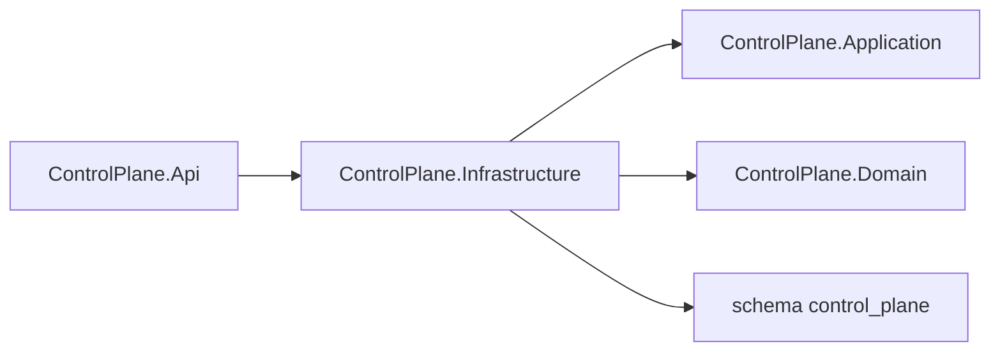

# AiControlCenter.ControlPlane.Infrastructure

Infrastructure реєструє `ControlPlaneDbContext`, `DirectionRepository`, unit of work та migration каталогу Directions у PostgreSQL.

`directions` зберігається у схемі `control_plane`. Унікальний index захищає normalized `code`; check constraints захищають status, name/code boundaries, sort order і timestamps. Складений index `(archived_at, status, sort_order, name, id)` підтримує типові list-запити, коли фільтрація починається з archive/status; інші комбінації фільтрів PostgreSQL може виконувати іншим plan. PostgreSQL system column `xmin` використовується як optimistic concurrency token. Архівування встановлює `archived_at`, не видаляючи рядок.

`AddControlPlaneInfrastructure` читає connection string, використовує Npgsql і окрему migration history table у схемі `control_plane`. Readiness host перевіряє доступність цього context. `ControlPlaneDbContextFactory` підтримує design-time EF commands через `ConnectionStrings__ControlPlaneDatabase`.

Посилається на власні Application і Domain; NuGet: EF Core, Npgsql provider та configuration abstractions.

[ControlPlane](../README.md) · [Api](../AiControlCenter.ControlPlane.Api/README.md) · [Directions](../../../../docs/architecture/directions.md) · [PostgreSQL integration tests](../../../../tests/Integration/AiControlCenter.Services.IntegrationTests/README.md)
