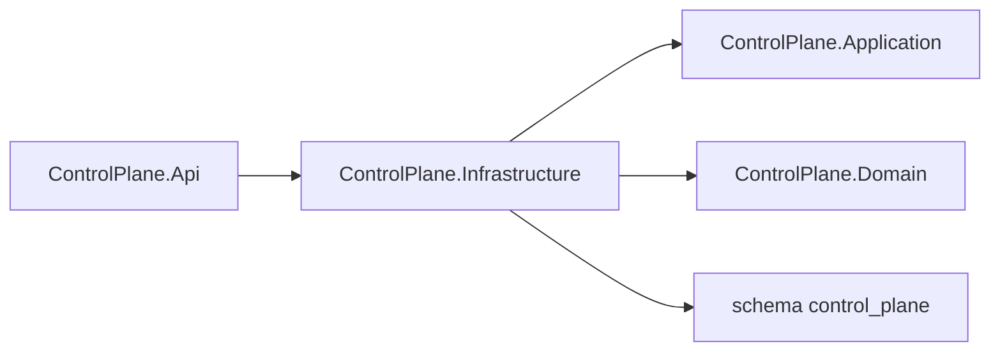

# AiControlCenter.ControlPlane.Infrastructure

Infrastructure реєструє `ControlPlaneDbContext`, repositories `Direction`/`AgentDefinition`, unit of work та migrations обох каталогів у PostgreSQL.

`directions` і `agent_definitions` зберігаються у схемі `control_plane`. Unique/check/FK constraints захищають normalized codes, boundaries, status, execution type й timestamps. PostgreSQL system column `xmin` використовується як optimistic concurrency token. FK має `Restrict`, а архівування встановлює `archived_at` без видалення рядка.

`AddControlPlaneInfrastructure` читає connection string, використовує Npgsql і окрему migration history table у схемі `control_plane`. Readiness host перевіряє доступність цього context. `ControlPlaneDbContextFactory` підтримує design-time EF commands через `ConnectionStrings__ControlPlaneDatabase`.

Посилається на власні Application і Domain; NuGet: EF Core, Npgsql provider та configuration abstractions.

[ControlPlane](../README.md) · [Api](../AiControlCenter.ControlPlane.Api/README.md) · [Directions](../../../../docs/architecture/directions.md) · [PostgreSQL integration tests](../../../../tests/Integration/AiControlCenter.Services.IntegrationTests/README.md)
