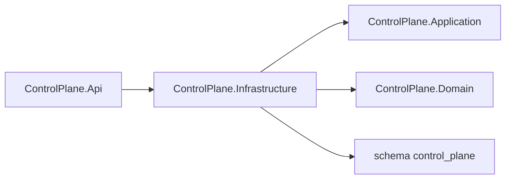

# AiControlCenter.ControlPlane.Infrastructure

Infrastructure реєструє `ControlPlaneDbContext` для PostgreSQL. Бізнес-таблиць, repositories і migrations у проєкті зараз немає.

`AddControlPlaneInfrastructure` читає connection string, використовує Npgsql і окрему migration history table у схемі `control_plane`. Readiness host перевіряє доступність цього context.

Посилається на власні Application і Domain; NuGet: EF Core, Npgsql provider та configuration abstractions.

[ControlPlane](../README.md) · [Api](../AiControlCenter.ControlPlane.Api/README.md) · [PostgreSQL isolation tests](../../../../tests/Integration/AiControlCenter.Services.IntegrationTests/README.md)
