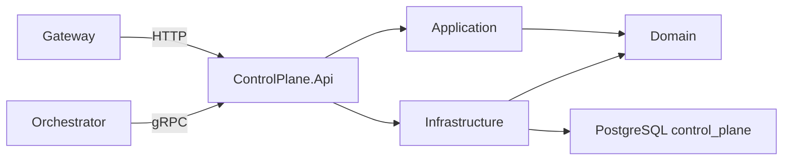

# ControlPlane

ControlPlane має ізольований HTTP/gRPC host і власну PostgreSQL-схему. Він володіє каталогами `Direction` та прив’язаних `AgentDefinition`, їх CRUD/status/archive lifecycle без hard delete. Через `AgentCatalog.GetRunnableAgent` Orchestrator отримує snapshot лише активного, неархівованого агента в активному напрямку.

Читати каталоги можуть `Admin`, `Developer` і `User` після зміни тимчасового пароля. Directions змінює лише `Admin`; AgentDefinitions — `Admin` або `Developer`. Зовнішні шляхи проходять через Gateway: `/api/control-plane/v1/directions` і `/api/control-plane/v1/agents`.

- [Api](AiControlCenter.ControlPlane.Api/README.md)
- [Application](AiControlCenter.ControlPlane.Application/README.md)
- [Domain](AiControlCenter.ControlPlane.Domain/README.md)
- [Infrastructure](AiControlCenter.ControlPlane.Infrastructure/README.md)

[Межі сервісів](../../../docs/architecture/service-boundaries.md)

[Модель і API Directions](../../../docs/architecture/directions.md)

[Agents, Runs і Worker](../../../docs/architecture/agents-runs-worker.md)
