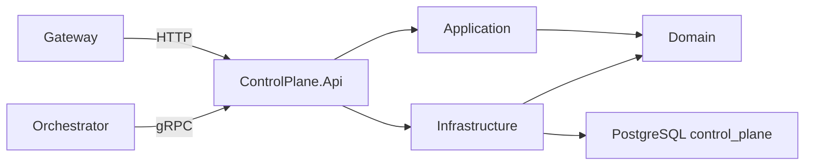

# ControlPlane

ControlPlane має ізольований HTTP/gRPC host і власну PostgreSQL-схему. Зараз він надає лише захищений технічний `ServiceInfo`; доменні use cases та entities відсутні.

- [Api](AiControlCenter.ControlPlane.Api/README.md)
- [Application](AiControlCenter.ControlPlane.Application/README.md)
- [Domain](AiControlCenter.ControlPlane.Domain/README.md)
- [Infrastructure](AiControlCenter.ControlPlane.Infrastructure/README.md)

[Межі сервісів](../../../docs/architecture/service-boundaries.md)
