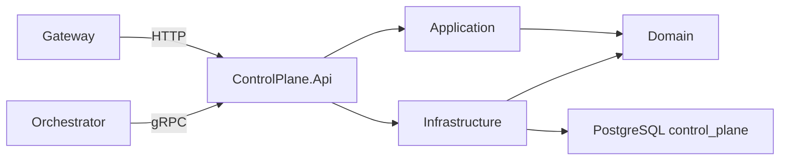

# ControlPlane

ControlPlane має ізольований HTTP/gRPC host і власну PostgreSQL-схему. Він володіє каталогом `Direction`: створенням, читанням, редагуванням, статусом, порядком сортування та архівуванням без hard delete. Технічний `ServiceInfo` gRPC залишається окремим від бізнес-API.

Читати Directions можуть `Admin`, `Developer` і `User` після зміни тимчасового пароля. Усі mutation endpoints доступні лише `Admin`. Зовнішній шлях проходить через Gateway: `/api/control-plane/v1/directions`.

- [Api](AiControlCenter.ControlPlane.Api/README.md)
- [Application](AiControlCenter.ControlPlane.Application/README.md)
- [Domain](AiControlCenter.ControlPlane.Domain/README.md)
- [Infrastructure](AiControlCenter.ControlPlane.Infrastructure/README.md)

[Межі сервісів](../../../docs/architecture/service-boundaries.md)

[Модель і API Directions](../../../docs/architecture/directions.md)
