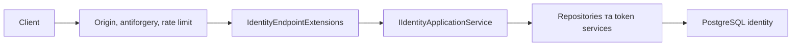

# AiControlCenter.Identity.Api

ASP.NET Core host приймає Identity HTTP-запити, застосовує transport/security middleware і викликає `IIdentityApplicationService`.

## Потік запиту

## Endpoints і компоненти

- Anonymous: `/v1/auth/csrf`, `/login`, `/refresh`, `/logout`.
- Authenticated: `/v1/auth/logout-all`, `/v1/users/me`, `/v1/users/me/change-password`.
- `AdminOnly` + `PasswordChanged`: users, status, roles, password reset і session revocation; `/v1/roles`.
- `IdentityExceptionHandler` переводить application/domain помилки у Problem Details.
- Звичайний API startup fail-fast перевіряє RSA/configuration, запускає seed системних ролей і bootstrap admin. Окремий `--migrate` path реєструє лише Identity persistence та застосовує EF migrations без RSA, Data Protection, HTTP endpoints чи runtime integrations.

## Залежності й конфігурація

Посилається на `Identity.Application`, `Identity.Infrastructure`, `Observability`, `Security`. Використовує ASP.NET Core Identity Data Protection, EF health check, FluentValidation, OpenAPI/Swagger. Потрібні секції Identity database, authentication/RSA, refresh cookie, CORS/origin і bootstrap.

[Identity](../README.md) · [Application](../AiControlCenter.Identity.Application/README.md) · [Authentication flow](../../../../docs/identity/authentication-flow.md)
