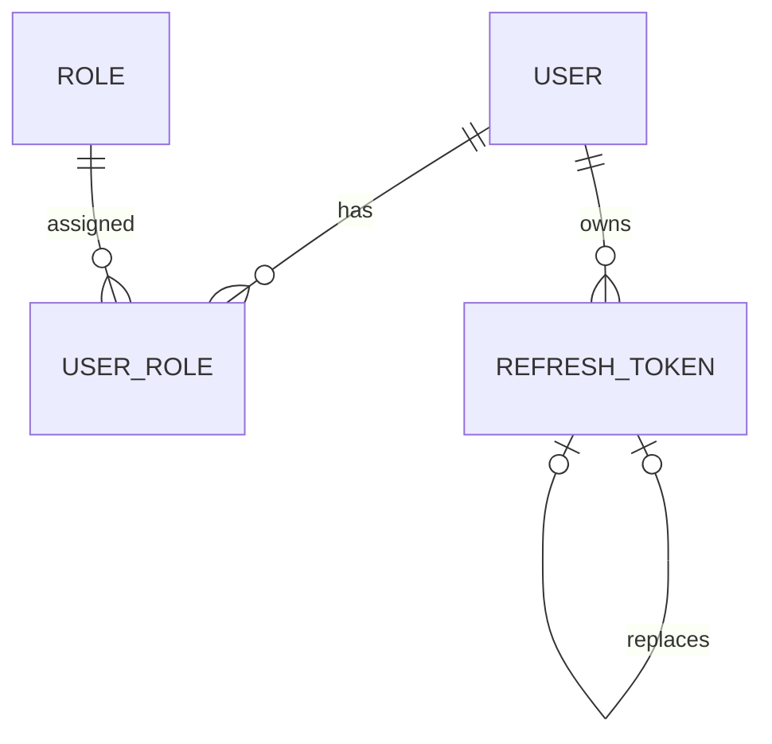

# AiControlCenter.Identity.Domain

Чистий домен Identity зберігає invariants користувачів, ролей і refresh sessions без залежностей від ASP.NET Core, EF Core або зовнішніх SDK.

## Модель

## Основні типи

- `User` — email, status, password hash, `PasswordChangeRequired`, roles і security stamp.
- `Role` — системні ролі `Admin`, `Developer`, `User`.
- `UserRole` — зв’язок many-to-many.
- `RefreshToken` — hash, family, expiry, revocation, replacement і reuse state.
- Value objects нормалізують/валідують email, role name, password/refresh hashes та token family.

Домен не генерує JWT, не хешує пароль і не працює з БД. `ProjectReference` і NuGet-залежності відсутні.

[Identity](../README.md) · [Application](../AiControlCenter.Identity.Application/README.md) · [Unit tests](../../../../tests/Unit/AiControlCenter.Identity.UnitTests/README.md)
