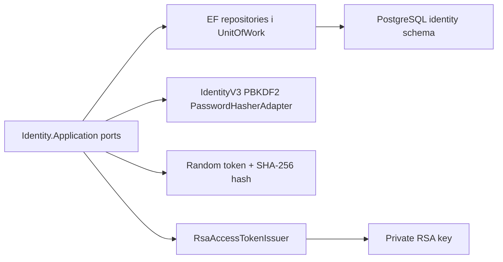

# AiControlCenter.Identity.Infrastructure

Infrastructure реалізує порти Identity Application: persistence, password hashing, refresh-token protection, RSA access-token issuance та Data Protection key storage.

## Потік даних

## Компоненти

- `IdentityDbContext`, entity configurations, migrations і repositories.
- `IdentityUnitOfWork` та PostgreSQL locks для атомарних mutating use cases.
- `PasswordHasherAdapter` використовує ASP.NET Core IdentityV3 PBKDF2 із 210000 iterations.
- `RefreshTokenGenerator` створює криптографічно випадковий token; у БД зберігається лише SHA-256 hash.
- `RsaAccessTokenIssuer` підписує короткоживучий JWT алгоритмом RS256.
- Startup validator відхиляє private material у `Authentication:PublicKeyPath`,
  перевіряє мінімальний розмір RSA й відповідність public/private pair.
- Data Protection keys зберігаються у filesystem-backed Docker named volume `identity_data_protection`.

Посилається на `Identity.Application` і `Identity.Domain`; використовує EF Core/Npgsql, ASP.NET Core Identity password hashing та JWT libraries.

[Identity](../README.md) · [Application](../AiControlCenter.Identity.Application/README.md) · [Security details](../../../../docs/architecture/identity-security.md)
