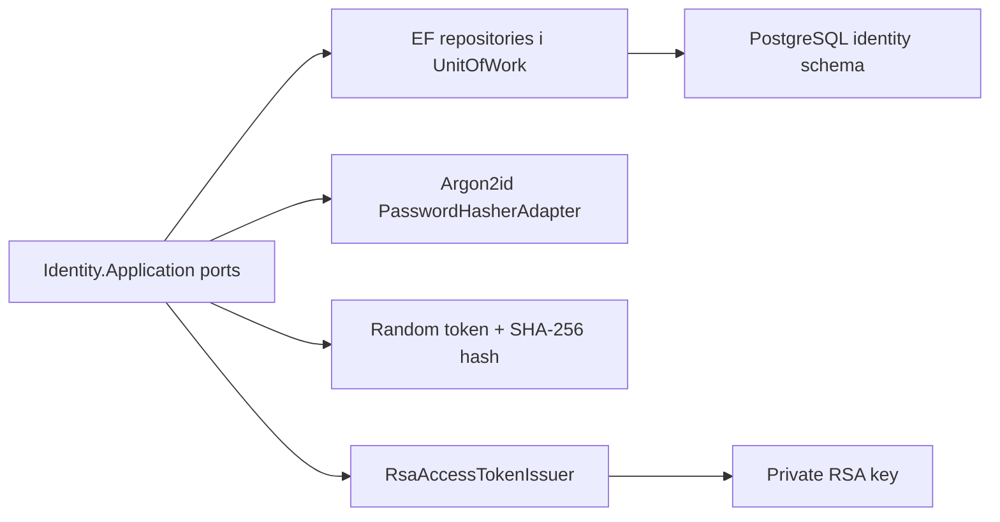

# AiControlCenter.Identity.Infrastructure

Infrastructure реалізує порти Identity Application: persistence, password hashing, refresh-token protection, RSA access-token issuance та Data Protection key storage.

## Потік даних

## Компоненти

- `IdentityDbContext`, entity configurations, migrations і repositories.
- `IdentityUnitOfWork` та PostgreSQL locks для атомарних mutating use cases.
- `PasswordHasherAdapter` на Konscious Argon2id.
- `RefreshTokenGenerator` створює криптографічно випадковий token; у БД зберігається лише SHA-256 hash.
- `RsaAccessTokenIssuer` підписує короткоживучий JWT алгоритмом RS256.
- Data Protection keys зберігаються у PostgreSQL.

Посилається на `Identity.Application` і `Identity.Domain`; використовує EF Core/Npgsql, JWT libraries та Argon2.

[Identity](../README.md) · [Application](../AiControlCenter.Identity.Application/README.md) · [Security details](../../../../docs/architecture/identity-security.md)
