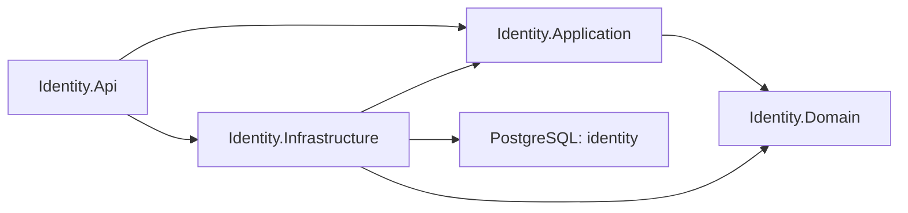

# Identity

Identity володіє користувачами, ролями, паролями й refresh sessions. Лише цей сервіс має приватний RSA-ключ та створює access tokens.

## Проєкти

- [Api](AiControlCenter.Identity.Api/README.md) — HTTP endpoints, middleware, CSRF/origin/rate limiting і composition root.
- [Application](AiControlCenter.Identity.Application/README.md) — login/refresh/logout, password і admin use cases.
- [Domain](AiControlCenter.Identity.Domain/README.md) — `User`, `Role`, `UserRole`, `RefreshSession`, `RefreshToken`, value objects та invariants.
- [Infrastructure](AiControlCenter.Identity.Infrastructure/README.md) — EF Core, repositories, IdentityV3 PBKDF2, RSA JWT і Data Protection.

## Поточні можливості

Login, single-use refresh rotation/reuse detection, logout/logout-all, зміна або reset пароля, список/створення/блокування користувачів, ролі та відкликання сесій. Public endpoints захищені CSRF/origin перевірками й rate limiting там, де це налаштовано.

Canonical JWT validation settings читаються з `Authentication`, а signing-only
`PrivateKeyPath` і access lifetime — з `JwtSigning`. Development configuration
використовує ті самі назви секцій. `PublicKeyPath` не приймає private PEM;
Identity додатково виконує sign/verify probe пари ключів до healthy startup.

[Authentication flow](../../../docs/identity/authentication-flow.md) · [Identity security](../../../docs/architecture/identity-security.md)
