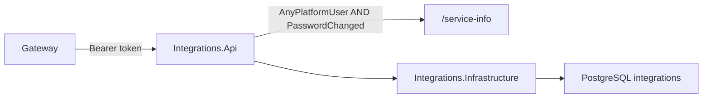

# AiControlCenter.Integrations.Api

ASP.NET Core host надає захищений `/service-info`, health endpoints і composition root Integrations.

API повторно перевіряє JWT після Gateway. Readiness використовує `IntegrationsDbContext`; liveness залишається анонімним. Зовнішніх provider endpoints, clients або credentials у host немає.

Посилається на Application, Infrastructure, Observability і Security. Використовує FluentValidation, EF health і Swagger/OpenAPI.

[Integrations](../README.md) · [Security](../../../BuildingBlocks/AiControlCenter.Security/README.md) · [Integration tests](../../../../tests/Integration/AiControlCenter.Services.IntegrationTests/README.md)
