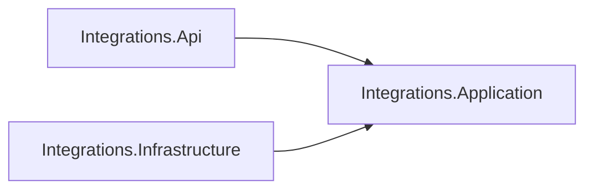

# AiControlCenter.Integrations.Application

Зарезервований application layer Integrations. Use cases, ports, DTO і provider abstractions у поточному коді відсутні.

Проєкт не має Domain reference, NuGet-залежностей або зовнішніх SDK. Майбутні provider contracts мають бути ізольовані від HTTP host і конкретних adapters.

[Integrations](../README.md) · [Infrastructure](../AiControlCenter.Integrations.Infrastructure/README.md) · [Правила залежностей](../../../../docs/architecture/dependency-rules.md)
