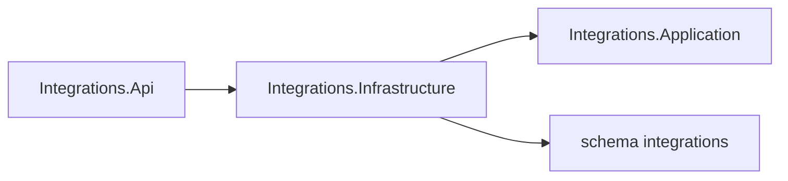

# AiControlCenter.Integrations.Infrastructure

Infrastructure реєструє `IntegrationsDbContext` для окремої PostgreSQL-схеми. Provider adapters, repositories, entities та migrations ще не створені.

`AddIntegrationsInfrastructure` налаштовує Npgsql і власну migration history table. Проєкт посилається лише на Application та використовує EF Core/Npgsql.

[Integrations](../README.md) · [Api](../AiControlCenter.Integrations.Api/README.md) · [PostgreSQL isolation tests](../../../../tests/Integration/AiControlCenter.Services.IntegrationTests/README.md)
