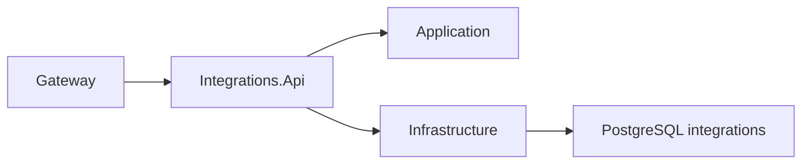

# Integrations

Integrations має ізольований HTTP host і PostgreSQL-схему. Наразі він надає лише захищений технічний `ServiceInfo`; provider adapters, OAuth flows та зовнішні інтеграції не реалізовані.

- [Api](AiControlCenter.Integrations.Api/README.md)
- [Application](AiControlCenter.Integrations.Application/README.md)
- [Infrastructure](AiControlCenter.Integrations.Infrastructure/README.md)

Окремого Domain-проєкту в поточній структурі немає.

[Межі сервісів](../../../docs/architecture/service-boundaries.md)
